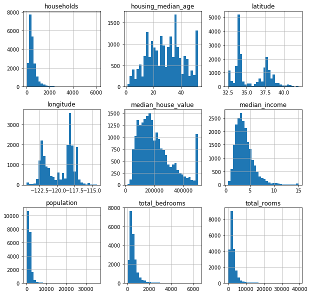
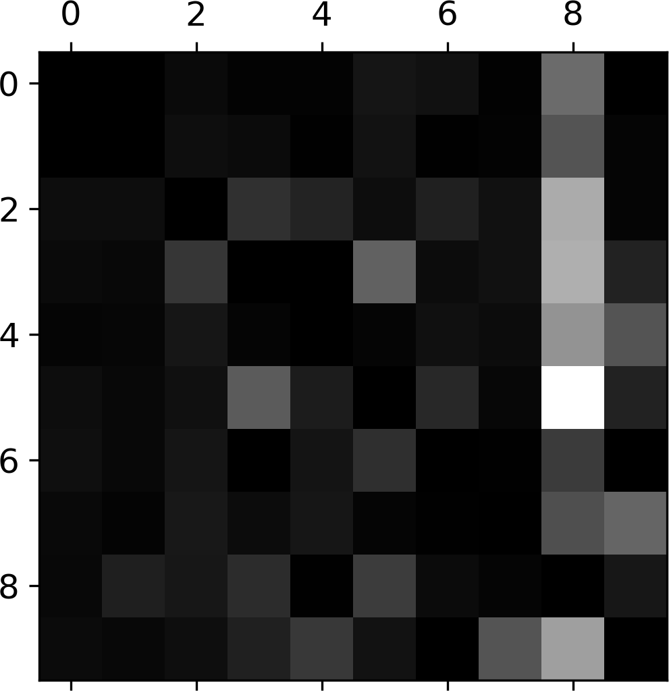

# Machine Learning Notes
_derived from Hands on Machine Learning by Aurélien Géron_
Rights & Credits belong to Aurélien Geron

## The Machine Learning Landscape
### What is Machine Learning
Machine Learning (ML) is the field of study that gives the ability to learn without 
being explicitly programmed.

### When to use ML
Scenarios to use Ml:
| Scenario | Example | Traditional Programming | Machine Learning |
| --- | --- | --- | --- |
| Use ML when the problem is fuzzy and complex, where there is no clear algorithm to complete the task effectively.|  Speech Recongition | Speech is so complex there is no clear recongition algorithm that can accomplish the task effectively  | use ML instead to automatically model this algorithm to a degree of performance |
| Use ML when trying to model evolving problem | Spam Filter | Spammers may notice the word "deal" is getting flagged by the systemand change their wording to "steal" instead,  rendering traditional hardcoded system useless. | an online ML model will notice the increase in "steal" in spam emails and flag them automatically. |
| Use ML when manual algorithms require the development and maintainance of many hardcoded rules | Spam Filter | Manually finding and mantaining a pattern rules that appears in spam but not in actual email is time consuming and daunting |  use instead ML to automatically find these pattern rules and detect spam |

> ML can also be used to expand human knowledge:
> - data mining - discovering trends in data that are not immediately apparent using ML

### Applications of ML
Applications of Machine Learning include:
| Applications | ML method |
| --- | --- |
| Analysing images of products on the production line to find defects | Convolutional Neural Networks (CNN) |
| Detecting brain tumors in brain scans | Convolutional Neural Networks (CNN) |
| Classifying News Articles | NLP methods (RNN, CNNs or transformers) |
| Flagging offensive comments on discussion forums | NLP methods (RNN, CNNs or transformers) |
| Summarizing long documents | NLP methods (RNN, CNNs or transformers) |
| Forcasting company revenue | Regression methods (Linear, SVM, Random Forest, RNN) |
| Segmenting Customers | Clustering methods (KNN) |
| Reommendation Systems | Neural Networks |
| Game AI | Renforcement Learning |

### Methods of ML
There are some common methods to employ ML:
| Method  | Description | Examples | Algorithms |
| --- | --- | --- | --- |
| Classification | Classifying something into a set of predefined classes | Spam classifier, Cancer detection | Logsitic Regression, SVMs, Random Forests NNs |
| Regression | Predicting a target numeric value | Predicting housing prices, company revenue | Linear Regression, SVMs, Random Forests, NNs |
| Clustering | Finding groups with common attribute in data | Finding groups of customers target | K-Means, BSScan |
| Anormally Detection | Detecting rare anormallities in data | Credit Fraud Detection | One-class SVM, Isolation Forest |
| Dimensionality Reduction | Simplify the data a lower no. of variables | Visualisation of high dimensional datasets | PCA, Kernel PCA, t-SNE |

### Types of ML
ML methods can be boardly classified using the following criteria:
- whether training the ML model data labele with solutions (supervised) or
    not (unsupervised).
- whether training can be done on the fly (online) or only once (batch/offline)
- whether they are based on building a predictive model (model based) or just 
    or use existing data points (instance based) to make predictions
 
Over of the categories derived from these criteria:
| Category | Description | Methods | Algorithms |
| --- | --- | --- | --- |
| Supervised | Data used to train the algorithm contains desired solutions | Classification, Regression | KNN, Linear Regression, Logsitic Regression, SVMs, Random Forests, NNs) |
| Unsupervised | Data used to train te algorithm has no desired solutions | Clustering, Anormaly Detection, Dimensionality Reduction | K Means,  Isolation Forest, t-SNE, PCA, Eclat |
| Semi-Supervised | Data used to train only needs to be partially labeled with desired solutions | Combined supervised and unsupervised methods | Deep Belief Nets |
| Reenforcement Learning | A agent learns a policy by interacting with the environment | Reenforcement Learning | Q Learning |
| Offline/Batch Learning | Training ML model is done once and oneshot on a static training set | - | PCA |
| Online Learning | Training is done incrementally over time using a changing training set | - | Incremental PCA |
| Instance Based Learning | Learning is done by using existing data and comparing | - | KNN |
| Model Based Learning | Learning is done by generalising existing data into a model | - | Random Forests, SVM |

> Categories can be overlapping and are non-exclusive

### Challenges in ML
Challenges in ML:
| Challenge | Description |
| --- | --- |
| Limited Training Data | ML requires a significant amount of training data to achieve performance |
| Nonrepresentive Data | Training on nonrepresentive data is akin to training the model to the wrong target |
| Low Quality Data | Using data with errors, noise, outliers and irrelevant features produces worse ML systems (garbage in garbase out) |
| Overfitting | ML system overgeneralises to fit training data, causing actual performance to suffer |
| Underfitting | ML system is too simple and unable to fit the training data. |

> In the paper _The Unreasonsable Effectiveness of Data_, researches showed 
> that different ML algorithms performed simliarly once enough data was used.
> Similary in the papper _No Free Lunch Theorem_, researchers showed that
> no ML algorithm is objectively better than another, hence the need to try
> out different algorithms for every problem.

### Testing and Validation in ML
Testing and Validation evaluate how well a ML system would generalize to 
unseen data:
- split the dataset into train-test subsets or train-validation-test
- train on the training set, holdout the validation, test sets from the model
- cross validate the model on validation, test sets.
- tune hyperparameters and select model based on error computed on validation set

> When training error is low and validation/test error is high, the model is
> overfitting to the training set.

### Data Mismatch
Data Mismatch can cause nonrepresentive data problems. Guidelines:
- validation/test set should come from the same data distribution
- validation/test set should be representative of data seen in production.
- to detect training set mismatch, we can holdout a train-dev set from training set
    and cross validate. If train-dev error low but validation/test error is high, 
    there is training set mismatch,


## End to End Machine Learning Project
### Overview of a ML project
Overview of typical ML project in terms of steps:
1. Defining the problem - look at the big picture
2. Obtaining & Loading the data
3. Inspect and visualize the data (EDA)
4. Preparing the data 
5. Select a ML model and train the model on the data
6. Fine-Tune your model
7. Present your solution
8. Launch, Monitor and Maintain your  system.

To further elaborate on the steps, we will walk through them via a problem example:
To build a model prodict housing prices in the state of Califonia, USA

### Defining the Problem
Frame the Problem - Clarify and further define the problem's objective:
1. Find the exact objective in building the model:
    - response will tell give you an idea of algorithms, metrics and success criteria.
2. Find out about the current solution
    - provides reference baseline performance to improve on.

Defining the problem - type of ML we are doing
- supervised or unsupervised problem: supervised
- classification or regression: regression
- online of batch learning: batch learning

Select the performance metric:
- typically for regression use RMSE
- use MAE if significant amount of outliers - reduces sensitivity to outliers 

> Its a good idea to check your assmptions to catch problems early.

### Obtaining & Loading the data
Open data repositories to obtain data from:
- [UML dataset repository](http://archive.ics.uci.edu/ml/)
- [Kaggle Datasets](https://www.kaggle.com/datasets)
- [Amazon AWS's datasets](https://registry.opendata.aws/)

Load the data to a `pandas` dataframe using `pandas` to facilitate further inspection:
```python
import pandas as pd
housing_df =  pd.read_csv("housing.csv")
```

> Its good practice to write functions to pull and load the data, which is
> usefull for reproducibility, especially if data changes over time.

### Inspecting and visualizing the data (EDA)
Inspect and visualize the data to gain insights into the data (also known as
exploratory data analysis (EDA)).

> Its important to only conduct EDA on the training and validation sets so as
> to prevent overfitting on test set. The test set is meant to be an _unbiased_
> estimate of the ML model's performance.

Common `pandas` methods to conduct EDA:
| Method | Description |
| --- | --- |
| `df.head()` | Show the first few rows of the data in dataframe `df` |
| `df.info()` | Display concise summary infomation of a  dataframe `df` |
| `s.value_counts()` | Display counts of each category in series of categorical variables `s` |
| `df.describe()` | Display a statistical (count, mean, median, ...) summary of the numeric variables in dataframe `df`|
| `df.corr()` | Compute matrix containing correlations of each feature with every other feature in  dataframe `df` |

#### Correlation
Correlation is a measure of the tendency of a variable to vary in tendem with another variable:
- positive correlation (>0 to 1) - as one variable increases the other also tends to increase.
- negative correlation (&lt;0 to -1)  as on varaible tends to increase the other tends to decrease
- the futher the value is from 0, the stronger the correlation.

> Correlation can only capture linear relationships. Nonlinear relationships 
> will not be captured when using correlation.

#### Visualising the data
Visualising the data using by plotting using `matplotlib` to conduct EDA

##### Histogram
Plotting histograms for each numeric feature in `housing_df`:
- bins controls the no. of bars each histogram. Controls the 'resolution' of the histogram
```python
import matplotlib.pyplot as plt
housing_df.hist(bins=30, figsize=(10,10))
plt.show()
```


> Use `%matplotlib inline` magic command when using Jupyter Notebook to make 
> plots appear inside the jupyter notebook.

The following inferences about the the data from the histogram:
| Inference | Observation | Explaination | 
| --- | --- | --- |
| The `median_income` feature is expressed in terms of \$10,000 dollar increments  | The `median_income` feature does not appear to be in single dollar increments | In this day and age, typical incomes are way higher than the 0-15 provided by the median income column |:
| The `median_income`, `housing_median_age` and `median_house_value` features are capped at the last va lue. | Counts in the histogram(s) seem uniformly low until a sudden spike at the last value  | By capping and acummulating all those above last value to the last value, the count for the last value  will be signnificantly higher thans surrounding values. |
| Features scaling is required to applied before doing machine learning | The ranges/scales of each feature in the data are very different | Some ML algorithms perform badly when using features of different scales |
| Transformation of tail heavy distrbuted features to normally distributed is necessary | Some features in the dataset (ie `population`, `total_bedrooms`, `total_rooms`)  are have tail heavy distributions | Some ML algorithms do not perform well with features with tail heavy distributions |

##### Scatterplot
Plotting scatterplot to show geographical locations:
```python
housing_df.plot(kind="scatter", x="longitude", y="latitude", alpha=0.4,
    s=housing_df["population"]/100, label="population", figsize=(10,7),
    c="median_house_value", cmap=plt.get_cmap("jet"), colorbar=True,
)
plt.legend()
```
- `alpha` - used to make the points transparent to see overlapping points.
- `s` - controls the size of points based on the given data values
- `c` - controls the color of the points based on the given data values.
- `cmap` - palette of colors used to color the points.
- `colorbar` - legend for the colors used

> Try out different visualisation parameters to find something that works.

Produces the following scatterplot:


#### Scatter Matrix
The scatter matrix plots a matrix of scatter plots where every feature is scatter
plotted against every other feature.

```python
from pandas.plotting import scatter_matrix
plot_features = ["median_house_value", "median_income", "total_rooms",  "housing_median_age"]
scatter_matrix(housing_df[plot_features], figsize=(12, 8))
```
> Limited the no. of features ploted (using `housing_df[plot_features]` as the
> no. of plots generated is square the no. of features.

Produces the following plot:


If we zoom in on the scatter plot of `median_income` and `median_house_value`:


We can make these observation:
- there seems to a relatively strong correleation between the two variable
- the data seems to have been capped at \$350k and \$280k.

### Preparing the Dataset
#### Spitting the Test Set.
Set aside a portion of the dataset as the test set for later cross validation:
- rule of thumb: 20%, smaller the larger the dataset (closer to 1% for very large datasets)
- ensure that the test set does not change across runs to have comparable performance 
    estimates when cross validating

The method of Sampling data for test set is important if dataset is small relative 
to the no. of features:
- use simple random sampling if dealing with large datasets with `sklearn`:
```python
from sklearn import train_test_split
train_test_split(housing_df, test_size=0.2, random_state=42)
```
> `random_state` sets the seed of the random no. generator used to generate 
>  the test set, ensuring that the test set will be the same across runs.

- use stratified random sampling if dataset is small: 
    - force the test set to be representative of the dataset 
        (each of the segments/strata is represeneted)
    - ensure that the proportionsegment/stratum of each class 
        (ie 51.3% male and 48.7% female) is replicated in the test set

How to do stratified random sampling:
1. Pick a categorical variable to be the stratification variable
    - convert a numeric variable to categorical to stratify a numeric variable:
```python
housing_df["income_cat"] = pd.cut(housing_df["median_income"],
                               bins=[0., 1.5, 3.0, 4.5, 6., np.inf],
                               labels=[1, 2, 3, 4, 5])
```
2. Perform stratified random sampling using `sklearn`:
```python
from sklearn.model_selection import StratifiedShuffleSplit

spliter = StratifiedShuffleSplit(n_splits=1, test_size=0.2, random_state=42)
for train_index, test_index in spliter.split(housing_df, housing_df["income_cat"]):
    strat_train_set = housing_df.loc[train_index]
    strat_test_set = housing_df.loc[test_index]
```
> Ensure that you have suffcient instances in each stratum which would otherwise
> introduce baises.

#### Feature Engineering 
Feature Engineering is the process of domain knowledge to make ML work better.

One way we can do feature engineering is to experiment with feature combinations:
```python
housing_df["rooms_per_household"] = housing_df["total_rooms"]/housing_df["households"]
housing_df["bedrooms_per_room"] = housing_df["total_bedrooms"]/housing_df["total_rooms"]
```

Inspect if we made any improvment at all by computing correleration:
```python
correlations = housing_df.corr()
```

> When using Random Forest models, you can get estimates of feature importance
> (how important the feature was for prediction) from `.feature_importances_`

#### Data Cleaning
Most ML Algorithms require data to be free of missing features.

Methods to remove missing features:
1. Remove entries with missing values
```python
housing_df.dropna()
```
2. Remove entire feature in dataset with missing value 
```python
housing_df.drop("total_bedrooms", axis=1)
```
3. Replace missing values with a subsitute value (ie mean, median, 0) 

- with `pandas`:
```python
median = housing_df["total_bedrooms"].median()
housing_df["total_bedrooms"].fillna(median, inplace=True)
```

- with `sklearn`:
```python
from sklearn.impute import SimpleImputer
imputer = SimpleImputer(strategy="median")
imputer.fit(housing_df)
imputed_data = imputer.fit(housing_df)
housing_df = pd.DataFrame(imputed_data, columns=housing_df.columns, index=housing_df.index)
```
> Note: When using the `sklearn` method all feature in the input data must be numeric.

#### Dealing with Cateogorical Features
Most ML algorithms work with numeric features, hence the need to convert
categorical features to numeric.

One way to convert categorical variables to numeric is to represent each category with
an integer:
1.  Using `pandas`
```python
housing_df["ocean_proximity"] = housing_df["ocean_proximity"].astype("category")
housing_df["ocean_proximity"] = housing_df.cat.codes
```
2. Using `sklearn`
```python
from sklearn.prerprocessing import OrdinalEncoder
encoder = OrdinalEncoder()
housing_cat = housing_dff[["ocean_proximity"]]
housing_cat = encoder.fit_transform(housing_cat)
```
> When to use single or double sqaure brackets to index dataframes:
> - use single `df[]` square brackets to obtain a `Series`
> - use double `df[[]]`square brackets to obtain a `DataFrame` (ie when indexing multiple columns)

However, this representation is less than optimal as the ML algorithm may infer
that some categories are closer to some categories than others.

Instead, we encode the categories in one hot encoding:
1. Using `pandas`:
```python
encoding = pd.get_dummies(housing_df["ocean_proximity"])
```
2. Using `sklearn`:
```python
from sklearn.preprocessing import OneHotEncoder
encoder = OneHotEncoder()
housing_cat = encoder.fit_transform(housing_cat)
```

#### Seperate Inputs and Outputs
Seperate the target output `median_housing_price` and housing prediction features:
```python 
features = housing_df.drop("median_house_value", axis=1)
labels = housing_df["median_house_value"].copy()
```

#### Custom Transformers
`sklearn` allows you to write transformers that operate seamlessly with `sklearn` API:
```python
from sklearn.base import BaseEstimator, TransformerMixin

class Transformer(BaseEstimator, TransformerMixin):
    def fit(self, ...):
        # fit to the data
        pass
    def transform(self, ...):
        # transform the data
        pass
```

#### Feature Scaling
ML algorithms do not work when given features of different scales, hence the 
need to scale the features before using the features as input.

Feature scaling can applied in two major ways:
1. Normalisation aka min-max scaling applied to feature  with max feature 
value  and min feature value :
<p align="center"></p>
- binds features to specific range (ie 0-1)
- sensitve to outliers in the data
- this form of scaling can be applied using `sklearn` via `MinMaxScaler`
2. Standardisation applied to feature  with feature mean  and standard deviation
:
<p align="center"></p>
- does not limit features to a specific range
- less senstive to outliers in the data
- this form of scaling can be applied using `sklearn` via `StandardScaler`

#### Transform Pipelines
Transformation pipelines allow to combine sequential data transformation steps into 
one pipline:
- when the pipeline's `fit()` method is called `fit_transform()` is called
    for each transformer in the pipeline:
```python
from sklearn.pipeline import Pipeline

num_pipeline = Pipeline([
        ('imputer', SimpleImputer(strategy="median")),
        ('attribs_adder', CombinedAttributesAdder()),
        ('std_scaler', StandardScaler()),
    ])

housing_num_tr = num_pipeline.fit_transform(housing_df)
```

Seperate transformers/pipelines can be applied to seperate columns in a dataframe
using `ColumnTransformer`. This can be used to apply seperate transformations
for categorical and numeric data:
```python
from sklearn.compose import ColumnTransformer

cat_features = ["ocean_proximity"]
num_features = [ for c in housing_df.columns if not c in cat_features ]

full_pipeline = ColumnTransformer([
    ("numeric", num_pipeline, num_features),
    ("catgorical", OneHotEncoder(), cat_features),
])

housing_processed = full_pipeline.fit_transform(housing_df)
```

### Training the Model
With the infomation, we can now select and train a model with `.fit()`:
- linear regression with `LinearRegression`
- decision tree with `DecisionTreeRegressor`
- random forest with `RandomForestRegressor`
```python
model = RandomForestRegressor()
model.fit(housing_processed, housing_labels)
```
Once the model is trained obtain predictions with `.predict()`

#### Evaluating Model Performance
Evaulate the model's fit to the training data by compuiting its training loss
- when the training loss is unsatisfactorly high, the model is underfitting
```python
from sklearn.metrics import mean_squared_error
housing_preds = model.predict(housing_processed)
train_loss = mean_squared_error(housing_labels, housing_preds)
```

Evalute the model's ability to generalise by cross validating on unseen data to 
compute a validation loss:
- when the validation loss is significantly higher than the training loss, the
    model is overfitting.
1. Hold Out Cross validation 
    - split training set into training and validation sets using `train_test_split`
    - train on the training set, withholding the validation set.
    - evaluate metric on the hold out validation set.
2. K Fold Cross Validation:
    - split the training set into $n$ sets called "folds"
    - train on all but one,withheld, fold.
    - evalulate metifc  on withheld fold
    - repeat, selecting another fold to withold.
```python
from sklearn.model_selection import cross_val_score
scores = cross_val_score(tree_reg, housing_processed, housing_labels,
                         scoring="neg_mean_squared_error", cv=10)
```
> The scores are negative as `sklearn` treats higher score better, but in our
> case the lower the loss the better the model.

#### Combating Underfitting
Ways to address underfitting:
- use a more complex model
- feed the model with better model
- reduce contraints on the model (ie regularisation)

#### Combating Overfitting
Ways to address overfitting:
- add regularisation
- use more training data

### Fine Tuning the Model
Try out the various types of models (ie SVM, NN, Random Forests) before
settling on one and fine tuning the hyperparameters.
> save the models and computed metrics after experimenting to compare 
> and find the best performing model

Methods fine tune the hyperparameters of the model:
- Grid Search - try every combination of the hyperparameters to see which one produces the best model
```python
from sklearn.model_selection import GridSearchCV

param_grid = [
    {'n_estimators': [3, 10, 30], 'max_features': [2, 4, 6, 8]},
    {'bootstrap': [False], 'n_estimators': [3, 10], 'max_features': [2, 3, 4]},
  ]

model = RandomForestRegressor()

grid_search = GridSearchCV(model, param_grid, cv=5,
                           scoring='neg_mean_squared_error',
                           return_train_score=True)

grid_search.fit(housing_processed, housing_labels)
```

- Random Search - try a limited  no. of combinations of hyperparameters choosen random to find the combination that produces the model.

#### Error Analysis
Conduct Error Analysis on the better models to find ways of improving performance:
- manually examine the examples that the model makes errors on
- find the importance of each feature and drop irrelevant features
- understanding why the model makes the errors can point you the direction of how to fix the errors.

### Final Evalution of Performance
Evaulate your model on the test set to obtain an unbiased estimate of the model's
performance.
- by tuning hyperparameters to the validation set, the model overfits to the validation set
- as a result, the validation error is typically lower than the test error

> At this stage, do not tune your hyperparameters to improve performance on the 
> test set as you lose the unbiased nature of the test error.

To obtain a more detailed measure of the model's performance by computing a 
confidence interval of the model's performance:
```python
from scipy import stats
confidence = 0.95
squared_errors = (final_predictions - y_test) ** 2
np.sqrt(stats.t.interval(confidence, len(squared_errors) - 1,
                         loc=squared_errors.mean(),
                         scale=stats.sem(squared_errors)))
```

### Deploying, Mointoring,Maintaining the System
Deploy your ML system examples:
- exposing it via a REST API
- hosting it via a cloud provider

Mointoring the ML system:
- mointor downstream metrics to see how well your model is doing 
    (ie sales made for recommander systems)
- use humans to verify ML system performance
- mointor data quality - garbage in garbage out

Maintaining the ML system:
- retraining the model with fresh data 
- automate training and evalulate to speed up the process.

## Classification
Classification is art of assigning a data point/example a set of predefined 
classes/labels.

To elaborate on how classification is done, we use the classic MINST dataset
as our running problem exmaple.

### Loading the Data
The MINST dataset contains 70k handwritten digit image and their corresponding 
digit labels.
- the main task of the MINST dataset classify each handwritten digit into their
    corresponding labels.

The MNIST dataset can be fetched using `sklearn`:
```python
from sklearn.datasets import fetch_openml
mnist = fetch_openml("mnist_784", version=1)
images, labels = mnist["data"], mnist["target"]
```

### Exploring the Data
Since the data is stored in `numpy` arrays, we can examine their `.shape`:
```python
images.shape # (70000, 784)
labels.shape # (70000,)
```
From this we can infer:
- there 70k handwritten digits, each with a label in the dataset
- each image is represented 784 features, which a flattened version of the 
    $28 \times 28$ image pixels they are derived from.

To reconstruct the image from the 784 features, we use `numpy`'s `.reshape()`:
```python
image = images[0].reshape((28, 28))
plt.imshow(image, cmap="binary")
plt.show()
print(f"digit: {labels[0]}")
```


### Preparing the Data
#### Converting to Numeric
Check the datatypes of the `numpy` to ensure they are numeric can be fed to 
ML algorithms:
```python
images.dtype # dtype('float64')
labels.dtype # dtype('O')
```
The datatype for digit labels is not numeric and would need to be converted:
```python
labels = labels.astype("uint8")
```

#### Train/Test split
Split dataset into train and test subsets:
```python
images_train, images_test, labels_train, labels_test = images[:60000], images[60000:], labels[:60000], labels[60000:]
```

#### Binary Classification Labels
Although the MINST dataset is a multi-class classification problem, 
we can convert it into a binary classification problem of whether a digit is a
`5` or not:
```python
# True for all 5s, False for all other digits.
labels_train_5 = (labels_train == 5
labels_test_5 = (labels_test == 5)
```

### Binary Classification Model Training
Training a classifier using `sklearn` is the same as training a regressor:
```python
from sklearn.linear_model import SGDClassifier

model = SGDClassifier(random_state=42)
model.fit(images_train, labels_train_5)
```

Obtaining predictions is slightly different due to the nature of output:
```python
model.predict([image])[0] # true - is 5, false - not 5
```

### Evaluting Classifiers
Classifiers evalulation have unique metrics and methods that differ from Regression.
- however central concepts, such as cross validation (k fold, hold out) stay the same.

#### Accuracy Metric
Accuracy is defined as the percentage of data points/examples that the classifier
classified correctly:
- available as `accuracy_score()` in `sklearn.metrics`

> Accuracy is sensitive to class imbalance and does not give an accurate estimate
> of model performance when class imbalance exists.  
> (ie Using the '5' or 'not 5' MNIST labels, a classifier can predict only 'not 5'
> and get 90% accuracy, simply because 90% of the labels (classes) are 'not 5')

#### Confusion Matrix
The Confusion Matrix  is a table with:
- each column a count of instances by predicted class
- each row a count of instances by actual class


- available as `confusion_matrix()` in `sklearn.metrics`
- visualize the confusion matrix using `plt.matshow()`

> A perfect classifier only has nonzero counts in its diagonal.
#### Precision & Recall & F1
Precision is accuracy of the positive predictions:
- available as `precision_score()` in `sklearn.metrics`
<p align="center"></p>
Where  is precision,  is true positive,  is false positive.

Recall is the sensitivity of the model to detect and classify positive examples:
- available as `recall_score()` in `sklearn.metrics`
<p align="center"></p>
Where  is recall,  is true positive,  is false negative.

F1 score balances both precison and recall using a harmonic mean
- available as `f1_score()` in `sklearn.metrics`
<p align="center"></p>
Where  is the F1 score,  is recall and  is precision

> Harmonic mean differs from the normal mean by providing a larger weight
> to the lower metric (percision or recall)

#### Precision Recall Tradeoff
Classifiers make predictions by:
- computing a value using their descision function
- comparing the value to a descision boundary/threshold and making prediction

This decision boundary/threshold can be adjusted to effect a precsion-recall tradeoff:


Controling the descision boundary/threshold tradeoff using `sklearn`:
```python
threshold = 8000
decision_values = model.decision_fnction([image])
predictions = (decision_values - threshold)
```

##### Calibrating Decsion Boundary
To choose the decision boundary threhold:
1. Compute decision values of the training set using `cross_val_predict()`:
```python
decision_values = cross_val_predict(model, images_train, labels_train_5, cv=3,
                             method="decision_function")
```
2. Plot a precision-recall threshold curve to visualize the tradeoff:
```python
from sklearn.metrics import precision_recall_curve
precisions, recalls, thresholds = precision_recall_curve(labels_train_5, decision_values)
plt.plot(thresholds, precisions[:-1], "b--", label="Precision")
plt.plot(thresholds, recalls[:-1], "g-", label="Recall")
plt.legend()
```

3. Choose the descision boundary based on the plot 
or based on statisfying one metric (ie minimum 90% precision):
```python
threshold = thresholds[np.argmax(precisions >= 90.0)]
````

#### ROC Curve
The ROC curve is commonly used to evaluate binary classifiers.
- the plots true postive rate/recall against false positive rate.
```python
from sklearn.metrics import roc_curve
fpr, tpr, thresholds = roc_curve(labels_train_5, decision_scores)
plt.plot(fpr, tpr, linewidth=2, label="ROC")
plt.plot([0, 1], [0, 1], 'k--') # dashed diagonal
```


Using the ROC curve we can compute ROC AUC to compare against other binary classifiers
- ROC AUC refers to the area under the ROC
- The ROC AUC ranges ranges from 0.5-1. 
- The higher the ROC AUC the better the classifier, 1 being the perfect classifier 
    and 0.5 being no better than random.
```python
from sklearn.metrics import roc_auc_score
roc_auc =  roc_auc_score(labels_train_5, decision_scores)
```
> ROC and ROC AUC evaluates the models indenpendently of the decision boundary
> threshold. When comparing models using ROC or ROC AUC take note that threshold
> has **not** been taken into account.

#### Error Analysis
Error Analysis is the process of analysing the errors that the model makes 
to find ways to improve the model.
- error analysis should be done after model selection and hyperparameter tuning.

1. Plotting classification errors with confusion matrix:
```python
# compute confusion matrix
confusion_mat = confusion_matrix(actual_labels, pred_labels)
# normalise no. of errors to no. of examples to to noralise errors
n_examples = confusion_mat.sum(axis=1, keepdims=True)
confusion_mat = confusion_mat / n_examples
# zero out correct predictions to visualize errors more clear
np.fill_diagonal(confusion_mat, 0)
# plot errors to visualize them
plt.matshow(confusion_mat, cmap=plt.cm.gray)
```


2. Analysing individual errors that the model makes:
    - shows what kind of data examples the model makes mistakes on (ie model misclassifies 3 as 8)
    - may give some indication of how to fix the mode

### Multiclass Classification
Multiclass classification is classification with two or more classes.

#### One vs All and One vs Rest
Strategies to make binary only classifiers do multiclass classification:
- one vs all - train a classifier for each class, predicting if example has class or not.
- one vs one - train a classifier for each pair of classes, predicting if they 
               belong in one class or the other.

> One vs one is used when the ML algorithms scales poorly to the size of the training
> set (ie SVM) as each classifier only has be trained on part of the training set.
> Otherwise, the one vs all is prefered

When training a multi-class task on a binary classifier, `sklearn` automatically
does one vs all or one vs one, depending on the ML algorithm used:
- one vs one is used for SVMs, Logsitic regression
- one vs all is used for SGD, Random Forest, Naive Bayes
- training is done with the same `.fit()` method as binary classification

> To force `sklearn` to use one vs all or one vs one, wrap the classifier using
>  `OneVsRestClassifier` or `OneVsOneClassifier`:
> ```python
> from sklearn.multiclass import OneVsRestClassifier
> model = OneVsRestClassifier(SVC())
> model.fit(...)
> model.predict(...)
> ...
> ```
> - `OneVsRestClassifier` and `OneVsOneClassifier` handly provide a `n_jobs` 
> parameters that could be to scale work load over multiple cores.

### Multilabel classification
Multilabel classification is classification with two or more labels, where each
data point/example can be assigned to two our more labels.
- ie face recongition assigns multiple labels to multiple people in the picture.

When doing Multilabel classification in `sklearn`:
- ensure that your labels are in the shape `(examples, label)`
- note that predictions will output multiple labels instead of one.
- evaluating the model is complicated by additional labels:
```python
# computes the average f1 score over all labels
f1_score(actual_labels, pred_labels, average="macro")
```
