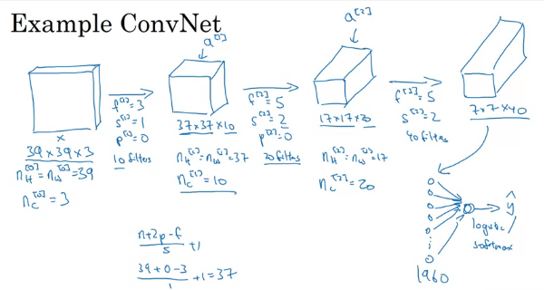
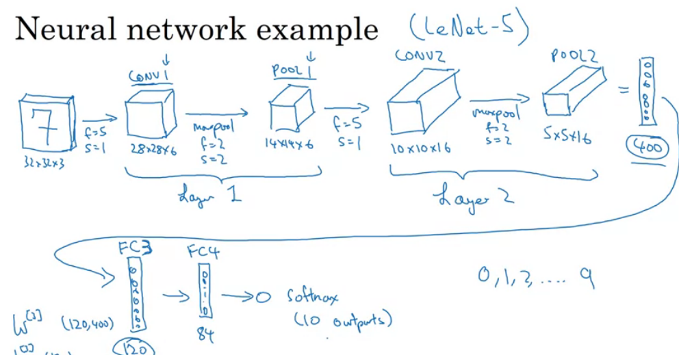
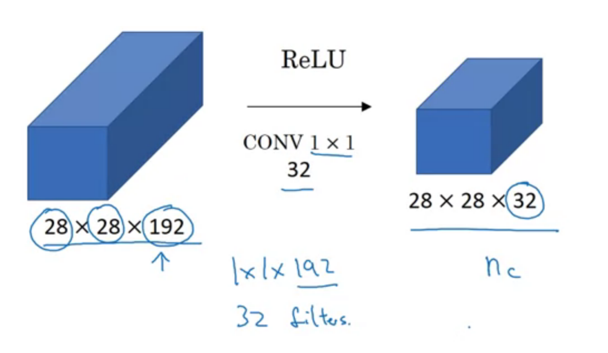

# Convolutional Neural Networks
Course 3 of _Deep Learning AI_ specialisation on Coursera 
Rights and Credits belong Andrew Ng and Course Creators

## Convolutional Neural Networks
### Computer Vision
Computer Vision(CV) has advanced rapidly due to deep learning:
- unlock door or phone with facial recongnition
- self-driving cars

Computer Vision(CV) Problems
- image classification - classify image into a set of classes
- object detection - recongnise object in picture by drawing bounding box
- neural style transfer - repaint content image in style.

Challenges of CV:
- DL on large image is computationaly intensive 
    - input: $3000 \times 3000 \times 3$ fed into dense layer of $1000$ units will
        result in 3 Billion parameters to fit.

### Convolution
#### Edge Detection
The Most Basic Problem in CV is edge detection which is done with convolution
operation

Problem Example: Vertical Edge Detection
-  image 
- convolve (apply convolution) with a  vertical edge detection filter

    1. Slide filter over the image, for each position:
    2. Multiply image covered by filter with corresponding
    3. Save resulting value as result
- results with a  resulting matrix with vertical edge

> In mathematics, convolution operation is represented by the  operator
> Also, convolution in mathematics requires the filter be transposed before 
> convolution.
> Convolution in CV, ML is akin to cross corelation in mathematics

#### Convolution Filters
Common Filters:
- vertical edge filter:

- horizontal edge filter:

- Sobel filter:

- Scharr filter:

> Instead of hand coding the filters we can use backprop to train the filters
> (ie treat the filter as weights)

#### Padding for Convolution
Using padding with convolution:
- Convolution of input image of dim  using a filter of 
results a reduced size image of 
- pad the input image with zeros to give an output result of the same size as input

Padding modes:
- same padding - pads the input image such that the output size is the same as 
    input size
- valid padding - no padding is added, ouput size is reduce

#### Strided Convolution
Strided Convolution allows you to control no. of strides/steps taken when sliding
over the image.
-  image padded with padding  convolved with stride  on filter 
    result image of size: $(\frac{n+2p-f}{s} + 1) \times (\frac{n+2p-f}{s} + 1)$

#### Convolution over Volumes
To apply convolution over 3 dim volumes with  (ie RGB image) 
- use a 3 dim filter of  where  dim matches with input  dim
- slide filter over image and apply convolution as usual (multiply corresponding values and sum

#### Multiple Filter 
When applying convolution with multiple filters, the resulting output would
be the result of convolving with each filter stacked together:
- input of  convolved with  filters results in an 
    output of dim $(n-f+1) \times (n-f+1) \times n_f$

### Convolution Neural Network
#### Notation
Notation used when describing a CNN:
- where  is a convolution layer in a CN

| Notation | Description |
| --- | --- |
|  | Filter size used in convolution |
|  | Padding used before convolution |
|  | Stride used in convolution|
|  | No. of filters used in convolution|

A  input will produce a 
-  output
- where  and  is derived by:
    - $$ n_H^{[l]} = \frac{n_H^{[l-1]} + 2p^{[l]} - f^{[l]}}{s^{[l]}} +1 $$
    - $$ n_W^{[l]} = \frac{n_W^{[l-1]} + 2p^{[l]} - f^{[l]}}{s^{[l]}} +1 $$

Each filter has a dimensions/shape: 
- since we have  filters the weight  of the convolution layer is 
    $f^{[l]} \times f^{[l]} \times n_C^{[l-1]} \times n_C^{[l]}$
- dimensions of the bias: 

#### Single Layer 

Flow of a single convolution layer in a CNN:
- Apply convolution with one or more layers with filters
- Apply bias and activation function to the output of convolution 
- Stack the resulting feature maps to produce output

> If we have 10x of 3 by 3 by 3 filters, we would have 280 parameters.
> Notice that the no. of parameters is not affected by the input size.
> (ie same parameters works for large images and tiny images without alteration)

#### Multiple Layers

Example of Convolution neural network is stacking together by the following:
- convolution layer(s) to perform convolution:
    - first convolution layer convolves the input to 37 by 37 by 10 feature map
    - second convolution layer convolves feature map to 17 by 17 by 20 feature map 
    - third convolution layer convolves feature map to 7 by 7 by 40 feature map fa
- flatten layer flattens the feature map a 1960 long vector
- dense/fully connected layer(s) to perform regression/classification on vector.

#### Pooling Layers
Pooling Layers allow us to reduce the size of the feature map when passing through
a CNN to reduce training.
- pooling layers have no parameters of their own and do not require training.

Types of pooling layers:
| Pooling | Description | Diagram | 
| --- | --- | --- | --- |
| Max Pooling | Pools by convolving and applying max over each square area of the feature map |  |
| Average Pooling | Pools by convolving and applying average over each square area of the feature map |   |

> Intution for max pooling: preserves the maxmimum feature which is typically the
> most relevant.  
> Max pooling is more used then average pooling.

Hyperparameters for pooling: 
- Filter size  used for filter when pooling
- stride  when pooling.

> When , pooling reduces a input of size  to 
> (ie by half)

### CNN Architecture
Example of CNN ala LeNet-5:

Conventions in CNN:
- as we go deeper, the spatial dimensions of the feature map (width and height) 
    decreases, while the depth increases.
- as we go deeper, the no. of parameters per layer increases

### Advantages of Convolution
Why convolutions work?
- parameter sharing - convolution shares parameters across entire image 
    (ie a learnt edge detector is shared accross the entire image)
- sparsity of connections - for each layer each output values only a small no. of input values.

Advantages
- less parameters, less data required for training, faster training time
- translation invariance - image translated(shifted) should give the same result.

## More CNNs
### CNN Case Studies
Case Studies - great way to learn how to build CNNs

#### Classic Networks
Classic Networks
- LeNet-5 - hand written digits classification
  - the size of the image/feature map decreases, while channels increases
    as it passes through the network
  - Conv-Pool-Conv-Pool pattern with two dense layers afterwards

- AlexNet - Imagenet
  - simliar to LeNet-5, although differs in no. of parameters, ReLU, MaxPooling

- VGG - Imagenet
  - Conv-Conv-Pool pattern with two dense layers afterwards

#### Recent Networks/Methods
##### ResNets
ResNets are networks built from residual blocks

Residual blocks are layers of NNs with short cuts/skip connections:
- provides a path from the start of the block skip layers of the block
- this combats the vanishing gradient problem allowing very deep NNs to be built

Mathematically, Activation  of the residual block is derieved from:
- the input of the residual block  
- the activation of the previous layer :

> Why do ResNets work:  identity function (copying the input) is easy to learn 
> - more layers does not hurt performance

##### One by One convolutions
One by One convolution/network in network is performing convolution using a 1x1 filter:

> This akin to having a dense layer within the network. Each element
> of the filter is like a fully connect unit Taking inputs from each 
> channel column.

Applications of One by One convolutions:
- shrink the channel dimensions (ie from 192 to 32)

- add nonlinearity to the neural network - learns more complex functions

##### Inception Network
Inception Networks are made of Inception Modules:

> The branches/arms of the network are dense/softmax layers which perform 
> predictions. This ensures that the features learnt in the hidden layer are 
> at least somewhat useful to the task at hand.

---
Inception Modules are drived from two ideas: Inception Blocks and Bottleneck Layers

Inception Block applys convolutions of various filter sizes/pooling techniques:
- allows the network to which filter size/pooling to use
- addresses the problem of having to choose filter size/where to put pooling

Bottleneck Layer applies a one by one convolution to reduce computation cost:
- by reducing the number of channels one can reduce the operations done by convolution

> Bottleneck Layers when used within reason, should not hurt modeling performance

---

Walkthrough of the Inception Module:
- obtain input as the activation of the previous module/layer
- pass through  of the inception Module
  1. one by one convolution shrinking no. of channels from 192 to 64
  2. one by one convolution shrinking no. of channels to 96 followed by 3 by 3 convolution
  3. one by one convolution shrinking no. of channels to 32 followed by 5 by 5 convolution
  4. max pool with a 3 by 3 filter (stride 1) and a one by one convolutions shrinking no. of channels to 32 
- concatenate the outputs of each branch by the channel

## Practical Advice on CNN
### Practical Advice on using CNNs
Practical Advice on using CNN:
1. use open source implementations if possible
    - less hyperparameters to tune (ie learning rate/decay etc.)
    - pretrained models reduce training time significantly
2. Use transfer learning:
    - use pretrained layers as feature extraction 
      - precompute activation with pretrained layers and use as input
      - freeze pretrained layers and train last few layers
    - fine tune pretrained models to your application 
      - unfreeze after some training abit to fine tune the other layers to your application
    - retrain everything - when you have alot of data
3. Data Argumentation - augment data to generate more data
    - Mirroring - flip horizontally/vertical
    - Random Cropping - randomly crop the image (reasonablely large subset of he image)
    - Color Shifting - randomly admend the RGB channels with some offset (ie PCA color augmentation)
    - Rotation
    - Shearing
    - Color Wraping

> 
> Implement data augmentation as a parallel/concurrent process to the training
> process, performing data augmentation on the fly

### Data vs Hand Engineering
Sources of knowledge in ML:
- data - information learnt from data
- hand engineering - manual feature engineering/specialised network architecture etc.

Tradeoff between data and hand engineering 
- more data: less hand engineering required to obtain performance
- less data: more hand engineering required to obtain performance

### Benchmarks/Winning Competitions
Tips on Benchmarks/Winning Competitions (dont use in production):
- ensembling - train models indepedently and average their outputs
- multi-crop - run model on multiple version of the image and average results

