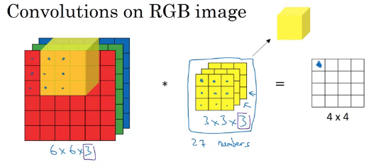
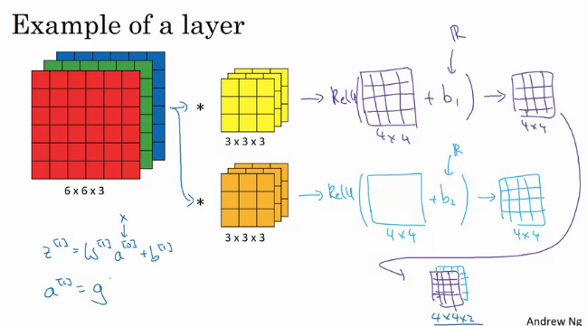

# Convolutional Neural Networks
Course 3 of _Deep Learning AI_ specialisation on Coursera 
Rights and Credits belong Andrew Ng and Course Creators

## Convolutional Neural Networks
### Computer Vision
Computer Vision(CV) has advanced rapidly due to deep learning:
- unlock door or phone with facial recongnition
- self-driving cars

Computer Vision(CV) Problems
- image classification - classify image into a set of classes
- object detection - recongnise object in picture by drawing bounding box
- neural style transfer - repaint content image in style.

Challenges of CV:
- DL on large image is computationaly intensive 
    - input: $3000 \times 3000 \times 3$ fed into dense layer of $1000$ units will
        result in 3 Billion parameters to fit.

### Convolution
#### Edge Detection
The Most Basic Problem in CV is edge detection which is done with convolution
operation

Problem Example: Vertical Edge Detection
-  image 
- convolve (apply convolution) with a  vertical edge detection filter

    1. Slide filter over the image, for each position:
    2. Multiply image covered by filter with corresponding
    3. Save resulting value as result
- results with a  resulting matrix with vertical edge

> In mathematics, convolution operation is represented by the  operator
> Also, convolution in mathematics requires the filter be transposed before 
> convolution.
> Convolution in CV, ML is akin to cross corelation in mathematics

#### Convolution Filters
Common Filters:
- vertical edge filter:

- horizontal edge filter:

- Sobel filter:

- Scharr filter:

> Instead of hand coding the filters we can use backprop to train the filters
> (ie treat the filter as weights)

#### Padding for Convolution
Using padding with convolution:
- Convolution of input image of dim  using a filter of 
results a reduced size image of 
- pad the input image with zeros to give an output result of the same size as input

Padding modes:
- same padding - pads the input image such that the output size is the same as 
    input size
- valid padding - no padding is added, output size is reduce

#### Strided Convolution
Strided Convolution allows you to control no. of strides/steps taken when sliding
over the image.
-  image padded with padding  convolved with stride  on filter 
    result image of size: $(\frac{n+2p-f}{s} + 1) \times (\frac{n+2p-f}{s} + 1)$

#### Convolution over Volumes
To apply convolution over 3 dim volumes with  (ie RGB image) 
- use a 3 dim filter of  where  dim matches with input  dim
- slide filter over image and apply convolution as usual (multiply corresponding values and sum

#### Multiple Filter 
When applying convolution with multiple filters, the resulting output would
be the result of convolving with each filter stacked together:
- input of  convolved with  filters results in an output of dim 

## Convolution Neural Network in Detail
#### Notations
Notation used when describing a CNN:
- where  is a convolution layer in a CN

| Notation | Description |
| --- | --- |
|  | Filter size used in convolution |
|  | Padding used before convolution |
|  | Stride used in convolution|
|  | No. of filters used in convolution|

A  input will produce a 
-  output
- where  and  is derived by:
    - $n_H^{[l]} = \frac{n_H^{[l-1]} + 2p^{[l]} - f^{[l]}}{s^{[l]}} +1$
    - $n_W^{[l]} = \frac{n_W^{[l-1]} + 2p^{[l]} - f^{[l]}}{s^{[l]}} +1$

Each filter has a dimensions/shape: 
- since we have  filters the weight  of the convolution layer is 
- dimensions of the bias: 

#### Single Layer 

Flow of a single convolution layer in a CNN:
- Apply convolution with one or more layers with filters
- Apply bias and activation function to the output of convolution 
- Stack the resulting feature maps to produce output

> If we have 10x of 3 by 3 by 3 filters, we would have 280 parameters.
> Notice that the no. of parameters is not affected by the input size.
> (ie same parameters works for large images and tiny images without alteration)

#### Multiple Layers

Example of Convolution neural network is stacking together by the following:
- convolution layer(s) to perform convolution:
    - first convolution layer convolves the input to 37 by 37 by 10 feature map
    - second convolution layer convolves feature map to 17 by 17 by 20 feature map 
    - third convolution layer convolves feature map to 7 by 7 by 40 feature map fa
- flatten layer flattens the feature map a 1960 long vector
- dense/fully connected layer(s) to perform regression/classification on vector.

#### Pooling Layers
Pooling Layers allow us to reduce the size of the feature map when passing through
a CNN to reduce training.
- pooling layers have no parameters of their own and do not require training.

Types of pooling layers:

| Pooling | Description | Diagram | 
| --- | --- | --- | 
| Max Pooling | Pools by convolving and applying max over each square area of the feature map |  |
| Average Pooling | Pools by convolving and applying average over each square area of the feature map |   |

> Intution for max pooling: preserves the maxmimum feature which is typically the
> most relevant.  
> Max pooling is more used then average pooling.

Hyperparameters for pooling: 
- Filter size  used for filter when pooling
- stride  when pooling.

> When , pooling reduces a input of size  to 
> (ie by half)

### CNN Architecture
Example of CNN ala LeNet-5:

Conventions in CNN:
- as we go deeper, the spatial dimensions of the feature map (width and height) 
    decreases, while the depth increases.
- as we go deeper, the no. of parameters per layer increases

### Advantages of Convolution
Why convolutions work?
- parameter sharing - convolution shares parameters across entire image 
    (ie a learnt edge detector is shared across the entire image)
- sparsity of connections - for each layer each output values only a small no. of input values.

Advantages
- less parameters, less data required for training, faster training time
- translation invariance - image translated(shifted) should give the same result.

## More CNNs
### CNN Case Studies
Case Studies - great way to learn how to build CNNs

#### Classic Networks
Classic Networks
- LeNet-5 - hand written digits classification
  - the size of the image/feature map decreases, while channels increases
    as it passes through the network
  - Conv-Pool-Conv-Pool pattern with two dense layers afterwards

- AlexNet - Imagenet
  - similar to LeNet-5, although differs in no. of parameters, ReLU, MaxPooling

- VGG - Imagenet
  - Conv-Conv-Pool pattern with two dense layers afterwards

#### Recent Networks/Methods
##### ResNets
ResNets are networks built from residual blocks

Residual blocks are layers of NNs with short cuts/skip connections:
- provides a path from the start of the block skip layers of the block
- this combats the vanishing gradient problem allowing very deep NNs to be built

Mathematically, Activation  of the residual block is derieved from:
- the input of the residual block  
- the activation of the previous layer :

> Why do ResNets work:  identity function (copying the input) is easy to learn 
> - more layers does not hurt performance

##### One by One convolutions
One by One convolution/network in network is performing convolution using a 1x1 filter:

> This akin to having a dense layer within the network. Each element
> of the filter is like a fully connect unit Taking inputs from each 
> channel column.

Applications of One by One convolutions:
- shrink the channel dimensions (ie from 192 to 32)

- add nonlinearity to the neural network - learns more complex functions

##### Inception Network
Inception Networks are made of Inception Modules:

> The branches/arms of the network are dense/softmax layers which perform 
> predictions. This ensures that the features learnt in the hidden layer are 
> at least somewhat useful to the task at hand.

---
Inception Modules are drived from two ideas: Inception Blocks and Bottleneck Layers

Inception Block applies convolutions of various filter sizes/pooling techniques:
- allows the network to which filter size/pooling to use
- addresses the problem of having to choose filter size/where to put pooling

Bottleneck Layer applies a one by one convolution to reduce computation cost:
- by reducing the number of channels one can reduce the operations done by convolution

> Bottleneck Layers when used within reason, should not hurt modeling performance

---

Walkthrough of the Inception Module:
- obtain input as the activation of the previous module/layer
- pass through  of the inception Module
  1. one by one convolution shrinking no. of channels from 192 to 64
  2. one by one convolution shrinking no. of channels to 96 followed by 3 by 3 convolution
  3. one by one convolution shrinking no. of channels to 32 followed by 5 by 5 convolution
  4. max pool with a 3 by 3 filter (stride 1) and a one by one convolutions shrinking no. of channels to 32 
- concatenate the outputs of each branch by the channel

## Practical Advice on CNN
### Practical Advice on using CNNs
Practical Advice on using CNN:
1. use open source implementations if possible
    - less hyperparameters to tune (ie learning rate/decay etc.)
    - pretrained models reduce training time significantly
2. Use transfer learning:
    - use pretrained layers as feature extraction 
      - precompute activation with pretrained layers and use as input
      - freeze pretrained layers and train last few layers
    - fine tune pretrained models to your application 
      - unfreeze after some training abit to fine tune the other layers to your application
    - retrain everything - when you have alot of data
3. Data Augumentation - augment data to generate more data
    - Mirroring - flip horizontally/vertical
    - Random Cropping - randomly crop the image (reasonablely large subset of he image)
    - Color Shifting - randomly admend the RGB channels with some offset (ie PCA color augmentation)
    - Rotation
    - Shearing
    - Color Wraping

> 
> Implement data augmentation as a parallel/concurrent process to the training
> process, performing data augmentation on the fly

### Data vs Hand Engineering
Sources of knowledge in ML:
- data - information learnt from data
- hand engineering - manual feature engineering/specialised network architecture etc.

Tradeoff between data and hand engineering 
- more data: less hand engineering required to obtain performance
- less data: more hand engineering required to obtain performance

### Benchmarks/Winning Competitions
Tips on Benchmarks/Winning Competitions (dont use in production):
- ensembling - train models indepedently and average their outputs
- multi-crop - run model on multiple version of the image and average results

## Object Localisation & Detection
Problems in Object Localisation & Detection:
- object classification - what is the object in the image
- object localisation - where the object is in the image
- object detection - tries to classify and localise multiple objects at the sametime.

### Object Localisation 
Defining Object Detection problem:
- predict the class of the object in the image 
- predict the location of the object in the image

Object Localisation - CNN architecture:

Output Layer of the object localisation CNN to predict:
- softmax to predict the probablity of being each  different classes 
- bounding box   to predict location of object in the image

Structure of the output produced by Object Localisation CNN:

>  is used to predict the prob. whether there is an actual object
> of interest in the picture at all in the first place. If  is
> less than some threshold, we discard the rest of the values.

#### Loss for Object Localisation
Objective Loss function for Object Localisation CNN:
- If we are sure there is an object is in the image (ie  is above threshold), 
    we optimise MSE to try to get $\hat{y} \to y$
- Otherwise we only try to optimise logistic loss for  to get 

#### Landmark Detection
Landmarks are points of interest on an image that we want the CNN to detect.
- CNN will output  for each point of interest:

Example: Facial Recongnition:
- points of interest on a persons face - ie the Iris of a person, nose etc.
- output  for each point of interest on the face.

Applications:
- Snapchat filters
- Face ID 
- Pose detection

> Downside: Requires dataset with landmarks labeled, which can be tedious.

### Object Localisation 
Object Detection problem tries to classify and localise multiple objects at the same time.

> Typically classification and localisation focuses on one object, 
> while object detection focuses on multiple objects in the image.

#### Object Localisation CNN
Object Localisation CNN implementation methods:

| Method | Description | Pros | Cons |
| --- | --- | --- | --- |
| Sliding Window |  Train a CNN to classify a closely croped image. Use a _sliding window_ to crop a part of the image to pass for classification with the CNN.  Incrementally increase the size of the sliding window used to crop the image passsed. | Easier to implement. |  Outdated. High Computation cost: More sliding windows of diff size means more accurate predictions but is slow. |
| YOLO | Divide image in to a grid (ie ). Apply CNN to predict bounding box/class label. (more details on YOLO follow.) | Fast. Suitable for real time object detection. | Hard to implement. 
| RCNN | Segments image into region proposal (ie part of image is car, road, etc.). Apply CNN classifier each region proposal. | Segmentation in addition to bounding box. | Hard to implement. Slower compared to YOLO. |

##### YOLO Algorithm
Steps in the YOLO Algorithm:
- Divide the cell into a grid of cells (ie )
- Apply CNN to predict bounding boxes  and class labels (combined into ) \
    for each grid cell $g$
- Apply duplicate suppression (ie IoU, Non max suppression) to remove duplicate predictions.
- Profit.

> 
> Each object in an image is assigned only to cell where its mid point resides,
> even if parts of the image can reside in other cells.

Structure of the output of YOLO: Lumps the output for each  together.
- each grid cell   yields :
-  combined together  for each  cell yields: :

> Lumping the output together is advantageous as it allows us to produce predictions
> for all grid cells  at once, instead of one at a time. This improves computing speed 
> (YOLO works for real time detection).

###### YOLO: Bounding Box Encoding
Bounding box  is encoded in terms of the cell:
-  is the centre of the object encoded as a fraction of the grid cell's dimensions
-  is the size of the object encoded as a fraction of the grid cell's dimensions 
    (can $\gt 1$ if object larger than grid cell.

###### YOLO: Suppressing Bounding Box duplicates
Methods used by YOLO to remove Bounding Box duplicates:
- Intersection over union (**IoU**) over some threshold:  
    - $A_I$ is the area of intersection between the bounding boxes
    - $A_U$ is the area of union between the bounding boxes
- Non max suppression
    - discard bounding boxes with $P_c$ \lt 0.6$
    - select a bounding box $B$ with the highest $P_c$ for prediction
    - discard any other bounding box  with high _IoU_ with $B$

##### YOLO: Anchor boxes

Anchor boxes allow multiple objects within the same grid cell:
- assumption: object within the same grid cell typically have different shapes
- assign an object to an anchorbox if the  is high.
- since each object is assigned to a different (grid, anchorbox) combination,
    muliple objects can be detected per anchorbox.

Structure of the output with anchorbox:

- For each anchorbox , we introduce a new 

##### YOLO: Structure of Outputs

Structure of the output of YOLO
- each (grid cell, anchorbox) combination yields :

-  combined together  for each  cell yields: 
    - $n(y)$ no. of values for each $y$ column vector.
    - $A$ - no. of anchorboxes.
    - $G$ - dimensions of the grid.

## CNN Applications: Facial Recognition
Facial Recognition subproblems:
- face verification - output whether the input image is an image a a certain given person.
- face recognition - output which person the input image is from a database of person images.

> Face recongnition is much more difficul than verification as its the database of person images can be quite large.
> However we can use face verification as a building block to build a face recognition system.

### One Shot Learning
In One Shot Learning, the model has to make predictions train only one data example:
- In the context of facial recongnition, the model has to predict the person given only image of person to learn.

Example: Facial Recongnition system for Employee clock info
Simple but unscalable solution: Build a CNN with a Softmax layer that predicts the probablity of
an image being an certain employee:
- requires the CNN to be retrained when a new employee
- not enough training data to train the CNN is suffcient predictive performance.

Solution: Train a CNN to learn a facial simliarity function  which
represents the degree of difference between images.
-  where  is threshold, output not the same person
-  output the same person

> This allows us to address the one shot learning problem as we don't need
> to need retrain the CNN when we add an employee and only need one image
> of employeee to make recongnition recongnise the employee

### Siamese Network
Siamese Networks use:
- an neural network encoder to convert the input to some embedding representation
- compares the embeddings to make for of prediction.

In the context of our facial recongnition example (DeepFace):
- train a NN to take in an input image  and outputs encoding 

- train NN such that encoding  satisfy the following conditions:
    - for $x^{(i)}$ &amp; $x^{(j)}$ are images of the same person: 
        $(f(x^{(i)}- f(x^{(j)}))^2$ should be small
    - for $x^{(i)}$ &amp; $x^{(j)}$ are images of the same person: 
        $(f(x^{(i)}- f(x^{(j)}))^2$ should be large

#### Cost Objective: Triplet Loss Function
Triplet Loss Function :
- compare a triplet of images
    - one _anchor_, $A$ image
    - one _postive_, $P$ image: same person as the anchor image.
    - one _negative_, $N$ image: different person as the anchor image
-  we want neural network encoding  to converge to:
    - $(f(A) - f(P))^2$ should be small ie distance $d(A, P)$ between positive images
    - $(f(A) - f(N))^2$ should be large ie distance $d(A, N)$ between negative images
- we can combine both objectives as follows:
    - $(f(A) - f(P))^2 - (f(A) - f(N))^2 \lt 0$
- however this allows the CNN to cheat by outputting , hence we add a constant margin 
    - $(f(A) - f(P))^2 - (f(A) - f(N))^2 + \alpha \lt 0$
    - $\alpha$ pushes $d(A,P)$ and $d(A,N)$ away from each other.
- Hence the final Triplet loss function  is defined as:

Gotchas with triplet loss:
- triplets () cannot be chosen randomly
- Choose tripets that are _hard_ to train on which implies:
    $d(A,P) \approx d(A,N)$

> Data size required for training a good images: in the millions

### Facial Reconigtion system
Facial Reconigtion System:
- use encoding CNN  to transform images A, B into encodings
- feed the encoding into a simple model (ie logistic regression) to predict if same person

> One possible optimisation is to precompute the encoding in the database, 
> which can save computation time.

## CNN Applications: Neural Style Transfer
Given a content image  and style image  generate an image  which
combines the content of  and the style :

### What are CNN layers learning
What the hidden units in the hidden layers of the CNN are learning:
- to find this we run the trained hidden unit over the input patches
- select the image patches that maximise the activation value.
- each layer's hidden units learn progressively more complex concepts (ie line  dog)

### Neural Style Transfer Algorithm
Neural Style Transfer Algorithm:
1. Init  to random values
2. Use gradient descent/other optimisation methods to optimise 

### Neural Style: Objective/Cost Function
Objective/Cost Function  measures:
- the match between the content of  and 
- the match between the style of  and 

> By convention of the original paper, the are two hyperparameters:  &amp; 

#### Content Cost/Loss Function
Content cost function  is defined:
- sample  and  from a hidden layer  of pretrained CNN (ie VGG)
    after passing raw images $C$ and $G$ in as input respectively.

Content cost function  is defined:
- sample  and  from a hidden layer  of pretrained CNN (ie VGG)
    after passing raw images $C$ and $G$ in as input respectively.

#### Style Cost/Loss Function
Style cost function  is defined:
- calculate _style_ matrix by correlating feature values across channels for both  and 
- compare the the correations between  to  to compare _style_ via normlise square difference.

Example of intution of how style can be approx. by correlation: Vincent Van Gogh's Stary night
- one channel might detect the swirly curls
- one channel might detect white blue colors
- correlation between the two channel might represents his style of displaying swirls and white/blue colors.

Calculating style matrix  from activation of input  in hidden layer , :

where  &amp;  are different combinations of pairs of different channels.

> Formally  is called unormalised correlation/gram matrix.

Style cost function :

