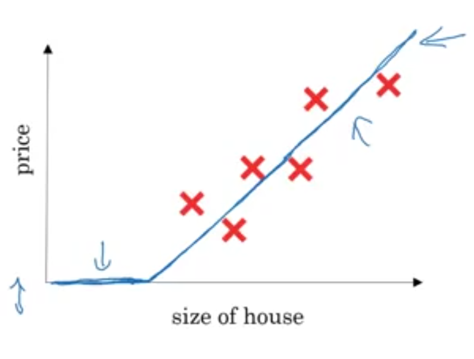
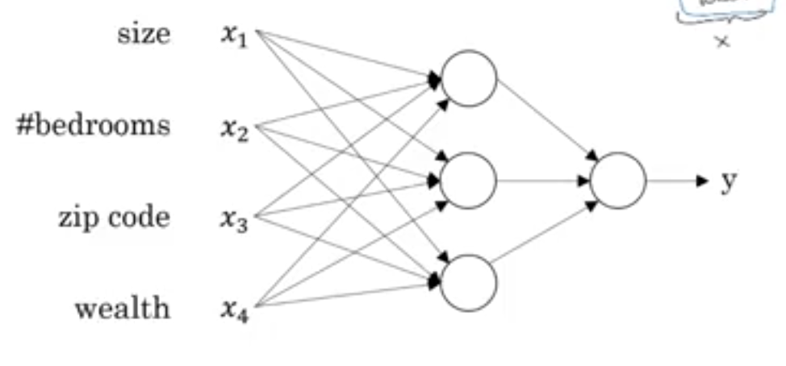
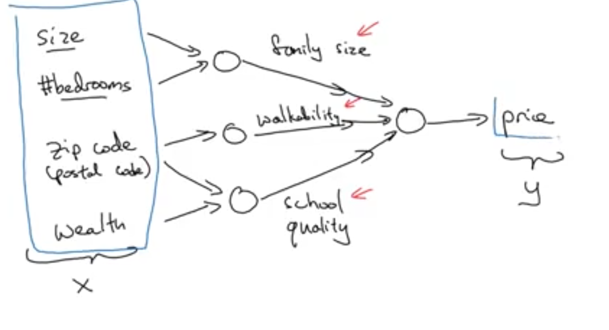

# Neural Network and Deep Learning
notes for deep learning specialisation course 1 - Neural Network and Deep Learning
Rights and Credits belong Andrew Ng and Course Creators

courses of the entire deep learning specialisation:
1. Neural Networks and Deep Learning
2. Improviing Deep Neural Networks: Hyperparameter tuning, regularization and 
    Optimization
3. Structuring your Machine Learning project
4. Convolution Nerual Networks
5. Natural Language Processing: Building Sequence models

## Introduction to Deep Learning
### What is a neural network?
Example: Housing price prediction.

Given the size of the house, we can predict the housing price using a straight line, 
truncates when the prices hits 0 because prices cannot go below zero.

This straight line represents function that is able to predict the price  of the 
house given the size of the house. This hypothesis function can be represented 
by a single **neuron**.

When multiple neurons can connected tother in a network, a neural network is formed.

#### Multiple features
Neural networks can handle multiple features. Continuing the housing price 
prediction example. Instead of just using a single feature, we can use multiple
features about the house, as the number of bedrooms, the zip code, and the wealth 
of the surrounding residents.

#### Auto feature  extraction
Neural networks with hidden units (neurons that are neither part of the input or 
output layer). can also automatically extract composite features from the input 
features.

Continuing the housing price prediction example, the neural network with 2 
hidden units is able to extract better composite features (family size, walkability, 
school quality.) for housing price prediction, achieving better error margins 
    compared to a neural neural network without hidden units.

> In a fully connected neural network, every hidden unit is connected to every
> input feature.

### Supervised Learning with Neural Networks
In Supervised learning, we learn a hypothesis function that takes input x andf
ouputs and predicted output y. 
Examples of supervised learning include:
- Housing price prediction
- Online Advertisting Click Prediction
- Photo tagging
- Speech reconigtiion
- Machine translation
- Speech reconigition

#### Type of Neural Networks
Types of Neural Networks
1. Standard NN
2. Convolutional NN
3. Recurrent NN

#### Types of Data used
Structured data refers to data where each feature is clearly defined.
For example, data obatained from a relational database is considered to be 
structured.

Unstructured data refers to data that do not have clearly defined features,
usch as audio data, image data and text data.

> neural networks learning unstructured data is more exciting (oh look the NN
> can reconigise a cat), but has structured data created more short term economic value.

### what is Deep Learning Taking off?
#### Neural Networks Scale Well
##### Data
Traditional Machine Learning methods do not scale to large amounts of data.

Neural Networks on the other hand are unable to scale and obtain better performance.
As the size of data  grows, we can train larger neural networks to achieve better
performance.

> This does not work for small training sets. Other machine learning methods may
> work better (eg. SVM)

##### Computation
Advances in computation power and training using GPU makes training larger neural
networks practical, resulting in higher model prediciton performance.

##### Algorithms
Better algorithms, better models have emerged from extensive research in recent 
years.

For example, an recent innovation in algorithms is switch from the sigmoid 
activation function to the ReLU function. This improves to performance of the
gradient decent algorithm which is used to train neural network.
