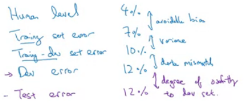
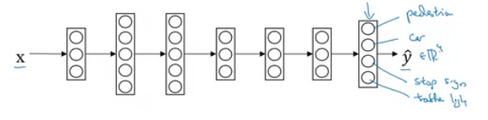

# Structuring ML Projects
Coursera -Deep Learning.AI specialisation - Course 3
Rights and Credits belong Andrew Ng and Course Creators

## Week 1
### Why ML Strategy
Motivating Example: How do we improve our cat classifier?
What should we try?
- collect more data?
- more diverse training set

What hyperparamters should we tune?
- try bigger neural network?
- adjust the learning rate?

ML Strategy tries to provide guidelines on what should we work on next to improve
performance.

### Orthogonalization
Orthogonalization in ML is tuning only the things (ie hyperparamters) that will only
affect one aspect of the produced model to control compexity.

#### Understanding Orthogonalization
Orthogonalization can be better understood in terms of analogies:
- old tvs have knobs that tune only one aspect of the projection( (ie rotation,
   horizontal offset, vertical offset). No knob tunes two aspects of the TV at a time.
- cars have a wheel that controls stearing, a pedal to control acceleration and 
    a pedal to control braking, No controls that controls more than one aspect of 
    movement the car at time.

#### Chain of Assumptions in ML
Chain of Assumptions is built when  when doing supervised ML. At each assumption,
we to tune the model to satisfy the assumption using:
1. fit training set suffciently well using the cost function (ie close to human
    level performance)
    - bigger network
    - train longer 
    - use different optimisation algorithm (ie Adam)
    - tuning learning rate
2. fit dev/valid set suffciently using the cost function (appromately close to training set)
    - regularisation
    - bigger training set
3. fit test set well on cost function
    - change dev/validation set
    - change cost function

> Early Stopping is non-orthogonal as it affects both the training fit and the 
> dev/validation fit at the same time and is thus hard to think about and use.

### Single Real Number Evaluation Metric
Having a Single Real Number Evaluation Metric helps make the iteration process
of ML much faster.

Problem Example: Cat Classifier Evaluation:

| Classifier | Precision | Recall |
| --- | --- | --- |
| A | 95% | 90%  |
| B | 98% | 85% |

Which classifier is better? Hard to tell as there are 2 numbers to consider.

Solution: Combine Precision and Recall with F1 Score (single no. numeric metric):

| Classifier | Precision | Recall | F1 Score |
| --- | --- | --- | --- |
| A | 95% | 90%  | 92.4% |
| B | 98% | 85% | 91.0% |

Now with the single no. evaluation is easy to tell that classifier A is better than B

Another problem: Classifier accuracy separated by geographies (ie US, China, India ...)
Solution: combine accuracies into single real number accuracy by computing accuracy.

### Satisficing and Optimizing Metric
Combine multiple metrics together by having one optimising metric and the rest
as satisficing metric.
- optimising metric - metric that we attempt to maxmimise or maxmimise 
(ie maxmimise accuracy)
- satisficing metric - metric that we attempt to satisfy to a certain threshold 
    (ie runs under running time limit)

Problem Example: We care about both accuracy and running time for our classifier:

| Classifier | Accuracy | Running Time |
| --- | --- | --- |
| A | 90% | 80ms  |
| B | 92% | 95ms |
| C | 95% | 150ms |

Solution: Pick the classifier that maximum accuracy that also satisfies the
the running time limit (ie running time)

### Train/Valid/Test Dataset Distributions
Guidelines for selecting dataset distributions:
1. ensure that dev/validation set and test set should come from the same distribution
    - analogy for different distribution dev and test: aiming for one target and shooting for another.
    - choose a dev/validation set and test set to reflect data you expect to get in the future.
2. allocate enough data into alidation and test sets (ie 10,000 each) to give enough confidence,
    leave the rest to the train set.
    - set test set to big enough give sufficiently high confidence in the overall 
        performance of the system. 
    - in some cases, no test set is okay. However having no test set is not 
        recommended as there is no unbased estimate of actual performance 
> Back in the old days, there was a convention to split the dataset in the
> into 70/30 or 60/20/20. However, with the advant of deep learning and larger
> datasets this convention no longer holds up (ie splits like 98/1/1 exist)

### When to Change Valid, Test sets or Metrics
Define dev/train sets and metrics define the target that you aim at when doing 
ML. Change them when you discover that the target they define do not match up
with what you have in mind.

> Reccomendation: define the valid,test sets and metrics early so iteration
> can begin early, even if they are not perfect.

#### Wrong Metric
Problem Example: Cat Classfier built on classification error:

- algorithm A has 3% error, but lets through pornographic images
- algorithm B has 5% error, no pornographic images are let through.

Pornographic images tarnish the image of the company, and should never be let
though. From this stand point, algorithm is the better algorithm. 
- The metric
    however metric says algorithm A is the better one.
- The metric does not match up with what you expect and should be changed.

Solution: We add weights to  to the metric to ensure that pornographic
errors are weighted 10 times more heavily compared to normal errors.

> Takeaway point: If your not satisfied with the metric, find a metric that
> are more in line with what you want.

#### Orthogonalization in ML revisted
Separate thing to in ML in separate orthogonal steps:
1. Define a metric (fits what you want)  to evaluate classifier.
2. Worry about doing well about metrics.

#### Wrong Valid, Tests sets.
Change your valid, tests sets when you find that doing well on the dev/validation
and test sets do not carry over to real world performance.
- change the valid, tests sets to be more representative of what's "out there".

Problem Example: Cat Classfier trained and validated nicely, but does not perform in the 
real world
- dev/validation and test sets contain high quality images, 
    while real world data by users are low quality

Solution: Change your dev/validation and test sets to be more representative
 of real world data, which is in this case is low quality images.

### Why Human Level Performance
Why compare against human level performance:
- advanced in ML has made human level performance feasible
- ML workflow is more effcient when comparing to human level performance.

Situation: ML algorithms performance increases quickly before reaching human
blow starts to slow down after exceeding human level performance.
- human level performance is sometimes close to bayes error
- certain tools can be used to improve performance

> Bayes error defines the theorically best error the ML model can achieve.

Human Level Error has to be define based on system requirements
- when using human level error as bayes error, use best possible error.

Tools that can be used when below human level performnance:
- get labled data from humans
- gain insight frommnaual error analysis 
- better analysis of bias/variance.

### Avoidable Bias
Human Level Error can be used to determine whether you have a bias or variance
problem.
- avoidable bias is the difference between human level performance and model performnance

Examples:

| Human Error | Training Error | Validation error | Verdict |
| --- | --- | --- | --- |
| 1% | 8% | 10% | Focus on bias as avoidable bias is large |
| 7.5% | 8% | 10% | Focus on variance as avoidable bias |

> For some applications (ie computer vision), human level error can be used 
> as a approximation for bayes error.

### Surpassing Human Level Performance
Without human level error, it is difficult to find the avoidable bias, making
progress is more difficult
- less clear whether there's is a bias or variance problems

Examples of ML models that have surpasses human-level performance
- online advertising
- product recommendations
- logistics
- loan approvals

> Surpassing models typically solve structured problems rather than natural
> perception (ie speech reconigion, image recongition) and are train with 
> alot of data.

### Improving Model Performance
Problems & solutions to improving model performance:
1. Combating Avoidable Bias:
    - train a bigger model
    - training longer
    - better optimization algorithms
    - NN architecture
    - NN hyperparamters
2. Combating Variance:
    - train with more data
    - add regularisation
    - NN architecture
    - NN hyperparamters

## Week 2
### Error Analysis
Conduct error analysis to determine how to improve your ML model:
1. sample a handful (ie 100) examples where the model predicts incorrectly
2. manually analyse the wrong examples to find probable causes (ie model is classifying dogs as cats)

Problem Example: Cat classifier found misclassifing dogs.
- should you spend time making you classifier to do better on dogs?

Solution: Conduct error analysis to determine possible improvement
- find the portion dogs examples with wrong predictions
    - 5% - not work much time
    - 50% - worth time to fix

#### Evaluating Multiple Causes
To evaluate multiple probable cause of poor performance (dog , great cat, instagram images) 
do error analysis on table like this:

| Wrong Example ID | Dog images | Great Cat Images | Blurry Images |
| --- | --- | ---- | --- |
|  1 | | | :heavy_check_mark: | |
|  2 | | :heavy_check_mark: | :heavy_check_mark: | |
| ... | ... | ...  | ... |
| **Total** | 8% | 43% | 61% |

From this example the most promising problem to work on is Blurry Images.

### Incorrect Labels
Conduct error analysis to determine the impact of incorrrectly labled data.

Dealing with incorrect labled data  in:
- training set 
    - deep learning is resilent against random errors. only systematic errors 
        need to be corrected
- dev/test set
    - correct if significantly contributes to dev/validations loss
    - apply the same correction process to the dev/test set to ensure that they
        still both come from the same distribution.

### Build Fast and Iterate
Build a quick and dirty system quickly than iterate:
1. set up dev/validation set and metric
2. build initial system quickly - "quick and dirty"
3. use bias/variance and error analysis to priorities next steps
4. iterate and improve the system.

### Mismatched Data Distributions
Training data is scarce - sometimes we have to draw training data from a different
distribution:
- drawing training data from another distribution is okay
- drawing validation and test sets from the other distribution is bad because
    as it is akin aim for the wrong target

Problem Example: Cat Classfier for Mobile app
- data available: 10k images from Mobile app and 200k images from scraping webpages
- how to distribute the dataset into train/validation/test sets?

Solution: Draw the validation/test sets from the Mobile App distribution as the
ability to classifier mobile app images is what you care about.
- validation set: 2.5k Mobile App, test set: 2.5k Mobile App
- training set: 5k Mobile App images, 200k Web Scrape images

> Always make sure that validation/test set match the data you expect to feed the
> ML algorithm in production.

### Measuring Data Mismatch
Data mismatch will cause some loss in generialisation performance because of the
mismatch between the training and validation data distribution.

Data mismatch can be computed by create and validating on a new training-dev set:
- the training-dev set should draw data from the training set's data distribution
- the error caused by data mismatch is the difference between validation error 
    and training-dev error
- overfitting error is the difference between training error and training-dev error.

### Addressing Data Mismatch
Guidelines for addressing data mismatch:
- conduct manual error analysis to understand the difference between training an 
    dev/test sets
- attempt to make the training more similar
    - artificaly synthesize data similar examples 
        (ie voice in car synthesized with voice and car noise)

> Keep in mind that artificial synthesized examples may cause the model to overfit
> to the synthesized examples as they only cover only a subset of all possible examples

### Transfer Learning
Transfer Learning is the process transferring knowledge trained on one task
(ie image reconigtion) to another task (ie radiology diagram classification)
- training time and data required is significantly less compared training from scratch
- neural network is pretrained on image reconigtion data.
- retrain last layer (little data) and/or fine-tune all layers (much data) to the new task

> Use transfer learning when you have very limited training on your task, but
> have data or pretrained models in a related task

Examples of Transfer Learning:
1. Building Radiology diagram diagnosis from a pretrained image recongition NN
2. Building a wake word detector from a pretrained speech recongition NN

When to use transfer learning:
- both tasks have the same input
- you have significantly more data on the related task than the task at hand
- low level features from related task is useful to learning the task at hand

### Multi-Task Learning 
Multi-Task Learning is the the technique of training a neural network at multiple
tasks simultaneously.

Example: Autonomous Driving system that predicts the presence of pedestrian, car, 
stop sign and traffic light simultaneously.

Solution: Train Neural Network with:
- 4 outputs one for each item to detect (ie pedestrian, car,...)
- each example in dataset is labled with a set 4 labels, one for each item to detect

> Multi-task learning still works when some examples only have a subset of the 
> labels (ie cars are not labeled)

When to use multi-taks learning:
- training on a set of tasks benfit from having shared low level features
- usually the maount of data you have for each task is quite similar
- able to train a suffciently large neural network

### End to End Deep Learning
End to End deep learning attempts the to many discrete ML steps in ML pipelines
with a single end to end neural network

Problem Examples:

| Problem  | ML Pipeline | End to End DL |
| --- | --- | --- |
| Speech Recognition | audio -> features  -> phonemes -> words -> transcript |  audio -> transcript |
| Face Recognition | image -> face crop -> identity | image -> identity |
| Machine Translation | English -> text analysis -> .... -> French | English -> French  |
| Estimate Age from Xray | Image -> Bone -> Bone Length -> Age | Image -> Age |

> The disadvantage of end to end deep learning is large training data requirement.

#### When to use End to End Deep Learning
Pros of End to End DL:
- let the data speak (no preconceptions)
- less hand designing of features are required.

Cons of End to End DL:
- requires need learning eamount of data to train to suffciently high performance
- excludes potential useful hand-designed components

> Hand-designed components help the ML system learn more effectively when training
> on a small dataset

Key Question: Do you have suffcient data to learn a function of the complexity
need to map from input  to output 
- choose the tasks where you can get data for.
