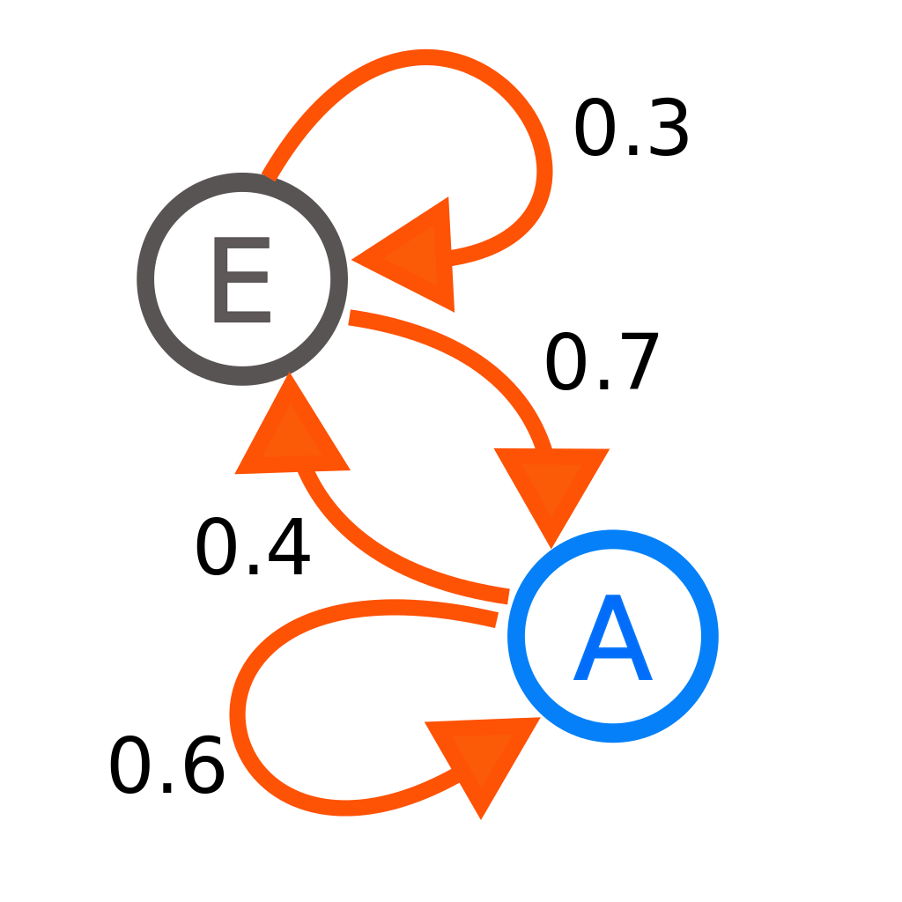

# Reinforcement Learning
Notes heavily derived from [Deep Lizards RL series](https://deeplizard.com/learn/playlist/PLZbbT5o_s2xoWNVdDudn51XM8lOuZ_Njv)
and this [Medium Article](https://towardsdatascience.com/introduction-to-reinforcement-learning-markov-decision-process-44c533ebf8da)

## Introduction to Reinforcement Learning
Reinforcement Learning (RL) is an area of ML that focuses on training an agent 
to take certain actions in a given environment in a way maximises returns.

Intesting Applications of RL:
- AlphaGo - AI Go player that was trained to play the complex game of go.
- OpenAI Five - OpenAI developed five bots to play the game of Dota.

### Terms & Defintion
Terms & Definitions:

| Term | Definition |
| --- | --- |
| Environment | An environment with different actions/rewards in which the agent will interact in. Does not change |
| Agent | The entity that RL attempts to train to make actions that maxmimise rewards |
| State | A specific state of that the environment is in based on the actions of the agent. Changes as the agent makes actions. |
| Reward | Numerical values that the agent recieves upon preforming an action in the environment |
| Return | Culmulative reward attained by the agent making actions in envrionment |

#### Notational Definitions
Notational definitions:

| Symbol | Meaning |
| ---- | ---- |
|  | State of the envrionment at timestep  |
|  | Future state of the envrionment at timestep  |
|  | A states transition model/function that describes how state changes over time.  |
|  | A set of coresponding rewards for each state  |
|  | Returns: Total reward at accumulated or discounted reward accumulated |

### RL Process

Formally, RL attempts to train the agent to make action , given environment
state  and reward , such that it will maxmimise return 

RL Process:
- the agent observes the current state  and selects action 
- the envrionment transitions to new state  and gives reward 
- repeat for the next the timestep 

### Episodic & Continuous Tasks
Episodic RL Tasks 
- tasks that have a defined start and end aka episode (ie a racing game)
- each episode is independent of other episodes

Continuous RL Tasks
- tasks that have no defined end (ie practice & be as good as possible at racing game)

### Returns & Discounted Return
Return  is the expected final returns that an agent attains over all timesteps

> Use plain returns for episodic tasks

---
Discounted Returns  is basically expected returns argumented with discount factor 
:
- exponentially reduces the weight of future rewards.
- use for continous RL tasks

> Given that rewards  are equal to  and   
> then  converges to   
> The discount factor  ensures that continuing task 
> (tasks with no clearly defined end time ) 
> do not have  expected reward, and converges to a finite value

Discounted Returns  can also be presented as recurrence equation:

> Use discounted returns for continous tasks

### Policies
Policies  defines how the agent acts by returning the probability
of taking action  given state :
- the "agent follows the policy", selecting the action based on the 
    probabilities given by the policy

### Value Functions 
Value functions estimate how much return can be expected for the given state 
or state-action pair , ; following policy  thereafter:
> the more the expected return, the more valuable the position

Types of Value Functions:

| Value Function | Description | Formula |
| --- | --- | --- | 
| State-Value Function | State-Value function  estimate return  starting in given state , following policy  thereafter |  |
| Q-Value Action-Value function | Action-Value function   estimates return  starting state  & taking action , following policy  thereafter |  |

> Action-Values for state-action pairs are also known as Q-Values (Q as in Quality)

## Training RL Algorithms
The goal of RL is to find a optimal policy such that the agent following this 
policy would yield the highest return

A policy  is considered better/equal to another policy  when its
expected return is greater or equal then the another policy's expected return,
for all states :

### Optimal Policy/Value Functions
Optimal policy  is the best possible policy , which
would yield the highest return

- optimal state-value value function  of optimal policy  gives
    the highest expected possible return for a given state $s$

- optimal Q-Value/action-value function  of optimal policy  given the
    the highest possible expected return/Q-Value for taking action $a$ in given state $s$

### Bellman Equation/Optimality
Bellman Equation/Optimality states that Q-value/highest possible expected return  of 
taking action  in state , is computed from:
- the expected reward for taking action , 
- the (discounted) Q-Value/highest possible expected return of following optimal policy  thereafter,
  picking best action  such that it maximises ,
  picking action  ... and so on...)

### Q Learning
Q-Learning attempts to derive the optimal Q-Value function  by
iteractively adjusting the Q-Value for each state-action pair 
until it coverges to the correct optimal Q-Value for that state-action 

#### Q-Value Function Representations
Different ways of representing the mapping of the Q-Value function :

| Representations | Description | Suitable Application |
| --- | --- | --- |
| Table | A Table storing the Q-Value for all possible combinations of states and actions | Small no. of combinations state & actions|
| Neural Network(NN) | A NN is trained that takes in input state and value and mapsm it to Q-values | Large no. of combinations of stae & actions |

#### Exploration vs Exploitation
Exploration - randomly selecting actions gather infomation about the environment
- we start with Q-Value function  that is significantlly off from the 
  optimal Q-Value function 
- hence selecting the best possible action (exploitation) based on  is a bad idea
- instead randomly select actions to tune  towards optimal 

Exploitation - selecting the best possible action based on Q-Value function 
- after tuning  sufficently, it converges to optimal Q-Value function 
- now we can exploit the tuned  to choose the (approx.) best action and
    achieve the (approx.) best reward.

Epsilon Greedy Strategy - explore then gradually transition to exploiting
- define a exploration rate  which is probablity of the agent exploring
- start with  and gradually decay/reduce 
- simulate the gradual transition from exploration to exploitation

#### Q Learning Loss
Since Q-Learning attempts to get  to converge to  the loss function of
Q-Learning is simply the difference between  and 

Where
-  can be derieved from the belman equation
-  - total discounted expected future rewards

#### Q Learning Update
Q Learning iteratively tunes  to  by apply the following update:
- find optimal possible Q-value for future states and actions:

> since we don't have , we use  to estimate 

- estimate the optimal Q-value  as the new Q-Value  using the belman equation

> again, since we don't have , we use  to estimate 

- update  with the new Q-value

> learning rate  tunes the rate of which  adapts the new Q-value 
> vs retaining the old Q-value. This is required as  may still not be an
> accurate estimate of  yet, hence the new Q-value may be inaccurate and 
> we use  to reduce their impact.

## Markov Theory
### Markov Property
Markov property states that future states are independent of past states
given the present state which captures all relevant infomation in history.

The present state  only captures all relevant infomation in history when
the following holds:

When the previous property holds, then it follows that the probablity of
transitioning to future state  given current state  is defined as:

When the the probablity of all possible current state transition are collected
together, that is know the state's transition function/model (), which
describes how state transitions over time.

### Markov Processes

> A diagram representing a two-state Markov process. Each number represents the 
> probability of the Markov process transitioning from one state to another state.

Markov Processes/Chains are a bunch of states  with the 
markov property:
- each state  may be mapped to another state  with a probability 
-  defines the probability of the process transitioning to another state 
  given that  be the current state.

### Markov Reward Processes

