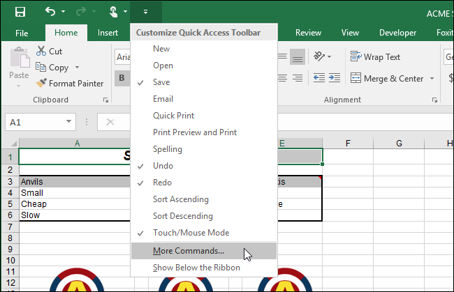
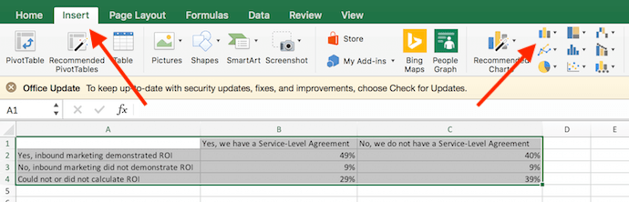
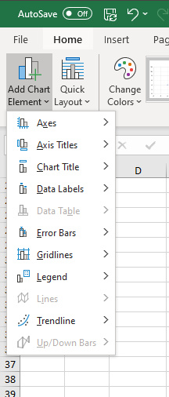
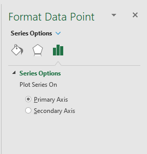
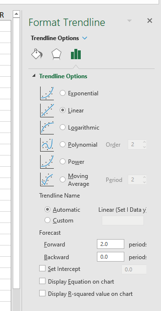

# Microsoft Excel
References this [Video Tutorial on Excel by edureka!](https://www.youtube.com/watch?v=RdTozKPY_OQ) 
and Microsoft Excel documentation.
Rights and Content belong to the respective authors

## Formulas
### Numeric Formulas
List of numeric Excel Formulas:

| Formula | Description |
| --- | --- |
| `SUM(cells)` | Compute the sum of some cells. |
| `SUMIF(condition cells, condition, sum cells)` | Compute the sum of cells where given condition is true |
| `SUMIFS(sum cells, condition cells, condition, condition cells 2,, condition 2,...)` | `SUMIF` with multiple conditions |
| `COUNT(cells)` | Count the number of numeric cells  |
| `COUNTA(cells)` | Count all cells, whether text or numeric |
| `COUNTIF(cells, condition)` | Count the cells where the given condition is true |
| `COUNTIFS(count cells, condition cells, condition, condition cells 2, condition 2,...)` | `COUNTIF` with multiple conditions |
| `AVERAGE(cells)` | Compute the mean of some cells |
| `STDDEV(cells)` | Compute the standard deviation of some cells |
| `ROUND(cell, digits)` | Round the value in cell to digits no. of decimal places |
| `RANDOMBETWEEN(cell 1, cell 2)` | Returns a random integer between the values in cell 1 and 2. |

### Indexing Formulas
List of Excel Formulas:

| Formula | Description |
| --- | --- |
| `INDEX(cells, row, [col])` | Get the value of of the cell indexed by row, col relative to cells |
| `OFFSET(cell, row, [col])` | Get the value of of the cell indexed by row, col relative to cell |
| `MATCH(value, cells, type)` | Get the index where the cell matches the given value |

### Text Formulas
List of Text Excel Formulas:

| Formula | Description |
| --- | --- |
| `TODAY()` | Get the date of the current day. |
| `CONCATENATE(text, text 2, ... text n)` | Concatenate cells as text |
| `LOWER(cell)` | Convert the text in the given cell to lower case. |
| `UPPER(cell)` | Convert the text in the given cell to upper case. |
| `LEFT(cell, characters)` | Extract the first characters no. of characters from the text in the given cell. |
| `RIGHT(cell, characters)` | Extract the last characters no. of characters from the text in the given cell. |
| `LEN(cell)` | Get the no. of characters in the given cell |

### Lookup Formula

## Conditionals
Conditions in excel can be defined using the following
- Operators:

| Operator | Description |
| --- | --- |
| `=` | Check if operands are equal |
| `<>` | Check if operands are not equal |
| `>` | Check if left operand is greater than right operand |
| `>=` | Check if left operand is greater than or equal to right operand |
| `<` | Check if left operand is less than right operand |
| `<=` | Check if left operand is less than equal to right operand |

- Formulas

| Formula | Description |
| --- | --- |
| `IF(condition, true value, false value)` | If condition is true, return true value, otherwise false |
| `IFS(condition, true value, condition 2, true value 2, ...)` | If an condition is true, return its corresponding true value |
| `IFERROR(cell, error value)` | If given cell contains an error, replace with error value |
| `ISNA(cell, error value)` | If given cell contains an N/A, replace with error value. Also used as a catch all for errors in formulas. |
| `OR(condition, condition 2)` | Logical or, false if both are false, otherwise true. |
| `AND(condition, condition 2)` | Logical and, true if both are true, otherwise false. |
| `NOT(condition)` | Logical not, true if condition is false, otherwise true. |
| `EXACT(text 1, text 2)` | Check if both text given are the exactly the same (case sensitive) then returns true,  otherwise returns false. |

> `IF()` can be nested to add addtional conditions similar to `IFS()`: 
> `IF(condition, true value, IF(condition 2, true value 2, IF(...)`

- Membership Checks

| Membership Check | Description |
| --- | --- |
| `ISNA(cell)` | Checks if the value of the cell is N/A |
| `ISNUMBER(cell)` | Check if the value in the cell is a number |
| `ISODD(cell)` | Check if the value in the cell is a odd number |

## Quick Access Toolbar

Customisable toolbar at the top of the excel window that can contain frequent actions.

## Conditional Formatting
A conditional formating  changes the appearance of cells on the basis of conditions that you specify. 

In this case conditional formating is used color the cells based on
tempereture, green to red for low to high tempereture.

### Data Visualisation
Plotting graphs to visualise data in excel

1. Select the cells which contain the data to be plotted
2. Select the type of Chart to be plotted: Insert > Chart Menu on top right

3. Customise the chart by selecting the chart (double click) and customising: 
    - Quick Layout - Choose a preset for quickly plotting the graph.
    - Add Chart Elements - add new elements to the chart:
        - Axis Titles - set a label for each axis
        - Chart Title - set a title for the chart 
        - Data Label - set a label for each data point on the graph
        - Gridlines - customise the gridlines that the chart is plotted on
        - Legend - Add a legend to the chart.
    - Select (Double Click) individual elements in the graph customise them
        in the Format sidebar on the right
        
4. Optional: Add Trendlines to the chart: Add Chart Element > Add Trendine and 
    select the trendline to add (ie linear for straight line)
    - Add R2 value/Equation of trendline by:
        - selecting (double click) the trendline
        - select the graph tab on the format sidebar
        - check Display Equation/Display R Squared value on the chart.
        

