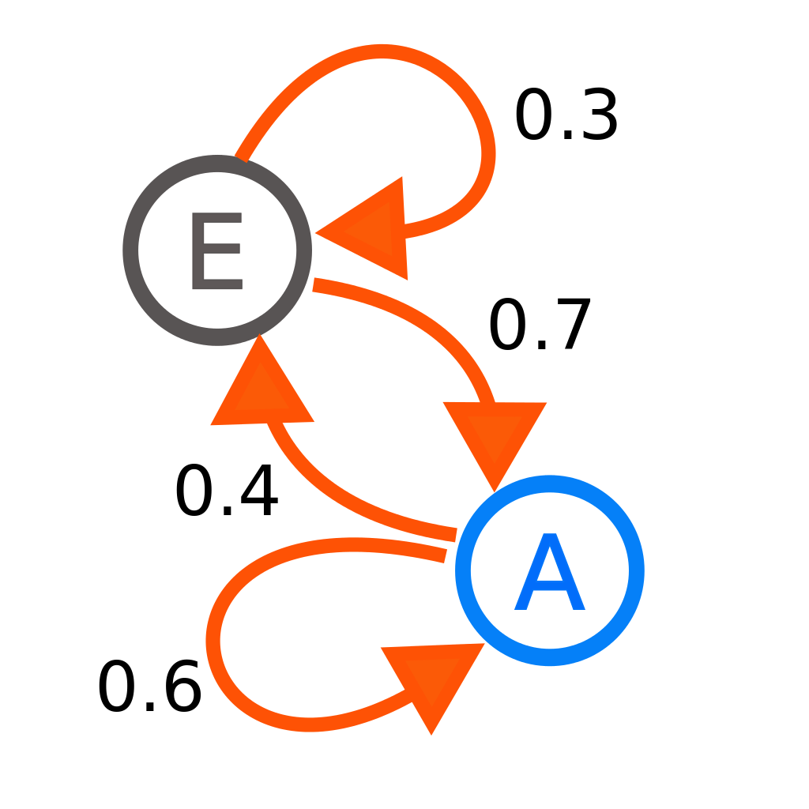

# Reinforcement Learning
Notes heavily derived from [Deep Lizards RL series](https://deeplizard.com/learn/playlist/PLZbbT5o_s2xoWNVdDudn51XM8lOuZ_Njv)

## Reinforcement Learning
Reinforcement Learning (RL) is an area of ML that focuses on training an agent 
to take certain actions in a given environment in a way maximises rewards.

In the context of a playing a game:
- game world is environment
- the scored attained by playing the game is the reward
- the player of the game is agent.
- the moves that player can make in the game is reward.

Intesting Applications of RL:
- AlphaGo - AI Go player that was trained to play the complex game of go.
- OpenAI Five - OpenAI developed five bots to play the game of Dota.

Notational definitions:

| Symbol | Meaning |
| ---- | ---- |
|  | A set of all possible current states at timestep  |
|  | A set of all possible future states at timestep  
|  | One possible state at current timestep   () |
|  | One possible future state at future timestep  () |
|  | A states transition model/function that describes how state changes over time.  |
|  | A set of coresponding rewards for each state  |

## Markov Decision Processes
### Markov Property
Markov property states that future states are independent of past states
given the present state which captures all relevant infomation in history.

The present state  only captures all relevant infomation in history when
the following holds:

When the previous property holds, then it follows that the probablity of
transitioning to future state  given current state  is defined as:

When the the probablity of all possible current state transition are collected
together, that is know the state's transition function/model (), which
describes how state transitions over time.

### Markov Processes

> A diagram representing a two-state Markov process. Each number represents the 
> probability of the Markov process changing from one state to another state.

Markov Processes/Chains are a bunch of states  with the 
markov property. 
- It represented as a set of tuples (, ).

### Rewards & Returns
Markov Reward Processes are Markov Processes with a reward  attached 
to each state :
- when the agent gets to state  it attains the reward 
- It represented as a set of tuples (, , , )

 is a reward function that describes which reward the state is expected to get 
given the current state :

Expected Return  the total expected future rewards to accumulated 
from current timestep  to final timestep 

#### Discounted Return
Discounted Returns  is basically expected returns argumented with discount factor 
:
- exponentially reduces the weight of future rewards.

The discount factor  ensures that continuing task 
(tasks with no clearly defined end time ) 
do not have  expected reward, and converges to a finite value:

Given that rewards  are equal to  and   
then  converges to 

> Discounted Returns  can also be presented as recurrence equation:
> 

### Policies
Policies  defines how the agent acts by returning the probability
of taking action  given state .

The aim of renforcement learning is to find the optimal policy that maxmises
return 

### Value Functions
Value Functions find the value of a given state 

### Belman Equation
TODO: i dont  understand 
Belman Equation.
