# From Nand to Tetris Part I
Part 1 of Build a Modern Computer from First Principles: From Nand to Tetris.
Rights and Credits belong to Noam &amp; Shimon, Course Creators

> `Reading:` sections refer to chapters of the Course's textbook:
> [The Elements of Computing Systems](https://mitpress.mit.edu/books/elements-computing-systems-second-edition)

## Week 1

### Introduction
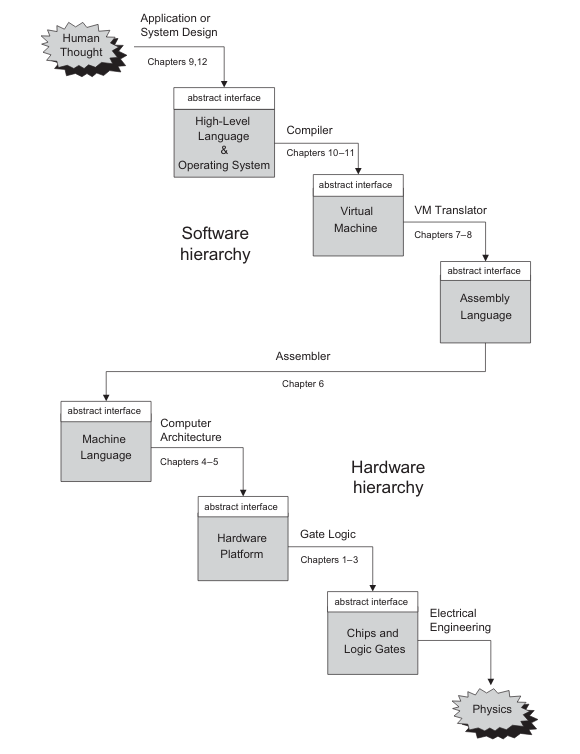

Nand2Tetris Overview: Build complete general purpose computer from the ground up:
- Nand2Tetris Part 1 focuses on **hardware platform** of the computer: Nand gate -> HACK computer.
- Nand2Tetris Part 2 focuses on **software hierarchy** that runs on the hardware platform: HACK computer -> Tetris.

### Abstraction
```
class Main {
    function void main() {
        do Output.printString("Hello World");
        do Output.println(); // New line.
        return;
    }
}
```

Motivating Example: Hello World program taught in introductory programming courses.
- Typically discuss what each line of the code is supposed to do but does not go further.
- To the computer code looks like individual characters that by itself does not mean anything.
- How does the computer figure which pixels to set on display based on characters?
    - Told about compiler, standard library, operating systems (OS) but there
      is no need to understand how they work

Abstraction: Don't worry about the "how", only about the "what":
- what: what is piece of code supposed to do?
- how: how a piece of code is implemented. Could be implemented by someone else or by us earlier/later.
- ie using OS like Windows does not require the user to understand how it works.
- reduces mental load: saves us from having to worrying about everything all at once.

> The Nand2Tetris course applies abstraction:
> - every week targets only a single level of abstraction.
> - take the lower level as given &amp; implement the target level.
> - test that the target level works, we can forget about the target level once it work.
> - rinse repeat until highest level.

### From Nand to HACK
Building the HACK hardware platform:
- Start from Nand Logical Gate
- Use combinational logic to build basic gates from elementary logic gates
- Use combinational/sequential logic to build CPU/RAM/Chipset.
- Combine chips to from HACK computer architecture.
- Write assembler to compile assembly into machine code that runs on the HACK platform.

### Building Hardware
Building a Hardware Platform without physical electronics:
- hardware engineers design chips with hardware simulator programs
- hardware simulator programs allows users to build/test chips virtually.

Building hardware process:
1. Start from chip abstraction/interface defining what the chip has to do.
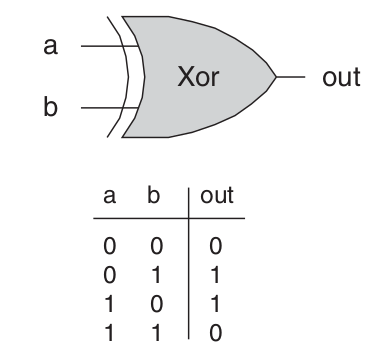

2. Design Chip using Chip diagram using lower level logic gates already built.
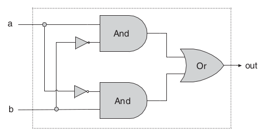

3. Code Chip using Hardware Description Language (HDL) based on design in diagram
    to produce HDL program virtualizing the hardware chip.

```
chip Xor {
    IN a, b;
    OUT out;
    PARTS:
        Not(in=a, out=nota);
        Not(in=b, out=notb);
        And(a=a, b=notb, out=w1);
        And(a=nota, b=b, out=w2);
        Or(a=w1, b=w2, out=out);
}
```

4. Use hardware simulator and test scripts to test that chip works as expected.

### From HACK to Tetris
Building Software Hierarchy that runs on the HACK platform:
- Start from HACK hardware platform and its assembler
- Build Higher Level Programming language that compiles into assembly.
- Build OS and standard library.
- Write Tetris using OS/Standard Library/High Level programming language.

### Boolean Logic
Boolean Values:
- only 2 values - 1/0. Simplest possible to maintain.

#### Basic Operations: AND/OR/NOT
AND operation:
| x | y | AND |
| --- | --- | --- |
| 0 | 0 | 0 |
| 0 | 1 | 0 |
| 1 | 0 | 0 |
| 1 | 1 | 1 |

OR operation:
| x | y | OR |
| --- | --- | --- |
| 0 | 0 | 0 |
| 0 | 1 | 1 |
| 1 | 0 | 1 |
| 1 | 1 | 1 |

NOT operation:
| x | NOT |
| --- | --- |
| 0 | 1 |
| 1 | 0 |


#### Evaluating Boolean Expressions
Evaluate :

<p align="center"></p>

#### Boolean Functions
Boolean functions encapsulate boolean expression **formulas**:
<p align="center"></p>

Boolean functions like  can be represented as **truth table**:

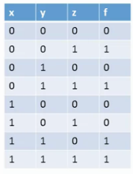

> Both formulas and truth tables are equavilent ways to specify boolean functions

#### Boolean Identities
Boolean Identities:
- Communicative Law:
<p align="center"></p>

- Associative Law: Ordering does not matter
<p align="center"></p>

- Distributive Law: Unpack expressions
<p align="center"></p>

- De Morgan Law:
<p align="center"></p>

### Boolean Function Synthesis
Boolean Function Synthesis: Given a truth table, derive the equavilent boolean expression:


1. For each row of the truth table where the boolean function evaluates to 1:
    - make a boolean expression that evaluates 1 **only** on that row, but 0 in all other rows.

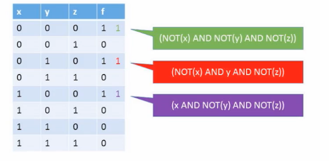

2.  the boolean expressions together to form the equavilent boolean expression.

<p align="center"></p>

3. Use boolean identities to simplify boolean expression.


### NAND
Theorem: Any boolean function can be represented using an expression containing AND/OR/NOT:
- OR can be represented with AND/OR via De Morgan Law:
<p align="center"></p>
- Updated Theorem: Any boolean function can be represented using an expression containing AND/NOT:
<p align="center"></p>
- Updated Theorem: Any boolean function can be represented using an expression containing NAND.
- Proof:
<p align="center"></p>

### Logic Gates
Gate Logic: technique for implementing boolean function using logic gates


**<p align="center">Logic Gate Diagrams</p>**
- Logic Gates: standalone chip that delivers a well defined functionality.
    - Elementary: NAND, AND, OR, NOT, ...
    - Composite: MUX, ADDR, ...

#### Elementary Logic Gates

| Logic Gate | Logic Gate Diagram | Functional Specification | Truth Table |
| --- | --- | --- | --- |
| NAND | 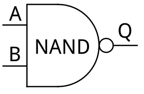 | `if (a == 1 and b == 1) then out=0 else out=1` | 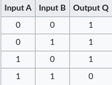 |
| AND | 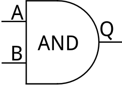 | `if (a == 1 and b == 1) then out=1 else out=0` | 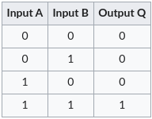 |
| OR | 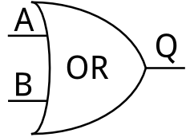 | `if (a == 1 or b == 1) then out=1 else out=0` | 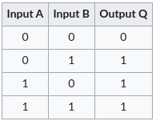 |
| NOT | 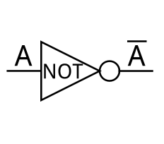 | `if (a == 1) then out=1 else out=0` | 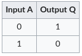 |

#### Composite Logic Gates
Composite Logic Gates: Composed from elementary logic gates.
Example: The composite 3-input AND gate:

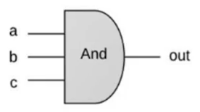

- can be composed of two elementary AND gates:

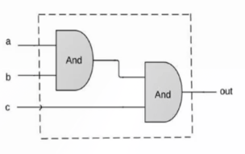

### Interface vs Implementation
Interface - defines what the logic gate/code/software system is supposed to do
Implementation - how the logic/gate/code/software system is implemented
- There might be many possible implementations for a given interface.
- Implementation vary in performance, speed, parts/time/space requirements.

### Hardware Description Language
From Abstraction to HDL/Hardware implementation of chips:
1. Obtain Abstractions/Interface specifying the requirements of chip: Truth Table/Gate Diagram.


2. Define the interface of the Chip:
```
/** Xor gate: out = (a And (Not b)) OR ((Not A) And B) */

CHIP Xor {
    // Xor interface
    IN a, b;
    OUT out;
}
```

3. Synthesize the boolean function equavilent for the Chip using [Boolean Function Synthesis](#boolean-function-synthesis)
4. Write a Implementation Gate Diagram with the implementation of the Chip:
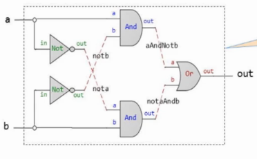
    - Fan out: signals can be distributed to unlimited no. of chips (ie input `a` to `And` &amp; input `a` to `And`)
    - Red connections: Named connections that connect component logic gates together.
5. Implement the Chip using HDL, referencing the Implementation Gate Diagram
```
/** Xor gate: out = (a And (Not b)) OR ((Not A) And B) */

CHIP Xor {
    // Xor interface
    IN a, b;
    OUT out;
    // Xor implementation
    PARTS:
    Not(in=a, out=nota);
    Not(in=a, out=notb);
    And(a=a, b=nota, out=aAndNotb);
    And(a=nota, b=b, out=notaAndb);
    Or(a=aAndNotb, b=notaAndb, out=out);
}
```
> HDL is code and thus maintainable development practices apply.
> Pay attention to indentation/comments/documentation/naming. 
> HDL conventions:
> - Describe the components of the Implementation Gate Implementation in
>   the `PARTS:` section from left to right
> - Use `a, b, ...` as Chip input/argument names, and `out` as chip output name.

HDL in the real world: VHDL, Verilog.

### Hardware Simulation/Testing
Hardware Simulation: Run/Test HDL chips
- Interactive Simulation: Run HDL code on Hardware Simulator to simulate the Hardware Chip.
- Script Based Simulation: Write Test Scripts to unit test the simulated Hardware Chip from HDL.

#### Interactive Simulation/Testing
Interactive Simulation:
- Load the HDL file into the hardware simulator to construct Simulated Hardware Chip
- Set values on the Chip's input pins.
- Evaluate/Simulate the Simulate Hardware Chip.
- Inspect the output/internal pins for expected values to check if the Virtualized Chip is working

#### Script Based Simulation/Testing
Script Based Simulation:
- Automate/Replicate testing by scripting testing steps:
```
load Xor.hdl;

set a 0, set b 0, eval;
set a 0, set b 1, eval;
set a 1, set b 0, eval;
set a 1, set b 1, eval;
```

- Test script can be configured to dump output to file with `output-file`.
  - `output-list` specifies the pins/symbols that will be dumped into the output file.
  - `compare-to` automatically compares output dump to another expected output file, errors if lines do not match.
  - `output` instructs simulator to dump output as configured by `output-file`, `output-list`.
> Behaviour Simulation: Allows high level planning in terms of expected output files before any HDL is written

```
load Xor.hdl,
output-file Xor.out,
compare-to Xor.cmp,
output-list a b out;

set a 0, set b 0, eval, output;
set a 0, set b 1, eval, output;
set a 1, set b 0, eval, output,;
set a 1, set b 1, eval, output;
```

> Test Script Docs can be found in Appendix B of the Textbook (Test Scripting Language)

### Multibit Buses
Buses: Array of bits
- convenient to think of group of bits as single entity, 'bus'.
- HDLs typically provide a convenient notation for dealing with buses

Example: 16-bit buses in 16-bit integer adder:
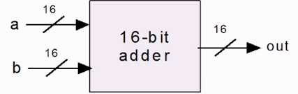.

#### Buses Syntax
In Nand2Tetris HDL buses are represented using array syntax:
- In `IN` &amp; `OUT` sections, `a[16]`  defines a bus `a` of size 16-bits.
- In `PARTS:` section, `a[2]` 0-base indexes the 3rd bit of the `a` bus.
- Input Buses can be assigned to in separate slices.
    - ie `a[0..7]=lsb` assigns lsb bus to the first 8-bits of the `a` 16-bit bus.
    - ie `a[8..15]=lsb` assigns msb bus to the last 8-bits of the `a` 16-bit bus.
- `false`, `true` are synonymous for buses of 0, 1 of any length.

> NOTE: Multi bit buses are indexed from right (least significant bit) to left (most significant bit).

- 16-bit Adder
```
/* Adds two 16-bit values */
CHIP Add16 {
    IN a[16], b[16];
    OUT out[16];

    PARTS:
    // implementation excluded
}
```

- 3 way 16-bit Adder
```
/* Adds three 16-bit value */
CHIP Add3Way16 {
    IN a[16], b[16], c[16];
    OUT out[16];

    PARTS:
        Add16(a=a, b=b, out=aPlusb);
        Add16(a=aPlusb, b=c, out=out);
}
```

- 4 way 4-bit AND
```
/* Performs ANDs between the 4 bits of input */
CHIP Add4Way {
    IN a[4];
    OUT out;

    PARTS:
        AND(a=a[0], b=a[1], out=and01);
        AND(a=and01, b=a[2], out=and012);
        AND(a=and012, b=a[3], out=out);
}
```

- 4-bit Bitwise AND
```
/* Performs 4bit Bitwise AND between inputs */
CHIP And4 {
    IN a[4], b[4];
    OUT out[4];

    PARTS:
        AND(a=a[0], b=a[0], out=out[0]);
        AND(a=a[1], b=a[1], out=out[1]);
        AND(a=a[2], b=a[2], out=out[2]);
        AND(a=a[3], b=a[3], out=out[3]);
}
```

### Mux/Demux
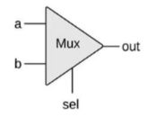

Multiplexor(Mux): If statement in hardware form:
- `sel == 0` output `a`
- `sel == 1` output `b`
- used to make programmable gates like `AndMuxOr` which does `And` or `Or` on its inputs depending on `sel`:
  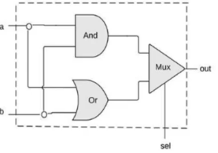

---

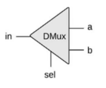

Demultiplexor(Demux): Inverse of Multiplexor, distributes input into multiple destinations.
- `sel == 0` output `in` on `a`output
- `sel == 1` output `in` on `b`output

Application Mux/Demux: Send multiple inputs over single communication line:
- `sel` is connected to an oscillator that alternates between 0/1
- weaves input lines Mux side into single line, unweaves into output line on Demux side.

## Week 2

### Represeting Integers as Binary
Binary Integers:
- Each bit gives 2 possibilities,  binary bits gives  possibilities.
- This allows us to represent numbers between 0 and 
- Representing Integers as binary bits:

| Binary (base-2) | Decimal (base-10) |
| --- | --- |
| 0 | 0 |
| 1 | 1 |
| 10 | 2 |
| 11 | 3 |
| 100 | 4 |
| 101 | 5 |

#### Converting Binary to Decimal
Converting Binary to Decimal Integers:
- given binary Integers :
- decimal equavilent  can be computed by
<p align="center"></p>


Elaboration:
- Recall basic math: Representing `789` in base-10, each position has a power of `10`:
<p align="center"></p>

- Similarly, Converting binary, base-2,`101` back to decimal `5`. Each position has a power of `2`:
<p align="center"></p>


#### Converting Decimal to Binary
Converting Decimal to Binary Integers:
- write the decimal as a sum of powers of two.
- when selecting terms, use the largest power of two such that the sum is smaller/equavilent to the decimal:
<p align="center"></p>

- for each  term, write  in the th position of the binary equavilent
    of the decimal (eg. 8-bit binary integer):

| Position | 8 | 7 | 6 | 5 | 4 | 3 | 2 | 1 |
| --- | --- | --- | --- | --- | --- | --- | --- | --- |
| Binary | 0 | 1 | 0 | 1 | 0 | 1 | 1 | 1 |
|  term | |  | | 2^4 | |  |  |  |

- Binary equavilent of `87` is `0101 0111`

- 99 = 2^6 + 2^5 + 2^2 + 2^1
= 0110 0011

### Binary Addition
Binary Addition:
- subtraction/comparison can be derieved easily from additions.
- multiplication/division can be implemented via software instead of hardware;

Example binary addition:
| Position | 8 | 7 | 6 | 5 | 4 | 3 | 2 | 1 |
| --- | --- | --- | --- | --- | --- | --- | --- | --- |
| Carry |  |  | 1 | 1 | 1 |   |   |   |
| x | 0 | 0 | 0 | 1 | 0 | 1 | 0 | 1 |
| y | 0 | 1 | 0 | 1 | 1 | 1 | 0 | 0 |
| --- | --- | --- | --- | --- | --- | --- | --- | --- |
| Sum | 0 | 1 | 1 | 1 | 0 | 0 | 0 | 1 |

> Overflow: Carry does not fit inside integer bit/word size.
> Typically the carry that exceeds the integer bit/word size is ignored/truncated.

#### Adder
Building an Adder: Hardware Chip that performs Binary Addition
1. Half Adder: Adds two bits
1. Full Adder: Adds three bits
1. Adder: Adds two numbers

##### Half Adder
Half Adder Performs a scoped down version of binary addition:
- :warning: condition: `carry` must be 0 before adding with half adder.
- input pins: `a` &amp; `b`
- output pins: `carry` &amp; `sum`

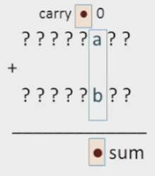

Truth table:

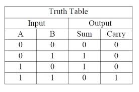

##### Full Adder
Full Adder removes the limitation of `carry` being 0:
- input pins: `a` &amp; `b` &amp; `c`
- output pins: `carry` &amp; `sum`

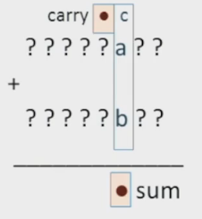

Truth table:


##### Multi-bit Adder
Multi-bit adder performs binary addition with multi-bit binary integers:
- Use Full Adder to add bits step by step from least significant/rightmost bit to most significant/leftmost bit:

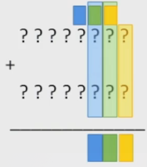

### Negative Integers
Representing Negative numbers:
- Signed bit
- 2's complmement

#### Signed Bit
Signed Bit representation for negative numbers:
- To represent negative Integers, 1 extra bit is consumed for the sign:
- 16-bit integer: 1 bit for sign, 15-bits to represent actual number
- typically most significant bit (leftmost) is used as sign bit.

Cons:
- `-0` can be represented even thou `0` and `-0` should be the same.
- implementation needs to deal with different cases

> :warning: Inelegant solution that is no longer used in the industry

#### 2's Complement
2's Complement representation for negative numbers:
- Represent negative integer  with using ,
    - where $N$ is number of bits in the integer, $x$ is the positive equavilent of the negative integer.
- Positive integers exists in range 
- Negative integers exists in range 

> Addition of negative integers using 2's Complement works out of the box:
> -  eg. -2 + -3 is equavilent to adding 14 + 13 with our multi-bit adder:
> - 1110 (14) + 1101 (13) = 11011 (27)
> - Since the  leftmost most significant bit truncated due to overflow:
> - 1110 (14) + 1101 (13) = 1011 (11)
> - 1011 in 2's Complement represent is equavilent to -5 which is exactly what we want.
>
> This works as both the representation (2's complement) is  and
> the addition (done by the adder) is also .

##### Negation
Negation: Given  compute :
- Using 2's complement representation: 
-  can be rexpressed as :
    - $(2^N-1)$ has a nice property of being composed of all 1s in binary form.
    - Means $(2^N-1) - x$ can be easily implemented with `XOR` binary operation.

##### Subtraction
Subtraction: Simply add the negation/negative equavilent eg:
- we can implement subtraction using our adder chip:
<p align="center"></p>

### Arithematic Logic Unit (ALU)
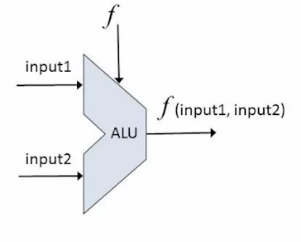

Arithematic Logic Unit (ALU):
- part of the CPU.
- takes in 2 inputs and a  function
- performs  on the given 2 inputs and returns as output.

 function is derieved from a family pre-defined arithmetic functions:
- arithmetic operations: integer addition, multiplication, division.
- logical operations: AND, OR, XOR

> Some operations can be implemented at the software layer instead.

#### Hack ALU
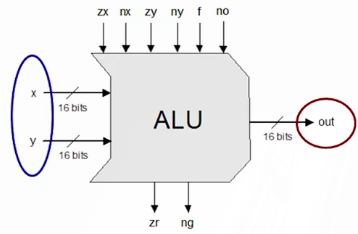

Hack ALU - ALU used in the Nand2Tetris project:
- takes in two 16-bit, two's complement input values.
- outputs one 16-bit, two's complement output value
- control pins: (`zx`, `nx`, `zy`, `ny`, `f`, `no`) select which 
    out of the 18 builtin functions to run on the input values.
- control outputs (`zr`, `ng`): Metadata about `out` output:
    - `zr`: output `out` is zero.
    - `ng`: output `out` is negative (zero is **not negative**).

##### Control Pins
Control Pins:
- Effects are applied sequentially (ie if both `zx`/`nx` are set,
    input `x` is first zeroed, then bitwise NOT).

| Pin | Description | Effect |
| --- | --- | --- |
| `zx` | Zeros the `x` input | `x=0` |
| `nx` | Bitwise NOT the `x` input | `!x` |
| `zy` | Zeros the `y` input | `y=0` |
| `ny` | Bitwise NOT the `y` input | `!y` |
| `f` | Selects between adder (`f=1`)/Bitwise AND (`f=0`) | `if f then x+y else x&y` |
| `no` | Bitwise NOT the output `o` | `!o` |
Control Pin Truth Table:

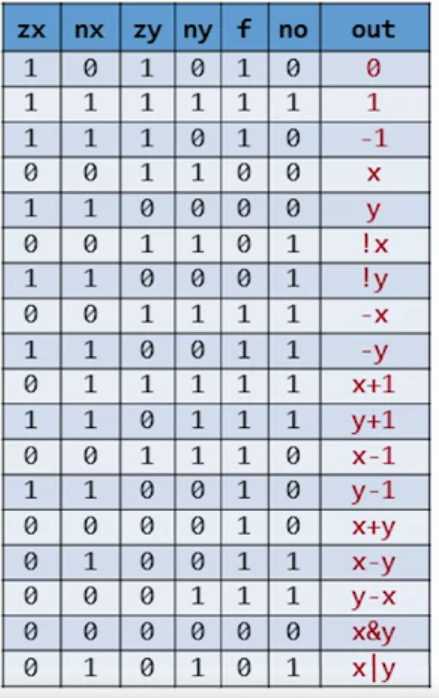

## Week 3

### Sequential Logic
#### Combinatorial Logic
Combinatorial "Functional" Logic:
- ignores notion of time.
- inputs are fixed and unchanging.
- outputs are a function of input &amp; computed instantly.

> So for we have used Combinatorial Logic only when implementing hardware chips

#### Time
Applications of tracking Time:
- use the same hardware over time: change inputs to compute something else.
- remember state: values from a point in time from the past. ie memory/counters.
- deal to speed: ensure that we don't compute faster than the hardware allows.

> Physical Time: Continuous infinitely divisiable flow of time. Hard to think about.
> Discrete Time: Time broken down into distinct points in time.

#### Clock
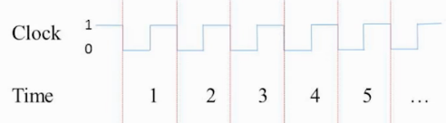

Clock: breaks down physical time into discrete time.
- breaks down countinuous time into units of time (`t=1`, `t=2`, ..., `t=n`).
- implemented via a oscillator going up and down at a fixed rate.
- assume that nothing else happens during within each unit of time.
    - eg. NOT gate can have an input at some time `t=s`, computes output immediately still at `t=s`
    - abstracts the eletrical delay away by assuming that change happens instantly in the time unit.

##### Electrical Delays
In reality, electrical signals do not change instantanously, voltage may take time to build.
- The clock abstracts the delay away by assuming that change happens instantly in the time unit.
- As long as clock cycle is not too fast, the eletrical signal should reach its final state by the end of the time unit.

Example of eletrical delay in NOT gate, gray part is ignored by clock cycle:  
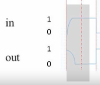


#### Sequential vs Combinatorial Logic
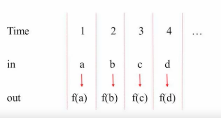

Combinatorial Logic: 
- output of time  depends solely from inputs  in the same time 


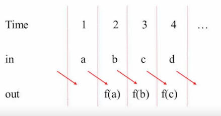

Sequential Logic: 
- output of time  depends solely from inputs  in the previous time step 


### State
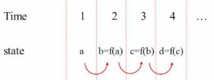

State can be implemented with sequential logic by:
- having the input  and output  by stored at the same hardware address 
- 

#### Remembering State
Remembering State:
- hardware required to remember bits from previous time step  for use at time step .

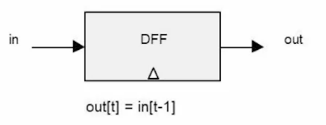

Clocked Data Flip-Flop (D Flip Flop/DFF):
- remembers by storing 1 bit from previous time step as 0 or 1.
- can retrieved stored bit from  in current time unit .

> The White Triangle in the chip diagram signifies that the chip stores state within.
> D Flip Flop are given as primitive chips in the course.

#### Implementing Sequential Logic
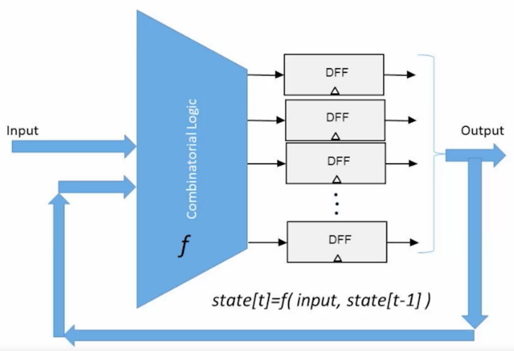

Implementing Sequential Logic Paradigm:
1. Manipulate bits using Combinatorial Logic
2. Remember bits across time units using DFF.
3. Feed output of DFF together with input to Combinatorial Logic gates.

### Memory Units
Memory:
- stores instructions &amp; data on which the instructions operate on.
- Main/Secondary Memory: RAM/Disk respectively
- Volatile/non-volatile memory: whether the memory is wiped (voltaile) or
    continues to persist when power is removed.

#### Registers
#### 1-bit Register
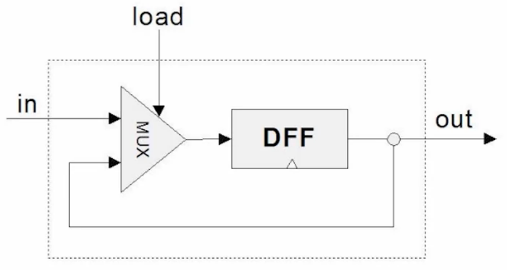

1 bit-Register:
- remember an input bit forever until requested to load new value.
- `load` pin signals to the chip to load the current `in` value.
- the output is only set to loaded `in` value in next time step 
- `if load(t-1) then out(t) = in(t-1) else out(t) = out(t-1)`
- the MUX chip allows the chip to decide whether to keep the previous value
    or load in the new input value

1 bit-Register Waveform:

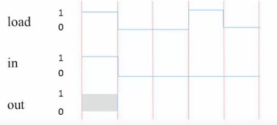

> Hardware Tip: Can be built from DFF and multiplexor.

#### Multibit Registers
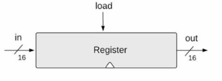

Multibit Register: combines  1-bit registers to store a multibit value:
- word width : no. of bits the register stores ie 16/32/64 bits.
- state: the value currently stored by the register.

Writing a value to the register: set the `in`bus  to value to be stored &amp; set `load` pin to true/1:
- the register's state becomes the value given by `in` bus
- from the next clock cycle onwards: `out` will start to emit the value stored as state.

> Hardware Tip: Can be built from multiple 1 bit registers.

#### RAM Unit
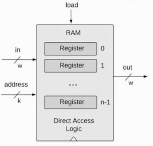

Random Access Memory (RAM) units: combines multiple registers to form memory:
- sequence of  registers, each with unique address from  to .
- only one register in RAM can be selected &amp; used at a point in time/clock cycle.
- select the register to use with address bus  (width of )
- word width : no. of bits the store by each register in RAM

Reading from RAM:
- set  where  is address of the register.
- from the next clock cycle onwards: retrieve stored value form `out` bus of the RAM.

Writing from RAM:
- set  where  is address of the register.
- set `in` bus to the value to be stored the selected RAM register.
- set `load` pin to true/1.
- the selected register's state becomes the value given by `in` bus
- from the next clock cycle onwards: `out` will start to emit the value stored.

> Regardless of RAM size, access from RAM is costs same amount of time for
> any of register in the RAM chip

> Hardware Tip (RAM8): Can be built from multiple multbit registers:
> - feed the in bus to all multibit registers.
> - use mux/demux to select which multibit register to manipulate.

> Hardware Tip (RAM64, RAM512, RAM4K, RAM16K):
> - use smaller RAM chips (starting from RAM8).
> - address input consist of two fields:
>    - first address field selects the specific smaller RAM chip to use.
>    - second address field selects register within the smaller RAM chi
> - use mux/demux to parse &amp; process given addresses.

### Counters
Motivating Example for Counters: Robot baker:
- programmed with set of instructions to bake.
- counter keep track of which instruction the robot is currently executing.
- counter used also be set arbitrary value so that:
    - robot can start baking new bread by resetting the counter.
    - robot can skip instructions (ie preheat oven) that are no longer required.

Program Counter (PC): keep track of which instruction should be fetch and executed:
- reset PC: run from the first instruction
- advance PC: run the next instruction
- jump/goto PC: run arbitrary instruction at position .

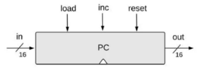

Counter: Hardware chip that implements the PC:
- if `reset` bit is set to true/1: counter's `out` bus should output 0.
- if `load` bit is set to true/1: set counter's internal state to the value given by its `in` bus.
- if `inc` bit is set to true/1: increments the counter's store state value by 1.
- otherwise: do nothing.

> Hardware Tip: Can be built with Register/Incrementer and Logic Gates.

## Week 4

### General Computer
General Computing:
- flexible: can be tasked the same computer to do various different tasks via different software.
- universality: the same hardware can run different software.

> Universal Turing Machine came up with the idea of a General computer while Von Neuman Architecture
> proposed the practical architecture for the practical computer.


#### Store Program Computer
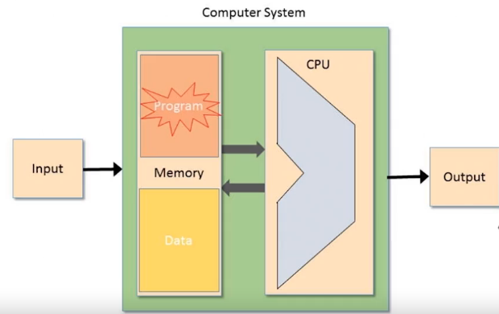

Stored Program Computer:
- stores the software/program stored in RAM.
- while hardware stays the same, software/program can change.
- changing software/program changes the functionality of the computer:

### Machine Language
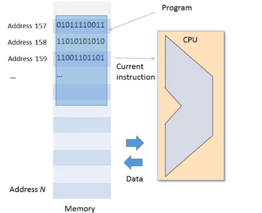

Machine Language:
- interface between hardware/software:
    - typically machine language corresponds 1/1 the underlying hardware.
    - cost-performance tradeoff: complex instructions costs silicon area, more clock cycles needed to complete.
- program is encoded as a series of instructions in the Machine Language in stored in RAM.
- CPU hardware executes Machine Language instructions in RAM one by one.
- different sequences of Machine Language instructions causes the CPU to provide a different functionality.

> High Level programming languages Java/Python compile to machine languages.
> Machine languages are optimized to be executed by the hardware, not to be written by humans.

#### Problem Statement
The Machine Language has to solve the following problems:
- encoding instructions: method of encoding Operations (ie Add) as instructions.
- program counter: keeping track of which instruction we are currently executing.
- addressing: telling the hardware where in RAM to retireve values for performing operations.

#### Memonics
Memonics/Assembly Language:
- hard to interpret Machine Language instructions as binary 
- memonics/Assembly are easier for humans to interpret: `ADD R3 R2`
- assembler: compiles memonics (assembly language) into binary instructions.

#### Symbols
Symbols: Alias/Name for location in memory:
- `ADD 1, Mem[129]` hard for humans to grasp: have to think about memory locations
- using symbols like `index` makes it easier for humans to grasp: `ADD 1, index`
- symbolic assembler can be used to translate symbols to memory locations `index`  `Mem[129]`

#### Operations
Operations in Machine Language:
- Arithmetic Operations: Add/Subtraction etc.
- Boolean/Logical operations: AND/OR/NOT
- Flow control operations: jump to instruction, conditional jump.

Differences in operations:
- Complex, rich operations: ie Division, Memory copy operations
- First class support for data types: floating point computation, 64-bit integers

##### Flow Control
Flow Control: specialised instructions to change execution order:
- CPU executes typically instructions in a sequence.
- `jump` instruction: jumps execution order to an arbitrary location in list of instructions.
    - use to implement loops, `continue`, `break`, `goto`, `return`.
- conditional jump instruction: jump with condition (ie `JGT` jump if greater thanu)
    - use to implement conditional if/else/else if, switch statements.

#### Memory Hierarchy
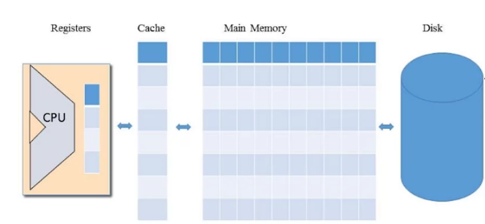

Memory Hierarchy:
- Problem: Accessing memory (RAM/Disk) is expensive:
    - requires the specification of an large address field &amp; pulling memory to CPU incurs a delay.
- Use a series of memory with sizes increasing the further it is from the CPU (Registers, Cache, RAM, Disk):
    - Access from smaller memory is fast as address field is small, access delay is small.
    - Access from larger memory is slower as address field is large, access delay is more significant.

##### Registers
Registers:
- Fastest, Smallest memory residing inside the CPU, built from the fastest memory technology.
- Easily accessed from the CPU with almost no delay.

Uses of Registers:
- Data Registers: use Registers as operands in an operation:
    - ie `Add R1, R2`: Add Register 1 to Register 2
- Address Registers: use Registers to store memory addresses:
    - ie `Store R1, @A`: Store value of Register `R1` into RAM at address given by Register `A`.

##### Memory Addressing
Modes of Memory Addressing/Addressing Modes:

| Addressing Mode | Description | Example |
| --- | --- | --- |
| Register | Address/Interact only with registers | `Add R1, R2`: Add `R2` to `R1` and store the result in `R1` |
| Direct | Direct access to memory | `Add R1, Mem[200]`: Add `Mem[200]` to `R1` and store the result in `R1`|
| Indirect | Access to memory via address stored in register. | `Add R1, @A`: Add the value at the address `A` to `R1` and store the result in `R1` |
| Immediate | Literals encoded in machine code | `Add R1, 73`: Add `73` to `R1` and store the result in `R1` |

#### Input / Output Overview
Input/Output/IO: Keyboard, mouse, display, printer etc.
- drivers: specialised programs that have the protocol know how to interface with IO devices
- one implementation of a driver: memory mapping IO devices:
    - range of memory reserved for interacting with the IO device.
    - ie mouse: mouse position is written in some range of memory, where it can be used by CPU.

### Hack Computer / Machine Language

#### Hack Computer
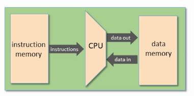

Hack Computer:
- 16-bit computer: stores/retireves/move/manipulates data in chunks of 16-bits.
- Data Memory/RAM: sequence of 16-bit RAM registers storing program/software data.
- Instruction Memory: sequence of 16-bit RAM registers storing program instructions.
- Central Processing Unit(CPU): executes instructions
- 16-bit Buses to move data between the above components (Instruct/Data/Address Bus).

> Hack Program: series of Hack Machine Language instructions that the Hack Computer executes.

#### Hack Computer: Controls
Controls for the Hack Computer:
- Load computer's ROM with Hack Program.
- Push the Reset Button to direct the computer to start executing the program.

#### Hack Computer: Registers
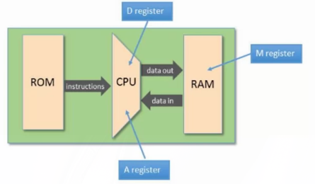

Registers in the Hack Computer:

| Register | Description |
| --- | --- |
| D | Holds 16-bit data value. |
| A | Holds 16-bit data value/memory address. |
| M | Provides the 16-bit value of the RAM register specified by the memory address in A |

#### Hack Machine Language
Hack Machine Language instructions:

| Syntax | Name | Description | Example |
| --- | --- | --- | --- |
| `@a` | A-instruction | `a` must be a non-negative decimal constant/symbol. Sets Register `A` to `a`, selecting the RAM register `RAM[a]` as the current working register, using `a` as a memory address. | `@21`. Sets Register `A` to `21`, selects `RAM[21]` as the working RAM register. |
| `dest = compute ; jump` | C-instruction | Compute the value given by the `compute` expression &amp; stores the result in `dest`. Evaluates the jump condition given by `jump` (ie `JGT`: jump if greater than, `JEQ` jump if equal) and jumps to the instruction given by `ROM[A]` if true. | `M=D-1` Sets `RAM[A]` to the value of register `D-1`. `D-1;JEQ` if `D-1 == 0`, jump to the instruction stored at `ROM[A]`|

##### Hack Machine Language: Binary Syntax

| Symbolic Syntax | Binary Syntax | Binary Description |
| --- | --- | --- |
| `@21` |  | First bit  specifies that this is a A-instruction, the rest of the bits specify the memory address as binary integer |
|op part `dest = compute; jump` |  | First bit  specifies that this is a C-instruction.  bits specify the `compute` part,  bits specify the `dest` part,  specify the `jump` part. |

> The Hack Assembler is responsible for compiling the Hack Instructions in Symbolic Syntax to Binary Syntax, where it can be used by the hardware.

###### Compute(a/c) bits truth table:

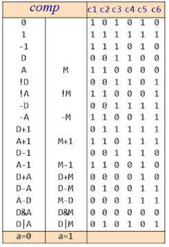

###### Dest(d) bits truth table:

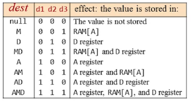

###### Jump(j) bits truth table:

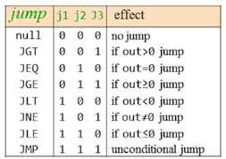

### Input / Output
Input / Output (IO) devices:
- keyboard: allows the user to provide input.
- display/screen: allows the Hack Computer to a Input / Output display graphic representation of data to users.

Talking to IO devices:
- High level approach: Use a library to interact with IO devices.
- Low level approach: Manipulate bits to interact with IO devices.

#### Drawing on Display
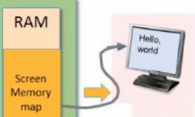

Drawing on the Display:
- Display buffer/screen memory map: area of RAM dedicated to represent pixels on the display.
- Display is constantly refreshed (at the display's refresh rate) with the contents of the display buffer.
- Hack computer has a 256 by 512 B/W display controlled by a 8K RAM display buffer: 1/0 to switch pixels on/off.
- The display buffer can be updated 16-bit at a time as  RAM can only be R/W in 16-bit chunks.
- Each 32 16-bit registers map to one row of pixels on the display:

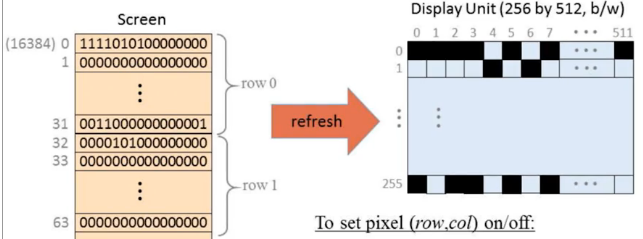

To set the pixel on on row  and column  in the display using display buffer :
1. The 16-bit register to use,  is given by:  
2. Set the  bit in  to 1/0.
3. Rewrite the changed  register to RAM.

#### Obtaining Input from Keyboard
Obtaining Input from Keyboard:
- Keyboard writes to keyboard designated area in RAM, 16-bit keyboard memory map.
- Key presses register in the keyboard memory map via set bits.
    (ie 'space' key press registers as 42 in the keyboard memory map.)
- Check the Keyboard Memory Map/Register for the currently pressed key or check for 0 when no key is pressed.

##### Hack Character Set
Hack Character Set: Key to value in keyboard memory map is given by Hack character set:

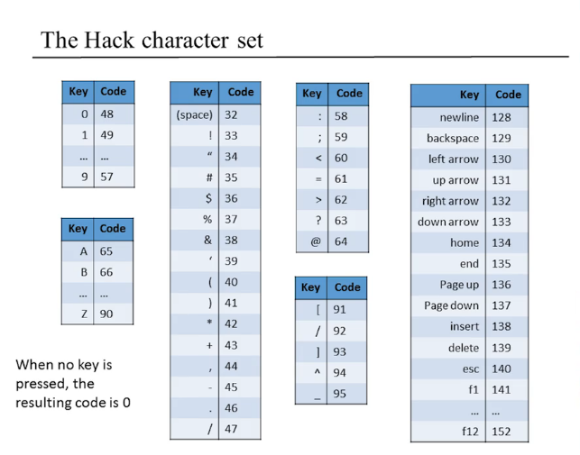


### Hack Programming
> Recap: [Hack Machine Language Instructions](#hack-instructions)

Hack Programming overview: Process of coding in the Hack Machine Language:
1. Design the program using pseudo code.
2. Write the program using Hack Machine Languagee
3. Test the program on paper by tracing execution manually using trace table.

#### Working with Registers and Memory
> Recap [Hack Computer: Registers](#hack-computer%3A-registers)

Examples of Working with Registers and Memory:
- Set Register `D` to `10`:
```
// set Register A to 10
@10
// assign value in Register A to D
D=A
```

- Increment value in `D`:
```
D=D+1
```

- Set value in RAM Register 17 to Register D:
```
// set Register A to 17 to address RAM's Register 17
@16
D=M
```

- Set value of Register D to RAM Register 17:
```
// set Register A to 17 to address RAM's Register 17
@16
M=D
```

- Set value  of RAM register 17 to 10:
```
// set register D to 10
@10
D=A

// set Register A to 17 to address RAM's Register 17
@16
// set RAM register 17 to 10 (via setting to register D)
M=D
```
- Adding RAM Register 1 to RAM Register 2 and setting the result to RAM register 3:
```
// set D to RAM[0]
@0
D=M

// set D to D (previously RAM[0]) + RAM[1]
@1
D=D+M

// set RAM[2] to D
@2
M=D
```

#### Program Termination
Program Termination:
- Without termination, Hack continues to execute instructions on ROM, even if ROM is set to uninitialized garbage, malicious code (NOP slide).
- "Terminate" the program using an infinite loop

```
//... the rest of the code
// set Register A to the last instruction (ie here is 6)
@6
0;JMP // Do nothing, jump to this instruction: causes an infinite loop.
```

#### Builtin Symbols
Builtin Symbols in Hack Machine Language:
- Hack allows an `R` (capitalize) to be prepended to numeric literals: `R0` is `0`, `R1` is `1`, `R2` is `2`, etc...
> Use the `R` versions of numeric literals (ie `R0`) to address registers (ie in RAM) for readablity.

- `SCREEN` equals `16384` and `KBD` equals `24576`, use to address Screen and Keyboard IO devices mapped in RAM.

#### Branching
Branching/Conditionals: Execute based on a boolean condition.
- High Level Languages: if/else/else if statements:
```python
if R0 > 0:
    R1 = 1
else:
    R1 = 0
```
- Hack Machine Language: Use jump instructions to goto branches of the conditional:
```
// read R0 into D register
@R0
D=M

// if RO > 0 goto instruction 8 (@R1)
@8
D;JGT

// else conditional block: set R1 to 0
@R1
M=0
// jump to end of program (0:JMP)
@10
0;JMP

// if conditional block: set R1 to 1
@R1
M=1

// terminate program via infinite loop
@10
0;JMP
```

> Conditional in Hack Machine Language is cryptic, hard to understand and maintain (fix and extend code).
> Which instruction does `@8` or `@10` refer to? Hard for the reader to resolve the correct instruction being jumped to.

##### Branching: Label
Using labels to label instructions for branching:
- use `(LABEL)` to label an instruction, `@LABEL` to reference a labeled instructions.
- labels are compiled into their respective instruction numbers (END=10, IF=8)
- labels do not exist in compiled machine language code.
```
@R0
D=M
@IF
D;JGT
// else conditional block: set R1 to 0
M=0
// jump to end of program (0:JMP)
@END
0;JMP
// if conditional block: set R1 to 1
(IF)
    @R1
    M=1
// terminate program via infinite loop
(END)
@END
0;JMP
```
#### Variables
Variables: store data in a registers specified by a given name:
- auto allocates an available RAM register and assigns it to the given name (ie `counter`):
```
// allocates RAM register under the 'counter' name, assigns value of D to it
@counter
M=D
```
- each reference of the variable `@counter` will refer to allocated RAM register.
- any `@reference` reference that does not reference a label is inferred to reference a variable.

> By using variables the program written is a symbolic program compose of **relocatable code**.
> Relocatable code does not depend on memory addresses an can be load in to any part of memory and run.

#### Iteration
Iteration/Loops:
- Use jump instructions to repeat instructions to create a execution loop.
- Conditional jumps instructions to implement loop exit conditions, break, continue.

Example: Compute :
```
// obtain N from R0
@R0
D=M
// n = N
@n
M=D
// i = 1
@i
M=0
// sum = 0
@sum
M=0

// for(i in 0..(n-1))
(FOR)
    // compute n - i
    @i
    D=M
    @n
    D=D-M
    // if (n - i) > 0, exit the loop
    @STOP
    D;JGT

    // compute sum += i
    @i
    D=M
    @sum
    M=M+D

    // i += 1
    @i
    M=M+1

    // perform next iteration of for loop
    @FOR
    0;JMP

(STOP)
    // copy sum result into R1
    @sum
    D=M
    @R1
    M=D
(END)
    // infinite loop to terminate the program
    @END
    0;JMP
```

#### Pointers
Pointers: Variable/Register storing a memory address that points to data at that memory address.
- To dereference a pointer, set memory address in  register and access value from  register.

Motivating Example: Iterating over arrays requires us to keep track:
- ; the pointer storing the memory address of of the start of array.
- : the variable storing the size of the array.
- : the index of the element currently being processed.

To iterate over the array:
- Use a for loop (see above) to iterate  over 
    1. Set the Register $A$ to point to the memory location of the currently processed element: $A=arr+i$
    ```
    // A = arr + i
    @arr
    D=M
    @i
    A=D+M
    ```
    2. Allowing the current array element to be accessed by Register $M$
    ```
    // M now references the current array element
    // Do something with current array element (M) ...
    ```
    3. Increment $i$ by 1 to process the next element
    ```
    // i++
    @i
    M=M+1
    ```
    4. continue loop.

#### Input / Output Programming
> Recap:
> - [Input / Output](#input-%2F-output)
> - [Builtin Symbols](#builtin-symbols)

Example: Drawing a  by 16 rectangle on the screen:
- drawing display buffer of the screen is akin to iterating an array add manipulating elements
```
// 'addr' points to the current row of pixels in rectangle to draw.
// initialize 'addr' with screen memory address starting point.
@SCREEN
D=A
@addr
M=D


// n = RAM[0]
@R0
D=M
@n
M+D

// i = 0
@i
M=0

(FOR)
    // compute (i-n)
    @i
    D=M
    @n
    D=D-M

    // exit loop if (i-n) >= 0
    @END
    D;JGE

    // draw pixels on the row of pixel
    @addr
    A=M
    M=-1 // -1 equavilent to fully setting every bit in the register to 1

    // i +=1
    @i
    M=M+1

    // advance addr to point at the next row of pixels
    @32
    D=A
    @addr
    M=D+1

    // advance addr to point at the next row of pixels (addr += 32)
    @32
    D=A
    @addr
    M=D+M

    // continue loop
    @LOOP
    0;JMP

// terminate program with infinite loop
(END)
    @END
    0; JMP
```

Keyboard: Use `RAM[KEYBOARD]` register to check for currently pressed key based on truth table.

## Week 5

> Recap: [Stored Program Computer](#store-program-computer)
### Von Neumann Architecture


Buses connect Elements of a Stored Program Computer:
- computer elements connected by buses: ALU, Registers, Program ROM, RAM.
- **data bus**: moves data values (ie numbers for addition) across elements.
- **address bus**: communicates memory addresses to access in RAM, currently executed instruction in ROM.
- **control bus**: instructs each element what to do in this clock cycle.

| Element | Connected Bus(es) | Description |
| --- | --- | --- |
| ALU | Data, Control Buses | The Data Bus provides input values to ALU and pulls result values computed by value. Control bits in the control bus instructs the ALU on what to compute. |
| Registers | Data, Address Bus | Reads input values for storage Data bus, writes stored value into the Data bus. Address Register writes memory addresses into the Address bus. |
| Memory (RAM) | Address, Data, Control Buses | Addressing Memory Access/Storage uses the memory address retrieved from the Address bus. RAM reads/write data values from/to the Data bus depending whether is storing/retrieving values. Instructions of loaded program in ROM are written into the control bus for execution. |

### Fetch Execute Cycle
Fetch Execute Cycle in a CPU:
1. **Fetch** instruction from ROM:
- advance the program counter to the next instruction in ROM.
- get memory address of the instruction from the program counter.
- retrieve the instruction by reading the ROM at the memory address.
2. **Execute** the instruction: instruction code is interpreted and executed by the ALU.
3. rinse &amp; repeat

#### Fetch Execute Clash


Fetch Execute Clash: clash between the Fetch and Execute stages use of memory addressing bus:

- Fetch: Uses memory address to address ROM to fetch instruction for execution
- Execute: Uses memory address to address RAM to fetch data values used in the program

Solution: Do the fetch stage first, then execute stage, one after the other:
- control bus provides a Fetch / Execute bit to control a mutiplexor.
- the multiplexor switches between
    - memory addressing for fetching instructions (using address from program counter)
    - memory addressing for data values in program execution (using address from instruction).

### Hack CPU

Hack CPU: 16-bit processor:
- executes the current instruction &amp; figures out which instruction to execute next.

#### Hack CPU Interface


| Kind | Name | Description | Size |
| --- | --- | --- | --- |
| Input | `inM` | Currently addressed data value from memory. | 16-bit |
| Input | `instruction` | Current instruction as demarked by the program counter. | 16-bit |
| Input | `reset` | Resets the CPU, effectively (re)starts program execution. | 1-bit |
| Output | `outM` | Computed Data value to write into RAM. | 16-bit |
| Output | `writeM` | Boolean bit Flag on whether to write into RAM. | 1-bit |
| Output | `addressM` | Memory address to address the register in RAM to write to. | 15-bit |
| Output | `pc` | Memory address of the next instruction in ROM. | 15-bit |

#### Hack CPU Implementation


> `C` represent control bits

Hack CPU Implementation:
- Instruction handling:
    - A-instruction:
        1. A-Instruction arrives via `instruction` input.
        2. Mux16 stores instruction value in A register.
    - C-instruction:
        1. C-Instruction arrives via `instruction` input.
        2. Mux16 stores instruction value in A register.
        3. ALU decodes the instruction into op-code + ALU control bits + Destination Load Bits + Jump bits for execution
- ALU operation:
    1. Fetch: Instruction is retrieved from the A-register, fed to the ALU's control bits.
    2. Execute: ALU gets data values from `inM` and D Register and executes instruction
- ALU output:
    - Output is fanned out to D-register, A-register and `outM` output.
    - Destination bits of instruction whether data values fed are actually stored by D-Register/A-Register.
- Control flow:
    1. Reset input resets the PC by setting it to 0, effectively (re)starting the program.
    2. On a jump instruction, the PC loads the target jump instruction address from the A-register.f
    3. Otherwise the PC increments by 1, advancing executing to the next instruction.

PC Logic:
```
if(reset) PC = 0
else
    load = f(jump, ALU control outputs)
    // perform jump to instruction pointed by A Register
    if(load) PC = A
    // advance to the next instruction
    else PC++
```

### Hack Computer


Hack Computer Architecture:
- Runs programs written in Hack Machine Language.
- Instruction Memory /  ROM feeds instruction to HACK CPU.
- Data Memory connected to CPU to allow provide read/write memory.
- Reset button connected to reset pin of the HACK CPU.

#### Hack CPU: Instruction Execution
Hack CPU Instruction Execution:
- CPU's control pins (`C`) are fed from the instruction's bits.

> See the [Hack CPU Implementation](#hack-cpu-implementation) for more info on
> how the Hack CPU executes instructions


#### Data Memory


Data Memory composition by memory address:
- 0 to 16383: RAM comprised of 16K RAM chip.
- 16384 to 24575: screen memory map / display buffer comprised of 8K RAM chip
    - side effect: automatically displays chip contents on screen / display.
- 24575: Keyboard memory map comprised of 1 16-bit register.
    - side effect: scan code written is written to the register as different keys are pressed.

#### Instruction Memory / ROM


Instruction Memory / ROM: stores the instructions of the program to be executed:
- hardware example: instructions burnt into plug/play ROM chips (ie game cartridge)f.
- implemented as ROM32K chip: takes in `address` from PC, writes instruction to `out`.

## Week 6
### Assemblers


Assemblers: Software that assembles Assembly Language (memonics) to Machine Language (binary)
- first / lowest software layer of abstraction above the hardware.
- cross compiling: assembler runs on our own computer produces machine language for the HACK computer.

> Cross compiling solves the bootstrap problem: writing an assembler requires an assembler
> to be already written to assemble to machine language. Writing and running the
> assembler removes this circular dependency of the assembler on itself.


#### Assembler Logic
Assembler Logic:
1. Read the next Assembly Language instruction: (`LOAD R1, 18`)
    - Ignore whitespace, comments, read characters as array.
2. Decompose Assembly instruction to multiple fields: (`LOAD`, `R1`, `18`)
3. Lookup binary code for each instruction field: (`11001`, `01`, `000010010`)
4. Combine resolved codes into single machine language instruction (`1100101000010010`)
5. Output machine language instruction and repeat 1-5 for next Assembly instruction.

#### Symbols
Symbols: names to reference things used reference things:
- variables: `LOAD R1, weight`, `weight` symbol references a RAM location that stores a value.
- labels: ie `JMP loop`, `loop` symbol references a ROM location that points to a instruction.
- assembler is responsible for replacing symbols with memory addresses:


##### Resolving Symbols


Resolving Symbols: Assembler lookups Symbol-Address table to resolve address of symbol:
- referencing variable: replace symbol with resolved address from Symbol-Address table.
- allocating variable: instruction references a variable that does not existf:
    1. find the next available RAM register's address
    2. records symbol, RAM address pair into the symbol-address table.
    3. replace variable symbol with the new address.
- referencing label: replace symbol with resolved address from Symbol-Address table.
- assigning label: on encountering a label definition (ie `LABEL loop:`)
    1. record symbol, ROM address of next instruction pair into the symbol-address table
    2. replace label symbol with the new address.

##### Forward References
```
// ...
JMP endif
// ...
LABEL endif:
// ...
```

Forward references: Label is referred to before label definition in program flow:
- ie Jump instruction references label before the label is defined on a later instruction.
- Solution: Leave blank until label appears then go back and resolve symbol. (1 pass).
- Solution: Only resolve symbols on first pass. Use another pass to perform assembly (2 pass).

### Hack Assembler
> Recap:
> - [Hack Machine Language](#hack-machine-language)
> - [Hack Programming](#hack-programming)

Hack Assembler Logic / Process:
1. Init symbol table: Load with pre-defined symbolsa
2. First pass:
    - Parse program for label definitions `(LABEL)` and add label symbols to symbol table.
3. Second pass;
    - Parse program instructions:
        1. A-instruction `@ADDR`: try resolve symbol `ADDR` in symbol table:
            - not found: autoallocate new variable with `ADDR` as variable symbol.
            - found: replace symbol with resolved address value.
        3. C-instruction: Translate instruction to binary form..
4. Write instructions to disk.

#### Hack Assembler: Problem Statement
Hack Assembler: Problem statement:
- symbols: variable / label symbols:
    - use another pass to resolve symbols.
- white space: empty lines, indentation, in line comments, multiline comments.
    - handling whitespace: ignore any white space detected.
- instructions: A / C-instructions
    - translate instructions into binary code equavilents.

#### Hack Assembler: Translating Instructions
Translating Instructions: translate instructions into binary code equavilents:
- Translating A-instruction: `@21` to `0 000000000010101`:
    - set most significant bit to `0` to signify A-instruction.
    - set rest of bits to number `21` in binary `10101`
- Translating C-instructions: `dest = compute; jump`:
    - set 3 most significant bits to `1` to signify C-instruction.
    - break down instruction into fields: `dest`, `compute`, `jump`
    - translate each field into their binary equavilents:
        - lookup [compute bits truth table](#compute(a%2Fc)-bits-truth-table%3A) to translate the `compute` field to binary.
        - lookup [dest bits truth table](#dest(d)-bits-truth-table%3A) to translate the `dest` field to binary.
        - lookup [jump bits truth table](jump(j)-bits-truth-table%3A) to translate the `jump` field to binary.
    - combine binary equavilents to form Machine Language C-instruction.

#### Hack Assembler: Resolving Symbols
Resolving Hack Assembly Symbols:
- pre-defined symbols: special memory locations (ie I/O devices memory mapping).
    - replace pre-defined symbols with hardcoded address:

    
- labels: destinations of jump instructions:
    - label declaration `(LABEL)`: pseudocode that assigns ROM address of next instruction to label symbol in symbol-address table.
    - resolve `@LABEL` by replacing symbol with recorded ROM address in symbol table.
- variables: program-defined data values in memory:
    - any symbol `@VARIABLE` that is not pre-defined / label defaults to be considered as variable.
    - each variable symbol is auto-allocated and assiigned a RAM address (starting at 16) in the symbol table.
    - resolve `@VARIABLE` by:
        - first time: auto-allocate RAM register to store data-value and record corresponding RAM address.
        - second time: replace with stored for variable symbol with address looked up in symbol table

##### Symbol Table
Symbol Table: Mapping from symbol to address value.
- Constructing a symbol table:
    1. First Pass
        - init symbol table with predefined symbols: resolves pre-defined symbols.
        - record label declarations `(LABEL)`: resolves label symbols.
    2. Second Pass
        - symbol not in symbol table: consider as variable &amp; autoallocate new variable symbol.
- Resolving symbols using the symbol table:
    1. Lookup symbol in table and retrieve address value
    2. Replace symbol with resolved address value


#### Hack Assembler Architecture
Recommended Hack Assembler Architecture:
- Parser: Unpacks HACK instructions into underlying fields
- Translator: Translate each instruction field into its binary equavilent
- Symbol Table: Manages and resolves symbols.

##### Parser
Parser: Reads &amp; Parses instructions:
- does not need to understand the meaning of the input assembly code.
- read file with given path, line by line (`next()`)
- ignore whitespace and comments
- determine type of instruction: A / C / Label instruction (`getKind()`)
- extract fields of the instruction (`getDest(), getComp(), getJump()`)

##### Translator
Translator: Translates Mnemonic code to binary equavilent:
- does not need to understand how the fields of the instruction are obtained
- Translates the Memonic code to binary based on [truth table](#compute(a%2Fc)-bits-truth-table%3A)

##### Symbol Table
Symbol Table: Resolves symbols using [symbol resolution methodology](#hack-assembler%3A-resolving-symbols)
- map / dictionary of symbol to address.
