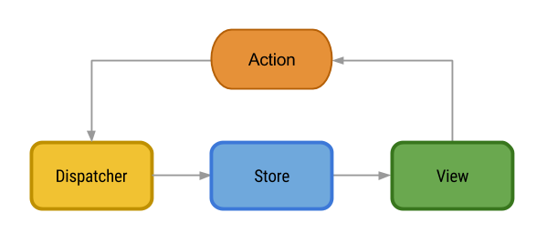

# React Native
References [ official tutorial ](http://reactnative.dev/docs/tutorial) on React Native,
[Redux Documentation](https://redux.js.org/), 
[React Navigation Documentation](https://reactnavigation.org/)

## Introduction
React Native allows us to build mobile apps with React & Javascript:
- instead of Web Component is React.js, native uses native components

Hello World Example:
```javascript
import React, { Component } from 'react';
import { Text, View } from 'react-native';

export default class App extends Component {
  render() {
    return (
      <View style={{ flex: 1, justifyContent: "center", alignItems: "center" }}>
        <Text>Hello, world!</Text>
      </View>
    );
  }
}
```
- `render()` when the component is rendered
- `Text` & `View` are native mobile components
- `style` is a prop passed to `View`


## React Recap

### Props
Props are attributes passed to components:
```javascript
return (
<Image source={picUrl} style={{width: 193, height: 110}}/>
);
```
where the image source url can be accessed at `this.props.source`


### State
State store variable state that changes over the lifetime of the component:
```javascript
// init state object
state = { "token": null };

getToken() {
    // ... get token ....
    this.setState({"token": token});
}

render() {
    if(this.state.token == null) {
        return ( <Text> Not Authenticated. </Text>);
    } else {
        return ( <Text> Logged In. </Text>);
    }
}
```
- when `getToken()` is called it changes the object state with `setState()`
- `setState()` causes the component to rerender via `render()`

### Flux & Redux
Flux & Redux are architectural patterns common used in react applications:
- flux


| Component | Description |
| --- | --- |
| Components/Views | Updates UI based state updates from stores. Creates actions |
| Action | Encupulates some form of action or command (ie login action). |
| Dispatcher | Pub/Sub object for publishing and listening for actions. |
| Stores | Stores & updates state based on actions from dispatcher. |

> Dispatcher publishes actions to all listeners. 
> Stores's state should only be modified by actions

- redux extends flux with with the following princples:
    - single source of truth - only one state store
    - no dispatchers use reducers instead which are pure functions
    - reducers take in actions and update state
    - state is modified by pure reducers
        - no modifications to state in updates
        - updates create new state that overwrite the old state entirely

#### Example: API Call
Flow of a online store that has to load offerings from the API using Flux/Redux:
1. Component/View creates action to start loading offerings from API
    - action starts async API request to pull offerings
    - action updates state store to signify pull in progress
    - Component/View updates to show loading screen
2. API callback creates action to show pulled offerings
    - action updates state store with offering data
    - Component/View updates to show offerings 

## React Native Specific

### Styling
React Styles components via JS object passed to a special `style`:
- contents of `style` JS object similar in CSS but in JS
- properties are in camelCase instead of kebab-case
- values to the properties are still in quotes "kebab-case"

```javascript
style = StyleSheet.create({
    color: 'blue',
    fontWeight: 'bold',
    fontSize: 30
});

render() {
    return (<Text style={style}>Styled Text </Text>)
}
```

### Layout
Methods to control layout of components in React Native:

Sizing components:

| Method | Description | Styling Properties |
| --- | --- | --- |
| Fixed | Component has fixed size | `width, height` |
| Flexbox | Component has resizable fraction of the size of the parent | `flex, flexDirection, justifyContent, alignItems, alignSelf, alignContent, flexWrap, flexGrow, flexShrink` |

Positioning components:
- use `top, right, bottom, left`  position elements

| Method | Description | Styling Properties |
| --- | --- | --- |
| Absolute | Position element relative to the parent | `position: "absolute"` |
| Reative | Position element relative to siblings | `position: "relative"` |


### Native Components
Common Native Components:

| Component | Description | Examples |
| --- | --- | --- |
| Fragment | Wraps multiple elements in a render but does not actual wrapping component | `<> </>` |
| Text | Text label to render text | `<Text>Render Text</Text>` |
| Image | Image view to render images | `<Image source={srcUrl} />` |
| TextInput | Text field/input to allow user to input text | `<TextInput placeholder="Input Text"   onChangeText={(text) => this.setState({text})} value={this.state.text} />` |
| Button | Pressable Button | `<Button onPress={this._onPressButton} title="This looks great!" />`| 
| ScrollView | Scrollable for content that does fit the screen renders all children at once. | `<ScrollView> ... </ScrollView>` |
| FlatList | Renders a scrollable list of content passed as `data` prop with callback `renderItem`, does not render all children at once | `  <FlatList data={[ {key: 'Devin'}, ...  {key: 'Julie'}, ]} renderItem={({item}) => <Text style={styles.item}>{item.key}</Text>} /> `|

### Navigation
Navigation is provided by a separaate packages:
- use `react-navigation` for easier API, but less features
- use `react-native-navigation` for native navigation, harder to use API

#### Setup
Setup for `react-navigation`:
1. Install the required package
```sh
npm install @react-navigation/native @react-navigation/stack
npm install react-native-reanimated react-native-gesture-handler react-native-screens react-native-safe-area-context @react-native-community/masked-view
```
2. Add ontop of entry file (ie `App.js`/`index.js`)
```javascript
import 'react-native-gesture-handler';
```

#### Actual Nativigation
Code used to configure navigation:
```javascript
import * as React from 'react';
import { View, Text } from 'react-native';
import { NavigationContainer } from '@react-navigation/native';
import { createStackNavigator } from '@react-navigation/stack';


const Stack = createStackNavigator();

function App() {
  return (
    <NavigationContainer>
      <Stack.Navigator initialRouteName="Home">
        <Stack.Screen name="Home" component={HomeScreen} />
        <Stack.Screen name="Details" component={DetailsScreen} />
      </Stack.Navigator>
    </NavigationContainer>
  );
  }
```
- app must be wrapped by `NavigatorContainer`
- App Screens are represented by `Screen`s wrapped by a `Navigator`

Components are passed `navigation` and `route` props
- navigation - contains useful navigation methods (ie `navigate()`, `push()`
- route - route data (ie params by caller)

#### Switching Screens
Methods to navigate screens:
- `navigation.navigate("Details")` - goto screen by name directly.
- `navigation.push("Details")` - push screen onto stack, which user can move back in stack
- `navigation.goBack()` - programmatically move back in stack

> Pass params on navigation to pass along data to target component.  
> - `navigation.navigate('Home', { post: postText });`
> - read params in `route.params` prop

## Miscellaneous Stuff
### Networking
Networking: 
- make network requests with `fetch()` API (same as web):

```javascript
let response = await fetch('https://mywebsite.com/endpoint/', {
  method: 'POST',
  headers: {
    Accept: 'application/json',
    'Content-Type': 'application/json',
  },
  body: JSON.stringify({
    firstParam: 'yourValue',
    secondParam: 'yourOtherValue',
  }),
});
```

> Note: iOS does not allow HTTP calls with App Transport Security rule.

- websockets are supported:
```javascript
var ws = new WebSocket('ws://host.com/path');

ws.onopen = () => {
  // connection opened
  ws.send('something'); // send a message
};

ws.onmessage = (e) => {
  // a message was received
  console.log(e.data);
};
```

### Platform Detection
Detect Platform (iOS/Android):
- Platform.OS: ie `Platform.OS === "android"`
- Platform.Select returns JS objects by platform
```javascript
const Component = Platform.select({
  ios: () => require('ComponentIOS'),
  android: () => require('ComponentAndroid'),
})();
```

