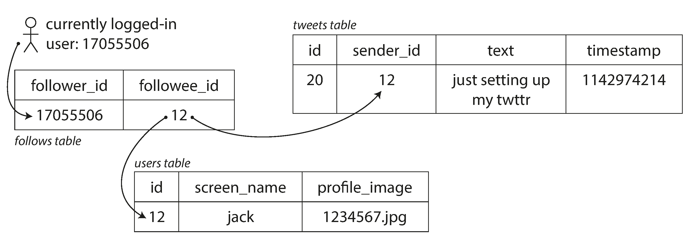

# Data Intensive Apps
References [Designing Data-Intensive Applications](https://www.oreilly.com/library/view/designing-data-intensive-applications/9781491903063/) book.

## Intro
Applications today have to scale to increasing larger volumes of data (aka data-intensive):
- databases - storing data for later use
- cache  - cache responses to speed up reads
- indexes - speed up search operations
- stream processing - asynchronous message queuing/processing
- batch processing - periodically process data in batches

> Data rather than CPU is the limiting factor for these apps

Data Apps typically have to hook up multiple suitable data systems
- different data systems (ie database/message queue) have different performance traits

### Major Concerns
Major Concerns when developing data intensive apps:
- reliability - app still works after hardware or software faults
- scalabiliy - app can handle growing data volumes/complexity
- maintainability - app is easy to work with

### Reliability
Reliability - continuing to work correctly even when things go wrong (faults)
- fault-tolerant - app able to withstand some faults
- purposefully triggering faults can be a good way to test faults

> Fault differs from failure as it only affects one component of the app
> while failure happens when the app stops providing services completely

Types of Faults:
| Fault | Description | Example | Solutions |
| --- | --- | --- | --- |
| Hardware Fault | Faults in infastructure hosting the app. | AWS EC2 going down,, hard disk failure. | Software/Hardware Redundancy |
| Software Fault | Faults in app code. More serious as fault might happen at the same time to multiple instances of the app | Leap Second Bugs, Zombie processes, Cascading failures | Clarifying assumptions, testing, crash and restart loops, analyze behaviour in production |
| Human Error | Fault due to human actions. | Accidentally wiping Production DB, leaking credentials in source code. etc. Introducing bugs. | Through testing. Make it easy to do the right thing. Recovery from human errors.  Monitoring: performance metrics/error rates. |

### Scability
Scability - ensuring the app works reliability even under increased load

Making apps scalable:
- define load
- measure performance
- cope with load

#### Defining Load
Load Parameter - defining Load on app is application specific:
- requests handled per second
- ratio of read to writes on db
- hit rate on cache


Example case study: Twitter  

Main Features:
- post tweet: 4.6k requests/sec on average 12k requests/sec peak.
- home timeline: 300k requests/se

Approaches:
1. Post tweet insert in SQL DB. Retrieve for feed  use join query.


- does not scale to home timeline load (300k reqs/sec)

2. Maintain Cache each user's home timeline. When user posts tweet push
    tweet to timeline caches


- extra work done to to push push new tweet into caches especially if many followers

Solution: Hybrid of  graph to keep track of what affects other &amp; 2: Approach 2 except for those with many followers, then approach 

#### Measuring Performance
Measure Performance of system as load increases
- how performance varies as load parameter increases given hardware resources constant
- how much hardware resources has to be added to maintain performance as load increases

Metrics for measuring performance - also application specific
- hadoop - batch job througphput
- latency/response time - of REST API get requests

> Latency is the waiting time the request waits before handling request
> While response time is the total time that the client waits for the request to be handled

Take multiple measurements to measure performance:
- certain random variables can affect response time (ie packet loss, gc collection, page fault). 
- use statistics (ie median, mean, 95 &amp; 99 percentile.) to get an estimate of performance.
- client side performance measurements are especially important and useful
- 95 &amp; 99 percentile performance is especially important as they show
     worst case performance, especially as the user is large customer.

> Artificial load should be sent concurrently to accurately simulate load.

#### Coping with Load
Approaches for Coping with Load:

| Approach | Description | Pros | Cons |
| --- | --- | --- | --- |
| Scale up (Vertical Scaling) | Host app on machine with more resources | Easier to implement app | Expensive to buy high end machines | 
| Scale out (Horizontal Scaling) | Distribute load across multiple machines | Easier to scale | Hard to implement app |
| Manually | Manually mointor performance and scale | Predictable |  Human reaction time, work expanded to manually evaluate &amp; scale | 
| Elastic | Autoscaling to automatically cater to increased load. | Scales to unpredictable workloads | Resources consumed can be unpredictable. |

- Good Architectures combine by scaling up and scaling out.
- ensure that scaling decisions are made on actual performance data to
    prevent wasted work on  making applications scale.

> Rule of Thumb: Redesign architecture every order of magnitiude increasef
> in load ()

### Maintainablity
Ensure maintainability to reduce pain of maintaince &amp; avoid costly rewrites:
- operability - make easy to operate the software
    - add healthchecks to verify app health
    - logs to track down problems in app
    - easy to update apps with patches
    - encapsulate dependencies to ensure portablity
    - support automation and integration with standard tools
- simplicity - make easy for new engineers to  understand the system.
    - abstract away the complex stuff. (performance hacks)
    - consistent naming practices
- evolvabiliy - make it easy to make changes in the system
    - agile software development life cycle
    - test driven development/refactoring
    - making changes to simpler systems are easier

## Data Models &amp; Query Languages
### Importance of Data Models
Importance of Data Models
- frames the way we think about about the problem at hand.
- most programs are built by layering data model in increasing levels of abstraction:
    1. app-specific data structures in app.
    2. DB code in app: converts app-specific data structures to more general data model (JSON, XML, RDBMS tables).
    3. DB stores general data model in terms of lower level primitives like disk storage.
    4. Hard Disk writes data as magnetic fields on disk.
- key question at each data layer: "how is it represented in the lower level data layer?"
- provides abstraction: hides the complexity layers behind a clean data model/interface with less details.

### Choosing a Data Model
Choosing Data Model:
- crucial to choose the correct data model for the app:
   - each data model makes assumptions on use casef
   - inflexibilty: data model makes to difficult to represent some data (ie graph data in RDBMS)
   - performance: data model makes it handicaps apps as it does not scale.

#### NoSQL
NoSQL: Not Only SQL
- emerged about of a need for greater scalabiliy than RDBMS could easily provide.
- special queries not well supported by SQL.
- restrictivness of releational model: not dynamic or expressive.


#### Relational vs Document Data Model
Relational Model (RDBMS + SQL):
- data organised in relations / tables which are composed of tuples / rows.
- designed for business data processing, but generalised to many varying use cases:

Document Model:
- data stored as complex structuresi in JSON / XML
- eg. databases: MongoDB, RethinkDB, CouchDB, Espresso.

##### Relational Model Con: Object-Relational Mismatch
Object-Relational Mismatch:
- impedance mismatch: relational model requires mapping layer (ie ORM) between objects in app and the SQL model used by the RDBMS:
    - eg. encoding Linkedin User with multiple Jobs:
        - have Jobs table separate from users and reference Job from Users using a Foreign Key.
        - use a data type that allows encoding of complex structures (JSON, XML).
        - encode at the app level into JSON, XML and store as text / bytes (downside: cannot query).
- document model reduces (but not removes) the impedance mismatch between the data model use by the app and used for storage in the DB:
    - no joins / subqueries required to query related fields as they are stored together: only 1 query required.

##### Document Model Con: Database Normalization
Database Normalization:
- dedeuplicating data using IDs and foreign keys.
- requires many-to-one relationships
- ie instead of encoding regions as free text, use an common id:
    - id remains constant and never changes.
    - reduces data duplication as id references the same data.
    - avoids ambiguity: users might type region in different ways (ie no caps / all caps)
    - localization: support for display the region in different languages is easy to add.
- natively supported by relational databases.

Document model does not support many-to-one, many-to-many relationships well:
- one-to-many relationships related are nested fields together, no join required.
- no native join support: joins must be emulated with multiple queries in application code:
    - document model does not natively database normalisstion
    - either denormalise data or manually resolve references in application code.
- data tends to to contain more relationships over time some of which are many-to-one, many-to-many

#### Hierarchical vs Relational vs Network Models
Hierarchical model:
- each data record has only one parent.
- old (1970) data model with simliarities to document model:
    - one-to-many related fields are nested together.
    - many-to-many relations are difficult as joins are not supported.

Network / CODASYL Model:
- generalisation of hierarchical model: each data record can have multiple parents.
- relationships represented as pointers, each data record has an access path.
- developers / hardcoded app code have to keep track of access path manually.
- difficult to evolve app's data model as a result.

Relational Model:
- data is laid out in the open: tables are collection of data rows.
- no nested structures, fixed access paths.
- RDBMS's query optimiser auto determines optimzed way of execute query (ie indexes to use).

#### Relational vs Document Data Model Today
Relational vs Document Data Model Today
- Document Model Advantages:
    - Schema flexibility: implicit schema on read.
    - Better performance via locality of related fields

> :warning; Locality performance gains only applies most the data in the
> document is used, as the document is loaded entirely on read.
> Workaround: Keep documents small and avoid writes that increase its size.

- Relational Model Advantages:
    - Better Joins support.
    - Many-to-one, many-to-many relationship support.

#### Selecting a Data Model
Use Document Model if:
- data is in a document like structure:
    - data is a tree of one-to-many-relationships.
    - whole document loaded at once.
- no need for many-to-many joins: logging events, analytics.
- some nesting: document database queries are access path specifications.
- schema flexibility is required (schema on read).

Use Relational Model if:
- need joins.
- need many-to-one, many-to-many relationship support.
- highly connected data with many relationships.
- storing normalised data / too much work to keep denormalised data consistent
- require data type consistency guarantees of schema on write.

##### Schema Flexibility in Document Model
Schema Flexibility in Document Model:
- tradeoff: DB allows abitary values to be stored, but provides type guarantees on retrieval.
- schema on read: implicit schema applied by app code reading the data.
- allows app data model changes without running a DB migration:
    - SQL `ALTER TABLE` typically runs fast (except MySQL).
    - SQL `UPDATE` is slow as it rewrites all data.

#### Merging of Relational and Document Model
Merging of Relational and Document Model:
- documents in RDMS: JSON, XML field types.
- joins in document DBs: Client side joins, relational like joins support.

### Querying Languages for Data
#### Types of Querying Languages for Data
Types of Querying Languages for Data:
- imperative languages: define exactly the computer is to do and in what order to complete the task. (ie CODASYL).
- declarative languages: define the expected end result of complting the task, but not  how or in what order to complete the task (ie SQL)

> Declarative languages are preferred as:
> - it allows the database engine to introduce optimizations without breaking existing code (ie transparently executing queries on multiple CPU cores).


#### MapReduce
MapReduce: programming paradigm for big data processing:
- low-level paradigm for scaling queries onto a cluster of machines.
- supported by Hadoop, MongoDB (Limited), CouchDB (Limited)
- mix between a imperative / declarative language.
- runs 2 pure (no side-effects) function `map()` and `reduce()` to perform MapReduce query.

Example: Query no. of sharks sighted per month:
```javascript
db.observations.mapReduce(
    // map() called once for every matching document
    function map() {
        var year  = this.observationTimestamp.getFullYear();
        var month = this.observationTimestamp.getMonth() + 1;
        // emits key-value pair (year-month, no. of sharks for that month).
        emit(year + "-" + month, this.numAnimals);
    },
    // map reduce groups all values pairs by key and runs reduces() on collected values.
    function reduce(key, values) {
        // totals ups the shark sightings for that month.
        return Array.sum(values);
    },
    {
        // declarative filter for shark family
        query: { family: "Sharks" }, 1
        // writes the final shark sightings into monthlySharkReport collection
        out: "monthlySharkReport"
    }
);
```

#### Graph Data Model
Graph Data Model:
- data modeled as vertices / nodes and connecting edges.
- high flexibility makes it suited for data of varying granularity and constantly evolving data.
- use case: data with lots of many-to-many relationships:
    - Social graphs: nodes are users and edges are which users are friends with one another.
    - Web graph: nodes are pages, edges are links between pages.
    - Road or rail networks: nodes are junctions / stations, edges are road / track connecting them.
- vertices / nodes can store different types of objects (ie Facebook uses nodes to store people, locations, events, comments, vertices to indicate friends, authorship etc.).

> Relational Data models can handle some many-to-many  relationships.
> However it may make sense to switch to a more suited Graph data model if the data contains lots of such relationships: Graphs are significantly more flexible.


##### Property Graph Model
Property Graph Model:
- used by Neo4j, Titan, InfiniteGraph.
- each vertex / node has:
    - unique id
    - set of incoming / outgoing edges
    - key-value pairs as properties or metadata.
- each edge has;
    - unique id
    - tail vertex / node: node where the edge starts
    - head vertex / node: node where the edge ends.
    - label to describe the edget
    - key-value pairs as properties or metadata.
- no schema constraints on edge: any vertex / node can have a edge connecting between them.
- graph traversal is efficient: follow edges.
- key-values pairs allow the storage of dynamic dta in a single graph.

##### Cypher Query Language
Cypher Query Language: query language for Property Graph databases (ie Neo4j):
- Inserting data using cypher:
```cypher
CREATE
   -- create nodes / vertices
  (NAmerica:Location {name:'North America', type:'continent'}),
  (USA:Location      {name:'United States', type:'country'  }),
  (Idaho:Location    {name:'Idaho',         type:'state'    }),
  (Lucy:Person       {name:'Lucy' }),
   -- create edges connecting the nodes
   -- edget format: (NODE) -[:EDGE]-> (NODE)
  (Idaho) -[:WITHIN]->  (USA)  -[:WITHIN]-> (NAmerica),
  (Lucy)  -[:BORN_IN]-> (Idaho)
```
- Querying data using cypher: Find the name of the person born in the US but lives in Europe:
```cypher
MATCH
   -- match 'person' with outgoing BORN_IN edge to a node,
   -- then any no. of edges to the node representing the US
  (person) -[:BORN_IN]->  () -[:WITHIN*0..]-> (us:Location {name:'United States'}),
   -- match 'person' with outgoing LIVES_IN edge to a node,
   -- then any no. of edges to the node representing Europe
  (person) -[:LIVES_IN]-> () -[:WITHIN*0..]-> (eu:Location {name:'Europe'})
RETURN person.name
```

> Behind the scenes the query is executed backwards, the DB engine backtracks from the end nodes to the to find the matching 'person' nodes.

##### Querying Graphs with SQL
Querying Graphs with SQL:
- variable length traversal path: requires a unknown, variable no. of joins.
- use recursive CTE (common table expressions) using `WITH RECURSIVE`: to recursively traverse edge table:
```sql
-- queries the vertice_id all the locations (States, Counties, Districts) in the USA.
WITH RECURSIVE
    in_usa(vertex_id) AS (
        -- non-recursive query provides the starting vertice_id for USA
        SELECT vertex_id FROM vertices
        WHERE properties->>'name' = 'United States'
        UNION
        -- recursive query is executed to collect the vertex_id in progressively deeper levels
        -- (ie US -> States, States-> Counties, etc...), until all  the vertex_id of all the locations in the US is returned in the result set. 
        SELECT edges.tail_vertex FROM edges
        JOIN in_usa ON edges.head_vertex = in_usa.vertex_id
        -- we only want to follow edges labeled to represent 'within' relationships,.
        WHERE edges.label = 'within'
    )
```

> Using Cypher, the same query can be written in 4 lines instead of 29 used by SQL.
> Use the right tool for the job.


#### Triple-store Graph Model
Triple-store Graph Model
- data store in terms of (subject, predicate, object) triples:
    - subject: vertex / node of the graph.
    -  predicate &amp; object functions in two ways:
        - key-value property: predicate is key, object is primitive value.
        - edge connecting to another vertex / node: predicate is the edge, object is the connected vertex / node.
- typically stored as the RDF file format.

Turtle Notation for Triples:
- Turtle is human-readable representation of the RDF format.
- vertices / nodes: `_:NODE`
- predicate: `:PROPERTY`
- example of representing Triples in Turtle:
    - multiple predicate-objects can be assigned the same subject using `;` as separator.
    - prefix namespaces data using a domain name.
```turtle
@prefix : <urn:example:>
_:lucy     a :Person;   :name "Lucy";          :bornIn _:idaho.
_:idaho    a :Location; :name "Idaho";         :type "state";   :within _:usa.
_:usa      a :Location; :name "United States"; :type "country"; :within _:namerica.
_:namerica a :Location; :name "North America"; :type "continent".
```

##### SQARQL Query Language
SQARQL Query Language: query triple-stores in RDF file format.
- variables are prefixed with question marks: `?VARIABLE`.
- use the same prefix used to namespace data in RDF.

```sparql
PREFIX : <urn:example:>

SELECT ?personName WHERE {
  ?person :name ?personName.
  ?person :bornIn  / :within* / :name "United States".
  ?person :livesIn / :within* / :name "Europe".
}
```

##### Datalog Query Language
Datalog Query Language:
- used by Datomic, Cascalog (Hadoop).
- defining graph data using Datalog Facts:
```datalog
name(namerica, 'North America').
type(namerica, continent).

name(usa, 'United States').
type(usa, country).
within(usa, namerica).

name(idaho, 'Idaho').
type(idaho, state).
within(idaho, usa).

name(lucy, 'Lucy').
born_in(lucy, idaho).
```
- querying data using Datalog rules:
    - datalog rule is populated like a datalog fact if the data matches predicate
        on the right of `:-` operator until `.`.
    - variables as defined as symbols that start with capital letters (ie `Variable`)
```datalog
/* within_recursive(): matches name fact with location and name
 * base case for recursive within_recursive()
*/
within_recursive(Location, Name) :- name(Location, Name).

/* recursive within_recursive(): matches within with location and via,
 * via has recursively satisfied within with via and name
*/
within_recursive(Location, Name) :- within(Location, Via),
                                    within_recursive(Via, Name).

/* migrated(): matches name with born in now lives in given locations */
migrated(Name, BornIn, LivingIn) :- name(Person, Name),
                                    born_in(Person, BornLoc),
                                    within_recursive(BornLoc, BornIn),
                                    lives_in(Person, LivingLoc),
                                    within_recursive(LivingLoc, LivingIn).

?- migrated(Who, 'United States', 'Europe').
```

