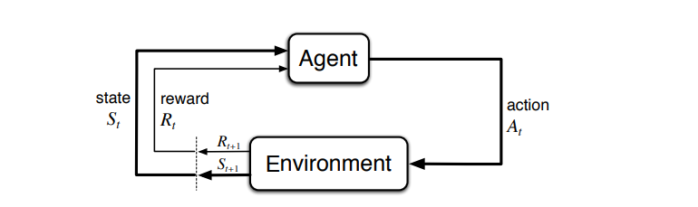

# Reinforcement Learning
Notes heavily derived from [Deep Lizards RL series](https://deeplizard.com/learn/playlist/PLZbbT5o_s2xoWNVdDudn51XM8lOuZ_Njv)
and this [Medium Article](https://towardsdatascience.com/introduction-to-reinforcement-learning-markov-decision-process-44c533ebf8da)

## Introduction to Reinforcement Learning
Reinforcement Learning (RL) is an area of ML that focuses on training an agent 
to take certain actions in a given environment in a way maximises returns.

Intesting Applications of RL:
- AlphaGo - AI Go player that was trained to play the complex game of go.
- OpenAI Five - OpenAI developed five bots to play the game of Dota.

### Terms & Defintion
Terms & Definitions:

| Term | Definition |
| --- | --- |
| Environment | An environment with different actions/rewards in which the agent will interact in. Does not change |
| Agent | The entity that RL attempts to train to make actions that maxmimise rewards |
| State | A specific state of that the environment is in based on the actions of the agent. Changes as the agent makes actions. |
| Reward | Numerical values that the agent recieves upon preforming an action in the environment |
| Return | Culmulative reward attained by the agent making actions in envrionment |

#### Notational Definitions
Notational definitions:

| Symbol | Meaning |
| ---- | ---- |
| $S_t$ | State of the envrionment at timestep $t$ |
| $S_{t+1}$ | Future state of the envrionment at timestep $t+1$ |
| $P$ | A states transition model/function that describes how state changes over time.  |
| $R_t$ | A set of coresponding rewards for each state $s \in S_t$ |
| $G_t$ | Returns: Total reward at accumulated or discounted reward accumulated |

### RL Process

Formally, RL attempts to train the agent to make action $A_t$, given environment
state $S_t$ and reward $R_t$, such that it will maxmimise return $G_t$

RL Process:
- the agent observes the current state $S_t$ and selects action $A_t$
- the envrionment transitions to new state $S_{t+1}$ and gives reward $R_{t+1}$
- repeat for the next the timestep $t+1$

### Episodic & Continuous Tasks
Episodic RL Tasks 
- tasks that have a defined start and end aka episode (ie a racing game)
- each episode is independent of other episodes

Continuous RL Tasks
- tasks that have no defined end (ie practice & be as good as possible at racing game)

### Returns & Discounted Return
Return $G_t$ is the expected final returns that an agent attains over all timesteps
$$
G_t = \sum_{i=t+1}^{T} R_i
$$

> Use plain returns for episodic tasks

---
Discounted Returns $G_t$ is basically expected returns argumented with discount factor 
$\gamma, \gamma \lt 1$:
- exponentially reduces the weight of future rewards.
- use for continous RL tasks

$$
G_t = \sum_{i=t+1}^{T} \gamma^{i-t-1} R_i
$$

> Given that rewards $R_t$ are equal to $1$ and $\gamma \lt 1$  
> then $G_t = \sum_{k=0}^\infty$ converges to $\frac{1}{1 - y}$  
> The discount factor $\gamma$ ensures that continuing task 
> (tasks with no clearly defined end time $T=\infty$) 
> do not have $\infty$ expected reward, and converges to a finite value

Discounted Returns $G_t$ can also be presented as recurrence equation:
$$
G_t = R_{t+1} + \gamma G_{t+1}
$$

> Use discounted returns for continous tasks

### Policies
Policies $\pi(a|s)$ defines how the agent acts by returning the probability
of taking action $a$ given state $s$:
- the "agent follows the policy", selecting the action based on the 
    probabilities given by the policy

### Value Functions 
Value functions estimate how much return can be expected for the given state $s$
or state-action pair $s$, $a$; following policy $\pi$ thereafter:
> the more the expected return, the more valuable the position

Types of Value Functions:

| Value Function | Description | Formula |
| --- | --- | --- | 
| State-Value Function | State-Value function $v_\pi(s)$ estimate return $G_t$ starting in given state $s$, following policy $\pi$ thereafter | $v_\pi(s) = E_\pi(G_t\|S_t=s)$ |
| Q-Value Action-Value function | Action-Value function  $q_\pi(s,a)$ estimates return $G_t$ starting state $s$ & taking action $a$, following policy $\pi$ thereafter | $q_\pi(s,a) = E_\pi(G_t \| S_t=s, A_t=a)$ |

> Action-Values for state-action pairs are also known as Q-Values (Q as in Quality)

## Training RL Algorithms
The goal of RL is to find a optimal policy such that the agent following this 
policy would yield the highest return

A policy $\pi$ is considered better/equal to another policy $\pi'$ when its
expected return is greater or equal then the another policy's expected return,
for all states $s$:
$$
\pi \ge \pi' \iff v_\pi(s) \ge v_{\pi'}(s) \forall s \in S
$$

### Optimal Policy/Value Functions
Optimal policy $\pi_*$ is the best possible policy $\pi_* = \max_{\pi}$, which
would yield the highest return

- optimal state-value value function $v_*$ of optimal policy $\pi_*$ gives
    the highest expected possible return for a given state $s$

$$
v_*(s) = \max_{\pi}v_\pi(s)
$$

- optimal Q-Value/action-value function $q_*$ of optimal policy $\pi_*$ given the
    the highest possible expected return/Q-Value for taking action $a$ in given state $s$

$$
q_*(s,a) = \max_{\pi}q_\pi(s,a)
$$

### Bellman Equation/Optimality
Bellman Equation/Optimality states that Q-value/highest possible expected return $q_*(s,a)$ of 
taking action $a$ in state $s$, is computed from:
- the expected reward for taking action $a$, $R_{t+1}$
- the (discounted) Q-Value/highest possible expected return of following optimal policy $q_*(s_{t+1},a_{t+1})$ thereafter,
  picking best action $a_{t+1}$ such that it maximises $q_*(s_{t+1},a_{t+1})$,
  picking action $a_{t+2}$ ... and so on...)

$$
q_*(s,a) = E(R{t+1} + \gamma \max_{a_{t+1}}q_*(s_{t+1},a_{t+1}))
$$

### Q Learning
Q-Learning attempts to derive the optimal Q-Value function $q_*$ by
iteractively adjusting the Q-Value for each state-action pair $q(s,a)$
until it coverges to the correct optimal Q-Value for that state-action $q_*(s,a)$

#### Q-Value Function Representations
Different ways of representing the mapping of the Q-Value function $q$:

| Representations | Description | Suitable Application |
| --- | --- | --- |
| Table | A Table storing the Q-Value for all possible combinations of states and actions | Small no. of combinations state & actions|
| Neural Network(NN) | A NN is trained that takes in input state and value and mapsm it to Q-values | Large no. of combinations of stae & actions |

#### Exploration vs Exploitation
Exploration - randomly selecting actions gather infomation about the environment
- we start with Q-Value function $q$ that is significantlly off from the 
  optimal Q-Value function $q_*$
- hence selecting the best possible action (exploitation) based on $q$ is a bad idea
- instead randomly select actions to tune $q$ towards optimal $q_*$

Exploitation - selecting the best possible action based on Q-Value function $q$
- after tuning $q$ sufficently, it converges to optimal Q-Value function $q_*$
- now we can exploit the tuned $q$ to choose the (approx.) best action and
    achieve the (approx.) best reward.

Epsilon Greedy Strategy - explore then gradually transition to exploiting
- define a exploration rate $\epsilon$ which is probablity of the agent exploring
- start with $\epsilon=1$ and gradually decay/reduce $\epsilon \to 0$
- simulate the gradual transition from exploration to exploitation

#### Q Learning Loss
Since Q-Learning attempts to get $q$ to converge to $q_*$ the loss function of
Q-Learning is simply the difference between $q$ and $q_*$
$$
L(s,a) = q_*(s,a) - q(s,a)
$$

Where
- $q_*(s,a)$ can be derieved from the belman equation
- $q(s,a) = E(\sum_{k=0}^\infty y^k R_{t+k+1})$ - total discounted expected future rewards

#### Q Learning Update
Q Learning iteratively tunes $q$ to $q_*$ by apply the following update:
- find optimal possible Q-value for future states and actions:
$$
q(s_{t+1},a_{t+1})= \max_{a_{t+1}}q(s_{t+1},a_{t+1})
$$

> since we don't have $q_*$, we use $q$ to estimate $q_*$

- estimate the optimal Q-value $q_*(s,a)$ as the new Q-Value $Q_{new}$ using the belman equation
$$
q(s,a) = E(R_{t+1} + \gamma \max_{a_{t+1}}q(s_{t+1},a_{t+1}))
$$

> again, since we don't have $q_*$, we use $q$ to estimate $q_*$

- update $q$ with the new Q-value
$$
q(s,a) = (1-\alpha) \times q(s,a) + \alpha \times Q_{new}
$$

> learning rate $\alpha$ tunes the rate of which $q$ adapts the new Q-value 
> vs retaining the old Q-value. This is required as $q$ may still not be an
> accurate estimate of $q_*$ yet, hence the new Q-value may be inaccurate and 
> we use $\alpha$ to reduce their impact.

## Markov Theory
### Markov Property
Markov property states that future states are independent of past states
given the present state which captures all relevant infomation in history.

The present state $S_t$ only captures all relevant infomation in history when
the following holds:
$$
P(S_{s+1} | S_t) = P(S_{s+1} | S_1, ..., S_t)
$$

When the previous property holds, then it follows that the probablity of
transitioning to future state $s'$ given current state $s$ is defined as:
$$
P_{s,s'} = P(S_{t+1} = s' | S_t = s )
$$

When the the probablity of all possible current state transition are collected
together, that is know the state's transition function/model ($P$), which
describes how state transitions over time.

$$
P = \begin{bmatrix}
P_{s_1, s'_1} & P_{s_1, s'_2} & ... & P_{s_1, s'_n}  \\
P_{s_2, s'_1} & P_{s_2, s'_2} & ... & P_{s_2, s'_n}  \\
... & ... & ... & ... \\
P_{s_n, s'_1} & P_{s_n, s'_2} & ... & P_{s_n, s'_n}  \\
\end{bmatrix}
$$

### Markov Processes

> A diagram representing a two-state Markov process. Each number represents the 
> probability of the Markov process transitioning from one state to another state.

Markov Processes/Chains are a bunch of states $s_1, s_2, ... s_n$ with the 
markov property:
- each state $s_i$ may be mapped to another state $s_j$ with a probability $P_{i,j}$
- $P_{i,j}$ defines the probability of the process transitioning to another state $P_j$
  given that $P_i$ be the current state.

### Markov Reward Processes

