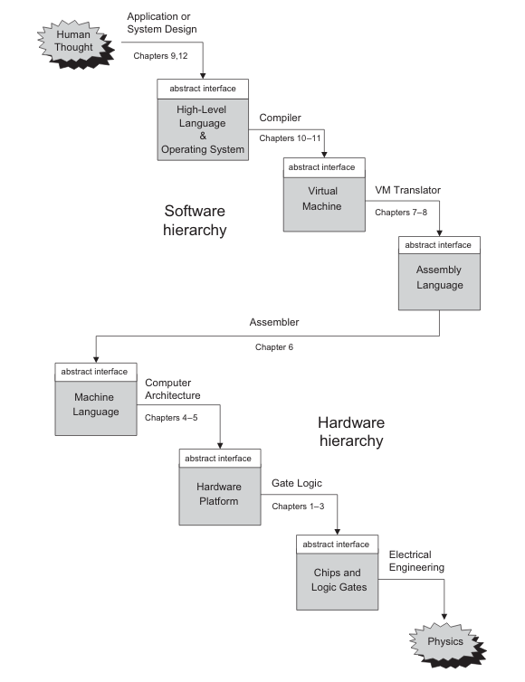
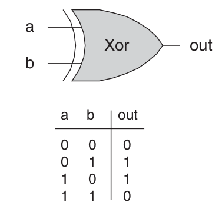
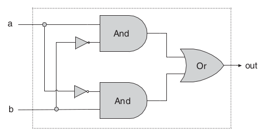

# From Nand to Tetris Part I
Part 1 of Build a Modern Computer from First Principles: From Nand to Tetris.
Rights and Credits belong to Noam &amp; Shimon, Course Creators

> `Reading:` sections refer to chapters of the Course's textbook:
> [The Elements of Computing Systems](https://mitpress.mit.edu/books/elements-computing-systems-second-edition)

## Week 1

### Introduction


Nand2Tetris Overview: Build complete general purpose computer from the ground up:
- Nand2Tetris Part 1 focuses on **hardware platform** of the computer: Nand gate -> HACK computer.
- Nand2Tetris Part 2 focuses on **software hierarchy** that runs on the hardware platform: HACK computer -> Tetris.

### Abstraction
```
class Main {
    function void main() {
        do Output.printString("Hello World");
        do Output.println(); // New line.
        return;
    }
}
```

Motivating Example: Hello World program taught in introductory programming courses.
- Typically discuss what each line of the code is supposed to do but does not go further.
- To the computer code looks like individual characters that by itself does not mean anything.
- How does the computer figure which pixels to set on display based on characters?
    - Told about compiler, standard library, operating systems (OS) but there
      is no need to understand how they work

Abstraction: Don't worry about the "how", only about the "what":
- what: what is piece of code supposed to do?
- how: how a piece of code is implemented. Could be implemented by someone else or by us earlier/later.
- ie using OS like Windows does not require the user to understand how it works.
- reduces mental load: saves us from having to worrying about everything all at once.

> The Nand2Tetris course applys abstraction:
> - every week targets only a single level of abstraction.
> - take the lower level as given &amp; implement the target level.
> - test that the target level works, we can forget about the target level once it work.
> - rinse repeat until highest level.

### From Nand to HACK
Building the HACK hardware platform:
- Start from Nand Logical Gate
- Use combinational logic to build basic gates from elementary logic gates
- Use combinational/sequential logic to build CPU/RAM/Chipset.
- Combine chips to from HACK computer architecture.
- Write assembler to compile assembly into machine code that runs on the HACK platform.

### Building Hardware
Building a Hardware Platform without physical electronics:
- hardware engineers design chips with hardware simulator programs
- hardware simulator programs allows users to build/test chips virtually.

Building hardware process:
1. Start from chip abstraction/interface defining what the chip has to do.

2. Design Chip using Chip diagram using lower level logic gates already built.


3. Code Chip using Hardware Description Language (HDL) based on design in diagram
    to produce HDL program virtualizing the hardware chip.
```
chip Xor {
    IN a, b;
    OUT out;
    PARTS:
        Not(in=a, out=nota);
        Not(in=b, out=notb);
        And(a=a, b=notb, out=w1);
        And(a=nota, b=b, out=w2);
        Or(a=w1, b=w2, out=out);
}
```
4. Use hardware simulator and test scripts to test that chip works as expected.


### From HACK to Tetris
Building Software Hierarchy that runs on the HACK platform:
- Start from HACK hardware platform and its assembler
- Build Higher Level Programming language that compiles into assembly.
- Build OS and standard library.
- Write Tetris using OS/Standard Library/High Level programming language

### Reading: Introduction: Hello, World Below
#### The World Above
What does it take to run a trivial Hello World program?
- Code must be compiled: parsed, semen statically uncovered &amp; reexpressed in low-level
    language ie machine/assembly language.
- Machine/Assembly language is itself an abstraction
