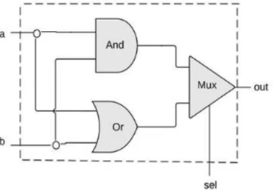

# From Nand to Tetris Part I
Part 1 of Build a Modern Computer from First Principles: From Nand to Tetris.
Rights and Credits belong to Noam &amp; Shimon, Course Creators

> `Reading:` sections refer to chapters of the Course's textbook:
> [The Elements of Computing Systems](https://mitpress.mit.edu/books/elements-computing-systems-second-edition)

## Week 1

### Introduction


Nand2Tetris Overview: Build complete general purpose computer from the ground up:
- Nand2Tetris Part 1 focuses on **hardware platform** of the computer: Nand gate -> HACK computer.
- Nand2Tetris Part 2 focuses on **software hierarchy** that runs on the hardware platform: HACK computer -> Tetris.

### Abstraction
```
class Main {
    function void main() {
        do Output.printString("Hello World");
        do Output.println(); // New line.
        return;
    }
}
```

Motivating Example: Hello World program taught in introductory programming courses.
- Typically discuss what each line of the code is supposed to do but does not go further.
- To the computer code looks like individual characters that by itself does not mean anything.
- How does the computer figure which pixels to set on display based on characters?
    - Told about compiler, standard library, operating systems (OS) but there
      is no need to understand how they work

Abstraction: Don't worry about the "how", only about the "what":
- what: what is piece of code supposed to do?
- how: how a piece of code is implemented. Could be implemented by someone else or by us earlier/later.
- ie using OS like Windows does not require the user to understand how it works.
- reduces mental load: saves us from having to worrying about everything all at once.

> The Nand2Tetris course applies abstraction:
> - every week targets only a single level of abstraction.
> - take the lower level as given &amp; implement the target level.
> - test that the target level works, we can forget about the target level once it work.
> - rinse repeat until highest level.

### From Nand to HACK
Building the HACK hardware platform:
- Start from Nand Logical Gate
- Use combinational logic to build basic gates from elementary logic gates
- Use combinational/sequential logic to build CPU/RAM/Chipset.
- Combine chips to from HACK computer architecture.
- Write assembler to compile assembly into machine code that runs on the HACK platform.

### Building Hardware
Building a Hardware Platform without physical electronics:
- hardware engineers design chips with hardware simulator programs
- hardware simulator programs allows users to build/test chips virtually.

Building hardware process:
1. Start from chip abstraction/interface defining what the chip has to do.


2. Design Chip using Chip diagram using lower level logic gates already built.


3. Code Chip using Hardware Description Language (HDL) based on design in diagram
    to produce HDL program virtualizing the hardware chip.

```
chip Xor {
    IN a, b;
    OUT out;
    PARTS:
        Not(in=a, out=nota);
        Not(in=b, out=notb);
        And(a=a, b=notb, out=w1);
        And(a=nota, b=b, out=w2);
        Or(a=w1, b=w2, out=out);
}
```

4. Use hardware simulator and test scripts to test that chip works as expected.

### From HACK to Tetris
Building Software Hierarchy that runs on the HACK platform:
- Start from HACK hardware platform and its assembler
- Build Higher Level Programming language that compiles into assembly.
- Build OS and standard library.
- Write Tetris using OS/Standard Library/High Level programming language.

### Boolean Logic
Boolean Values:
- only 2 values - 1/0. Simplest possible to maintain.

#### Basic Operations: AND/OR/NOT
AND operation:
| x | y | AND |
| --- | --- | --- |
| 0 | 0 | 0 |
| 0 | 1 | 0 |
| 1 | 0 | 0 |
| 1 | 1 | 1 |

OR operation:
| x | y | OR |
| --- | --- | --- |
| 0 | 0 | 0 |
| 0 | 1 | 1 |
| 1 | 0 | 1 |
| 1 | 1 | 1 |

NOT operation:
| x | NOT |
| --- | --- |
| 0 | 1 |
| 1 | 0 |


#### Evaluating Boolean Expressions
Evaluate $\text{NOT(0 OR (1 AND 1))}$:

$$
\text{NOT(0 OR (1 AND 1))}
= \text{NOT (0 OR 1)} \\
= \text{NOT 1} \\
= 0
$$

#### Boolean Functions
Boolean functions encapsulate boolean expression **formulas**:
$$
\text{f(x, y, z) = (x AND y) OR ((NOT x) AND z)}
$$

Boolean functions like $f$ can be represented as **truth table**:


> Both formulas and truth tables are equavilent ways to specify boolean functions

#### Boolean Identities
Boolean Identities:
- Communicative Law:
$$
\text{(x AND y) = (y AND x)} \\
\text{(x OR y) = (y OR x)}
$$

- Associative Law: Ordering does not matter
$$
\text{(x AND (y AND z)) = ((x AND y) AND z)} \\
\text{(x OR (y OR z)) = ((x OR y) OR z)}
$$

- Distributive Law: Unpack expressions
$$
\text{(x AND (y OR z))) = (x AND y) OR (x AND z)} \\
\text{(x OR (y AND z)) = (x OR y) AND (x OR z)}
$$

- De Morgan Law:
$$
\text{NOT(x AND y) = (NOT x) OR (NOT y)} \\
\text{NOT(x OR y) = (NOT x) AND (NOT y)}
$$

### Boolean Function Synthesis
Boolean Function Synthesis: Given a truth table, derive the equavilent boolean expression:


1. For each row of the truth table where the boolean function evaluates to 1:
    - make a boolean expression that evaluates 1 **only** on that row, but 0 in all other rows.


2. $\text{OR}$ the boolean expressions together to form the equavilent boolean expression.

$$
\text{((NOT x) AND (NOT y) AND (NOT z)) OR} \\
\text{((NOT x) AND y AND (NOT z)) OR} \\
\text{(x AND (NOT y) AND (NOT z))}
$$

3. Use boolean identities to simplify boolean expression.


### NAND
Theorem: Any boolean function can be represented using an expression containing AND/OR/NOT:
- OR can be represented with AND/OR via De Morgan Law:
$$
\text{x OR y = NOT((NOT x) AND (NOT y))}
$$
- Updated Theorem: Any boolean function can be represented using an expression containing AND/NOT:
$$
\text{x NAND y = NOT(x AND y)}
$$
- Updated Theorem: Any boolean function can be represented using an expression containing NAND.
- Proof:
$$
\text{(NOT x) = (x NAND x)} \\
\text{(x AND y) = NOT(x NAND y)}
$$

### Logic Gates
Gate Logic: technique for implementing boolean function using logic gates


**<p align="center">Logic Gate Diagrams</p>**
- Logic Gates: standalone chip that delivers a well defined functionality.
    - Elementary: NAND, AND, OR, NOT, ...
    - Composite: MUX, ADDR, ...

#### Elementary Logic Gates

| Logic Gate | Logic Gate Diagram | Functional Specification | Truth Table |
| --- | --- | --- | --- |
| NAND |  | `if (a == 1 and b == 1) then out=0 else out=1` |  |
| AND |  | `if (a == 1 and b == 1) then out=1 else out=0` |  |
| OR |  | `if (a == 1 or b == 1) then out=1 else out=0` |  |
| NOT |  | `if (a == 1) then out=1 else out=0` |  |

#### Composite Logic Gates
Composite Logic Gates: Composed from elementary logic gates.
Example: The composite 3-input AND gate:


- can be composed of two elementary AND gates:


### Interface vs Implementation
Interface - defines what the logic gate/code/software system is supposed to do
Implementation - how the logic/gate/code/software system is implemented
- There might be many possible implementations for a given interface.
- Implementation vary in performance, speed, parts/time/space requirements.

### Hardware Description Language
From Abstraction to HDL/Hardware implementation of chips:
1. Obtain Abstractions/Interface specifying the requirements of chip: Truth Table/Gate Diagram.


2. Define the interface of the Chip:
```
/** Xor gate: out = (a And (Not b)) OR ((Not A) And B) */

CHIP Xor {
    // Xor interface
    IN a, b;
    OUT out;
}
```

3. Synthesize the boolean function equavilent for the Chip using [Boolean Function Synthesis](#boolean-function-synthesis)
4. Write a Implementation Gate Diagram with the implementation of the Chip:

    - Fan out: signals can be distributed to unlimited no. of chips (ie input `a` to `And` &amp; input `a` to `And`)
    - Red connections: Named connections that connect component logic gates together.
5. Implement the Chip using HDL, referencing the Implementation Gate Diagram
```
/** Xor gate: out = (a And (Not b)) OR ((Not A) And B) */

CHIP Xor {
    // Xor interface
    IN a, b;
    OUT out;
    // Xor implementation
    PARTS:
    Not(in=a, out=nota);
    Not(in=a, out=notb);
    And(a=a, b=nota, out=aAndNotb);
    And(a=nota, b=b, out=notaAndb);
    Or(a=aAndNotb, b=notaAndb, out=out);
}
```
> HDL is code and thus maintainable development practices apply.
> Pay attention to indentation/comments/documentation/naming. 
> HDL conventions:
> - Describe the components of the Implementation Gate Implementation in
>   the `PARTS:` section from left to right
> - Use `a, b, ...` as Chip input/argument names, and `out` as chip output name.

HDL in the real world: VHDL, Verilog.

### Hardware Simulation/Testing
Hardware Simulation: Run/Test HDL chips
- Interactive Simulation: Run HDL code on Hardware Simulator to simulate the Hardware Chip.
- Script Based Simulation: Write Test Scripts to unit test the simulated Hardware Chip from HDL.

#### Interactive Simulation/Testing
Interactive Simulation:
- Load the HDL file into the hardware simulator to construct Simulated Hardware Chip
- Set values on the Chip's input pins.
- Evaluate/Simulate the Simulate Hardware Chip.
- Inspect the output/internal pins for expected values to check if the Virtualized Chip is working

#### Script Based Simulation/Testing
Script Based Simulation:
- Automate/Replicate testing by scripting testing steps:
```
load Xor.hdl;

set a 0, set b 0, eval;
set a 0, set b 1, eval;
set a 1, set b 0, eval;
set a 1, set b 1, eval;
```

- Test script can be configured to dump output to file with `output-file`.
  - `output-list` specifies the pins/symbols that will be dumped into the output file.
  - `compare-to` automatically compares output dump to another expected output file, errors if lines do not match.
  - `output` instructs simulator to dump output as configured by `output-file`, `output-list`.
> Behaviour Simulation: Allows high level planning in terms of expected output files before any HDL is written

```
load Xor.hdl,
output-file Xor.out,
compare-to Xor.cmp,
output-list a b out;

set a 0, set b 0, eval, output;
set a 0, set b 1, eval, output;
set a 1, set b 0, eval, output,;
set a 1, set b 1, eval, output;
```

> Test Script Docs can be found in Appendix B of the Textbook (Test Scripting Language)

### Multibit Buses
Buses: Array of bits
- convenient to think of group of bits as single entity, 'bus'.
- HDLs typically provide a convenient notation for dealing with buses

Example: 16-bit buses in 16-bit integer adder:
.

#### Buses Syntax
In Nand2Tetris HDL buses are represented using array syntax:
- In `IN` &amp; `OUT` sections, `a[16]`  defines a bus `a` of size 16-bits.
- In `PARTS:` section, `a[2]` 0-base indexes the 3rd bit of the `a` bus.
- Input Buses can be assigned to in separate slices.
    - ie `a[0..7]=lsb` assigns lsb bus to the first 8-bits of the `a` 16-bit bus.
    - ie `a[8..15]=lsb` assigns msb bus to the last 8-bits of the `a` 16-bit bus.
- `false`, `true` are synonymous for buses of 0, 1 of any length.

> NOTE: Multi bit buses are indexed from right (least significant bit) to left (most significant bit).

- 16-bit Adder
```
/* Adds two 16-bit values */
CHIP Add16 {
    IN a[16], b[16];
    OUT out[16];

    PARTS:
    // implementation excluded
}
```

- 3 way 16-bit Adder
```
/* Adds three 16-bit value */
CHIP Add3Way16 {
    IN a[16], b[16], c[16];
    OUT out[16];

    PARTS:
        Add16(a=a, b=b, out=aPlusb);
        Add16(a=aPlusb, b=c, out=out);
}
```

- 4 way 4-bit AND
```
/* Performs ANDs between the 4 bits of input */
CHIP Add4Way {
    IN a[4];
    OUT out;

    PARTS:
        AND(a=a[0], b=a[1], out=and01);
        AND(a=and01, b=a[2], out=and012);
        AND(a=and012, b=a[3], out=out);
}
```

- 4-bit Bitwise AND
```
/* Performs 4bit Bitwise AND between inputs */
CHIP And4 {
    IN a[4], b[4];
    OUT out[4];

    PARTS:
        AND(a=a[0], b=a[0], out=out[0]);
        AND(a=a[1], b=a[1], out=out[1]);
        AND(a=a[2], b=a[2], out=out[2]);
        AND(a=a[3], b=a[3], out=out[3]);
}
```

### Mux/Demux


Multiplexor(Mux): If statement in hardware form:
- `sel == 0` output `a`
- `sel == 1` output `b`
- used to make programmable gates like `AndMuxOr` which does `And` or `Or` on its inputs depending on `sel`:
  

---


Demultiplexor(Demux): Inverse of Multiplexor, distributes input into multiple destinations.
- `sel == 0` output `in` on `a`output
- `sel == 1` output `in` on `b`output

Application Mux/Demux: Send multiple inputs over single communication line:
- `sel` is connected to an oscillator that alternates between 0/1
- weaves input lines Mux side into single line, unweaves into output line on Demux side.

## Week 2

### Represeting Integers as Binary
Binary Integers:
- Each bit gives 2 possibilities, $N$ binary bits gives $2^N$ possibilities.
- This allows us to represent numbers between 0 and $2^N-1$
- Representing Integers as binary bits:

| Binary (base-2) | Decimal (base-10) |
| --- | --- |
| 0 | 0 |
| 1 | 1 |
| 10 | 2 |
| 11 | 3 |
| 100 | 4 |
| 101 | 5 |

#### Converting Binary to Decimal
Converting Binary to Decimal Integers:
- given binary Integers $b_n + b_{n-1} + b_{n-2} .. b_0$:
- decimal equavilent $D$ can be computed by
$$
D = \sum^{n}_{i} 2^ib_i
$$


Elaboration:
- Recall basic math: Representing `789` in base-10, each position has a power of `10`:
$$
7 \times 10^2 + 8 \times 10^1 + 9 \times 10^0 = 789
$$

- Similarly, Converting binary, base-2,`101` back to decimal `5`. Each position has a power of `2`:
$$
1 \times 2^2 + 0 \times 2^1 + 1 \times 2^0 = 5
$$


#### Converting Decimal to Binary
Converting Decimal to Binary Integers:
- write the decimal as a sum of powers of two.
- when selecting terms, use the largest power of two such that the sum is smaller/equavilent to the decimal:
$$
87 = 64 + 16 + 4 + 2 + 1 \\
= 2^6 + 2^4 + 2^2 + 2^1 + 2^0
$$

- for each $2^i$ term, write $1$ in the $i$th position of the binary equavilent
    of the decimal (eg. 8-bit binary integer):

| Position | 8 | 7 | 6 | 5 | 4 | 3 | 2 | 1 |
| --- | --- | --- | --- | --- | --- | --- | --- | --- |
| Binary | 0 | 1 | 0 | 1 | 0 | 1 | 1 | 1 |
| $2^i$ term | | $2^6$ | | 2^4 | | $2^2$ | $2^1$ | $2^0$ |

- Binary equavilent of `87` is `0101 0111`

- 99 = 2^6 + 2^5 + 2^2 + 2^1
= 0110 0011

### Binary Addition
Binary Addition:
- subtraction/comparison can be derieved easily from additions.
- multiplication/division can be implemented via software instead of hardware;

Example binary addition:
| Position | 8 | 7 | 6 | 5 | 4 | 3 | 2 | 1 |
| --- | --- | --- | --- | --- | --- | --- | --- | --- |
| Carry |  |  | 1 | 1 | 1 |   |   |   |
| x | 0 | 0 | 0 | 1 | 0 | 1 | 0 | 1 |
| y | 0 | 1 | 0 | 1 | 1 | 1 | 0 | 0 |
| --- | --- | --- | --- | --- | --- | --- | --- | --- |
| Sum | 0 | 1 | 1 | 1 | 0 | 0 | 0 | 1 |

> Overflow: Carry does not fit inside integer bit/word size.
> Typically the carry that exceeds the integer bit/word size is ignored/truncated.

#### Adder
Building an Adder: Hardware Chip that performs Binary Addition
1. Half Adder: Adds two bits
1. Full Adder: Adds three bits
1. Adder: Adds two numbers

##### Half Adder
Half Adder Performs a scoped down version of binary addition:
- :warning: condition: `carry` must be 0 before adding with half adder.
- input pins: `a` &amp; `b`
- output pins: `carry` &amp; `sum`


Truth table:


##### Full Adder
Full Adder removes the limitation of `carry` being 0:
- input pins: `a` &amp; `b` &amp; `c`
- output pins: `carry` &amp; `sum`


Truth table:


##### Multi-bit Adder
Multi-bit adder performs binary addition with multi-bit binary integers:
- Use Full Adder to add bits step by step from least significant/rightmost bit to most significant/leftmost bit:


### Negative Integers
Representing Negative numbers:
- Signed bit
- 2's complmement

#### Signed Bit
Signed Bit representation for negative numbers:
- To represent negative Integers, 1 extra bit is consumed for the sign:
- 16-bit integer: 1 bit for sign, 15-bits to represent actual number
- typically most significant bit (leftmost) is used as sign bit.

Cons:
- `-0` can be represented even thou `0` and `-0` should be the same.
- implementation needs to deal with different cases

> :warning: Inelegant solution that is no longer used in the industry

#### 2's Complement
2's Complement representation for negative numbers:
- Represent negative integer $-x$ with using $2^N - x$,
    - where $N$ is number of bits in the integer, $x$ is the positive equavilent of the negative integer.
- Positive integers exists in range $0 \le x \le 2^{N-1}-1$
- Negative integers exists in range $- \le x \le -2^{N-1}$

> Addition of negative integers using 2's Complement works out of the box:
> -  eg. -2 + -3 is equavilent to adding 14 + 13 with our multi-bit adder:
> - 1110 (14) + 1101 (13) = 11011 (27)
> - Since the  leftmost most significant bit truncated due to overflow:
> - 1110 (14) + 1101 (13) = 1011 (11)
> - 1011 in 2's Complement represent is equavilent to -5 which is exactly what we want.
>
> This works as both the representation (2's complement) is $x \mod 2^n$ and
> the addition (done by the adder) is also $x \mod 2^n$.

##### Negation
Negation: Given $x$ compute $-x$:
- Using 2's complement representation: $-x = 2^N - x$
- $2^N - x$ can be rexpressed as $1 + (2^n-1) - x$:
    - $(2^N-1)$ has a nice property of being composed of all 1s in binary form.
    - Means $(2^N-1) - x$ can be easily implemented with `XOR` binary operation.

##### Subtraction
Subtraction: Simply add the negation/negative equavilent eg:
- we can implement subtraction using our adder chip:
$$
x - y =  x + (-y)
$$

### Arithematic Logic Unit (ALU)


Arithematic Logic Unit (ALU):
- part of the CPU.
- takes in 2 inputs and a $f$ function
- performs $f$ on the given 2 inputs and returns as output.

$f$ function is derieved from a family pre-defined arithmetic functions:
- arithmetic operations: integer addition, multiplication, division.
- logical operations: AND, OR, XOR

> Some operations can be implemented at the software layer instead.

#### Hack ALU


Hack ALU - ALU used in the Nand2Tetris project:
- takes in two 16-bit, two's complement input values.
- outputs one 16-bit, two's complement output value
- control pins: (`zx`, `nx`, `zy`, `ny`, `f`, `no`) select which $f$
    out of the 18 builtin functions to run on the input values.
- control outputs (`zr`, `ng`): Metadata about `out` output:
    - `zr`: output `out` is zero.
    - `ng`: output `out` is negative.

##### Control Pins
Control Pins:
- Effects are applied sequentially (ie if both `zx`/`nx` are set,
    input `x` is first zeroed, then bitwise NOT).

| Pin | Description | Effect |
| --- | --- | --- |
| `zx` | Zeros the `x` input | `x=0` |
| `nx` | Bitwise NOT the `x` input | `!x` |
| `zy` | Zeros the `y` input | `y=0` |
| `ny` | Bitwise NOT the `y` input | `!y` |
| `f` | Selects between adder (`f=1`)/Bitwise AND (`f=0`) | `if f then x+y else x&y` |
| `no` | Bitwise NOT the output `o` | `!o` |
Control Pin Truth Table:


## Week 3

### Sequential Logic
#### Combinatorial Logic
Combinatorial "Functional" Logic:
- ignores notion of time.
- inputs are fixed and unchanging.
- outputs are a function of input &amp; computed instantly.

> So for we have used Combinatorial Logic only when implementing hardware chips

#### Time
Applications of tracking Time:
- use the same hardware over time: change inputs to compute something else.
- remember state: values from a point in time from the past. ie memory/counters.
- deal to speed: ensure that we don't compute faster than the hardware allows.

> Physical Time: Continuous infinitely divisiable flow of time. Hard to think about.
> Discrete Time: Tikme broken down into distinct points in time.

#### Clock


Clock: breaks down physical time into discrete time.
- breaks down countinuous time into units of time (`t=1`, `t=2`, ..., `t=n`).
- implemented via a oscillator going up and down at a fixed rate.
- assume that nothing else happens during within each unit of time.
    - eg. NOT gate can have an input at some time `t=s`, computes output immediately still at `t=s`
    - abstracts the eletrical delay away by assuming that change happens instantly in the time unit.

##### Electrical Delays
In reality, electrical signals do not change instantanously, voltage may take time to build.
- The clock abstracts the delay away by assuming that change happens instantly in the time unit.
- As long as clock cycle is not too fast, the eletrical signal should reach its final state by the end of the time unit.

Example of eletrical delay in NOT gate, gray part is ignored by clock cycle:  


#### Sequential vs Combinatorial Logic


Combinatorial Logic: $\text{out}[t] = f(\text{in}[t])$
- output of time $t$ depends solely from inputs $in$ in the same time $t$


Sequential Logic: $\text{out}[t] = f(\text{in}[t-1])$
- output of time $t$ depends solely from inputs $in$ in the previous time step $t-1$


### State


State can be implemented with sequential logic by:
- having the input $in$ and output $out$ by stored at the same hardware address $state$
- $\text{state}[t] = f(\text{state}[t-1])$

#### Remembering State
Remembering State:
- hardware required to remember bits from previous time step $t-1$ for use at time step $t$.


Clocked Data Flip-Flop (D Flip Flop/DFF):
- remembers by storing 1 bit from previous time step as 0 or 1.
- can retrieved stored bit from $t-1$ in current time unit $t$.

> The White Triangle in the chip diagram signifies that the chip stores state within.
> D Flip Flop are given as primitive chips in the course.

#### Implementing Sequential Logic


Implementing Sequential Logic Paradigm:
1. Manipulate bits using Combinatorial Logic
2. Remember bits across time units using DFF.
3. Feed output of DFF together with input to Combinatorial Logic gates.

#### Registers


1 bit-Register:
- remember an input bit forever until requested to load new value.
- `load` pin signals to the chip to load the current `in` value.
- the output is only set to loaded `in` value in next time step $t+1$
- `if load(t-1) then out(t) = in(t-1) else out(t) = out(t-1)`
- the MUX chip allows the chip to decide whether to keep the previous value
    or load in the new input value

1 bit-Register Waveform:


